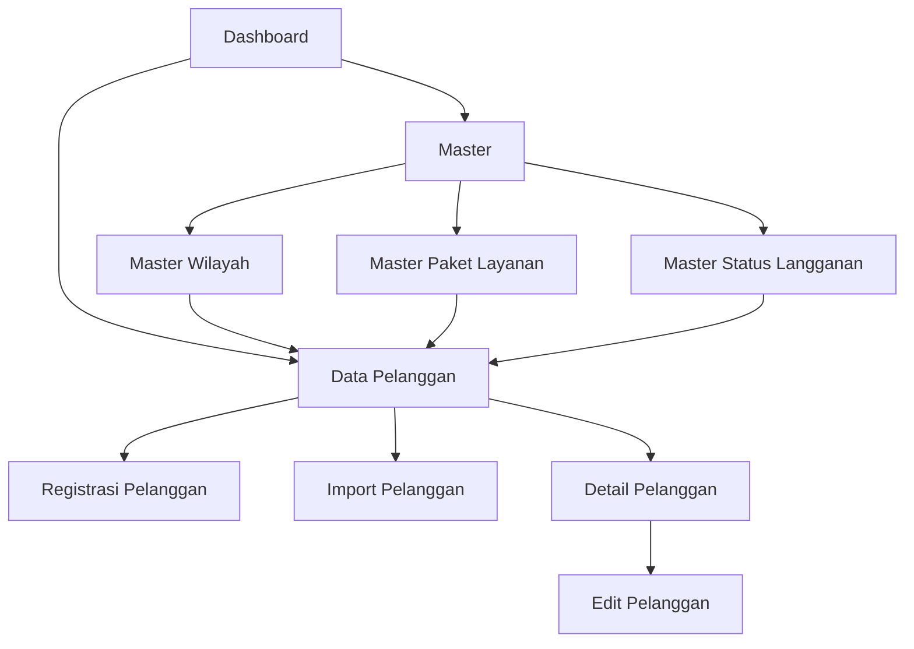

# WHUSNET Operasional

WHUSNET Operasional adalah aplikasi web berbasis Laravel untuk membantu proses administrasi dan monitoring operasional ISP. Project ini berfokus pada pengelolaan data pelanggan, master data layanan, master wilayah, status langganan, dashboard operasional, dan proses import pelanggan.

Dokumentasi detail setiap fitur tersedia di folder [docs](docs/README.md).

## Gambaran Umum

Aplikasi ini dibuat sebagai fondasi sistem operasional ISP dengan modul utama:

1. Dashboard operasional untuk melihat ringkasan pelanggan.
2. Data Pelanggan untuk registrasi, daftar, edit, detail, dan import pelanggan.
3. Master Wilayah untuk referensi kota, kecamatan, dan desa.
4. Master Paket Layanan untuk referensi paket internet WHUSNET.
5. Master Status Langganan untuk workflow status pelanggan.
6. API penunjang untuk dependent dropdown wilayah dan validasi import pelanggan.

## Teknologi

| Komponen | Teknologi |
| --- | --- |
| Backend | Laravel 13, PHP 8.3 |
| Frontend | Blade, Vite, Tailwind CSS |
| Database | MySQL atau database Laravel yang dikonfigurasi di `.env` |
| Testing | PHPUnit |
| Container | Docker, Nginx, PHP-FPM, MySQL, phpMyAdmin |

## Menu Aplikasi

| Menu | Route | Fungsi | Dokumentasi |
| --- | --- | --- | --- |
| Dashboard | `/` | Ringkasan total pelanggan, pelanggan aktif, pending, suspend, distribusi status, kategori paket, dan tren registrasi. | [Dashboard](docs/dashboard/README.md) |
| Data Pelanggan | `/customers` | Daftar pelanggan dengan search, filter status, filter kecamatan, filter paket, indikator kelengkapan data, dan progress workflow. | [Data Pelanggan](docs/data-pelanggan/README.md) |
| Tambah Pelanggan | `/customers/create` | Form registrasi pelanggan baru beserta data diri, wilayah, layanan, referral, teknis, dan dokumen. | [Flow Data Pelanggan](docs/data-pelanggan/flow.md) |
| Import Pelanggan | `/customers/import` | Import batch pelanggan melalui validasi row, warning, error, dan simpan massal. | [Import Pelanggan](docs/penunjang/import-pelanggan.md) |
| Detail Pelanggan | `/customers/{customer}` | Detail pelanggan dengan timeline, survey, FOP, pemasangan, aktivasi, teknis, uji layanan, invoice awal, referral, dan timelog. | [Flowchart Data Pelanggan](docs/data-pelanggan/flowchart.md) |
| Edit Pelanggan | `/customers/{customer}/edit` | Perubahan data pelanggan dan pengelolaan dokumen upload. | [Schema Data Pelanggan](docs/data-pelanggan/database-schema.md) |
| Master Wilayah | `/master/wilayah` | Referensi kota, kecamatan, desa, dan pencarian wilayah. | [Master Wilayah](docs/master/wilayah.md) |
| Master Internet Package | `/master/paket` | Daftar paket internet aktif yang dikelompokkan berdasarkan kategori. | [Master Internet Package](docs/master/internet-package.md) |
| Master Status Langganan | `/master/status-langganan` | Daftar status workflow pelanggan beserta jumlah pelanggan per status. | [Master Status Langganan](docs/master/status-langganan.md) |
| Master Timeline SLA | `/master/sla-timeline` | Matrix batas waktu wajib mulai ditangani per jenis tiket, beda-beda per paket internet. | [Master Timeline SLA](docs/master/sla-timeline/README.md) |
| API Kecamatan | `/api/cities/{city}/districts` | Mengambil daftar kecamatan berdasarkan kota. | [API Wilayah](docs/penunjang/api-wilayah.md) |
| API Desa | `/api/districts/{district}/villages` | Mengambil daftar desa berdasarkan kecamatan. | [API Wilayah](docs/penunjang/api-wilayah.md) |

## Alur Sistem Singkat



Dokumentasi flowchart lengkap tersedia di [Flowchart System](docs/flowchart-system.md).

## Struktur Dokumentasi

| File / Folder | Isi |
| --- | --- |
| [docs/README.md](docs/README.md) | Indeks dokumentasi project. |
| [docs/database-schema.md](docs/database-schema.md) | Database schema utama berdasarkan migration aktual. |
| [docs/flowchart-system.md](docs/flowchart-system.md) | Flowchart sistem secara umum. |
| [docs/data-pelanggan](docs/data-pelanggan/README.md) | Dokumentasi fitur pelanggan. |
| [docs/master](docs/master/README.md) | Dokumentasi fitur master. |
| [docs/dashboard](docs/dashboard/README.md) | Dokumentasi dashboard. |
| [docs/penunjang](docs/penunjang/README.md) | Dokumentasi fitur penunjang. |

## Struktur Project Penting

| Path | Keterangan |
| --- | --- |
| `routes/web.php` | Definisi route halaman dan API sederhana. |
| `app/Http/Controllers` | Controller utama aplikasi. |
| `app/Http/Controllers/Master` | Controller untuk menu master. |
| `app/Models` | Model Eloquent. |
| `database/migrations` | Struktur tabel database. |
| `database/seeders` | Seeder master wilayah, paket layanan, status langganan, dan pelanggan dummy. |
| `resources/views` | Blade view aplikasi. |
| `resources/views/customers` | View fitur pelanggan. |
| `resources/views/master` | View fitur master. |
| `docs` | Dokumentasi project. |

## Aturan CID & REQ ID Pelanggan

Identitas pelanggan (`customers.customer_code` / `customers.cid`) mengikuti format berjenjang, tergantung status pelanggan. Detail lengkap (termasuk celah desain yang perlu disiplin operasional) ada di [Business Logic Master POP](docs/master/pop/business-logic.md).

**Struktur CID lengkap** (`Pop::generateComplexCid()`):

```
D    2      X6C          RQ001296
│    │      │            └─ REQ ID (nomor registrasi permanen, RQ + 6 digit)
│    │      └─ Kode Distribusi (Distribution.code, unik global, input manual admin)
│    └─ Nomor Mini POP (dari mini_pop yang di-assign, fallback pop_code Cabang, fallback olt_number teknis)
└─ Kode Cabang POP (Pop.cid_prefix, input manual admin)
```

**Format ID per status pelanggan** (`Pop::resolveDisplayId()`):

| Status | Format tampil | Contoh |
| --- | --- | --- |
| Baru daftar / survey / pemasangan (belum ada distribusi) | REQ ID murni | `RQ001296` |
| Active / Suspended + **sudah** ada distribusi | CID lengkap | `D2X6CRQ001296_MANGKUJAYAN_DYAHGALUH` |
| Active / Suspended + **belum** ada distribusi | Default cabang | `C00RQ001296` |
| Terminated / Failed / Rejected / Putus / Gagal | Balik ke REQ ID murni | `RQ001296` |

REQ ID **permanen** — dibuat sekali saat registrasi, gak pernah berubah/hilang seumur hidup pelanggan. CID cuma "dibungkus" beda tergantung status; saat terminate, sistem gak generate ID baru, cuma nampilin lagi REQ ID murni yang dari awal udah ada (`extractBareRegistrationId()`).

## Database Utama

Tabel utama yang digunakan:

| Tabel | Fungsi |
| --- | --- |
| `customers` | Data utama pelanggan. |
| `cities` | Master kota/kabupaten. |
| `districts` | Master kecamatan. |
| `villages` | Master desa/kelurahan. |
| `internet_packages` | Master paket layanan internet. |
| `subscription_statuses` | Master status workflow langganan. |

Detail schema tersedia di [Database Schema](docs/database-schema.md).

## Instalasi Lokal

Salin file environment:

```bash
cp .env.example .env
```

Install dependency backend dan frontend:

```bash
composer install
npm install
```

Generate key dan jalankan migration:

```bash
php artisan key:generate
php artisan migrate --seed
```

Jalankan aplikasi:

```bash
composer run dev
```

Atau jalankan frontend dan backend terpisah:

```bash
php artisan serve
npm run dev
```

## Menjalankan dengan Docker

Jalankan container:

```bash
docker compose up -d --build
```

Akses aplikasi:

| Service | URL |
| --- | --- |
| Aplikasi | `http://localhost:8000` |
| phpMyAdmin | `http://localhost:8080` |

## Testing

Jalankan test:

```bash
php artisan test
```

Atau melalui Composer:

```bash
composer test
```

## Sprint 8 — FOP Task Management & Design System

Sprint 8 menambahkan modul task scheduling dan management untuk FOP:

| Fitur | Route | Dokumentasi |
|-------|-------|-------------|
| FOP Dashboard | `/fop` | [Dashboard](docs/sprint-8/fop-dashboard.md) |
| Kanban Task Scheduler | `/fop/kanban` | [Kanban](docs/sprint-8/kanban-task-scheduler.md) |
| Calendar Scheduler | `/fop/calendar` | [Calendar](docs/sprint-8/calendar-scheduler.md) |
| Task Workflow | — | [Workflow](docs/sprint-8/task-workflow.md) |
| Design System UI | — | [Design System](docs/sprint-8/design-system-ui.md) |
| Overdue Indicator | `/fop` (stat card) | [Overdue](docs/sprint-8/overdue-indicator.md) |

**Overview lengkap:** [Sprint 8 Documentation](docs/sprint-8/README.md)

## Ticketing — Tiket Internal Perusahaan

Modul Ticketing menangani tiket MTN (Maintenance) dan C-REQ (Customer Request) yang diajukan helpdesk/NOC/sales/admin, otomatis membuat Task FOP terkait:

| Fitur | Route | Dokumentasi |
|-------|-------|-------------|
| Daftar Tiket (4 bucket) | `/tickets/{bucket}` | [README](docs/ticketing/README.md) |
| Tiket Baru | `/tickets/new` | [User Flow](docs/ticketing/user-flow.md) |
| Detail Tiket | `/tickets/{id}` | [Business Logic](docs/ticketing/business-logic.md) |

**Overview lengkap:** [Ticketing Documentation](docs/ticketing/README.md)

---

## Catatan Implementasi

Project ini sudah menyediakan fondasi fitur operasional ISP, termasuk modul Onboarding Workflow (Survey, Verifikasi Lapangan, Pemasangan, Aktivasi) yang diatur menggunakan *State Machine* (`CustomerWorkflowService`) serta tabel riwayat transaksi pendukung (`customer_surveys`, `customer_installations`, `customer_technical_details`). 

Sprint 8 menambahkan Task Management untuk FOP dengan:
- **Kanban & Calendar views** untuk task scheduling
- **Real-time updates** via Reverb WebSocket
- **Design System konsistensi** UI (CSS vars)
- **Workflow approval gates** — FOP approve trigger customer transition (no auto-update)
- **Overdue indicator** untuk SLA waiting phase

Data tagihan awal dan uji layanan secara bertahap akan diintegrasikan dengan modul Billing.
## Menu Dokumentasi Fitur

Bagian ini dibuat sebagai pintu masuk cepat untuk programmer baru. Pilih menu sesuai fitur yang ingin dipelajari, lalu buka dokumentasi detailnya.

### Dashboard

| Kebutuhan | Dokumentasi |
| --- | --- |
| Memahami fungsi dashboard | [Overview Dashboard](docs/dashboard/README.md) |
| Melihat alur data dashboard | [Flow Dashboard](docs/dashboard/flow.md) |
| Melihat flowchart dashboard | [Flowchart Dashboard](docs/dashboard/flowchart.md) |
| Melihat tabel sumber dashboard | [Schema Dashboard](docs/dashboard/database-schema.md) |

### Data Pelanggan

| Kebutuhan | Dokumentasi |
| --- | --- |
| Memahami fitur Data Pelanggan secara umum | [Overview Data Pelanggan](docs/data-pelanggan/README.md) |
| Melihat alur daftar pelanggan | [Flow Data Pelanggan](docs/data-pelanggan/flow.md) |
| Melihat alur registrasi pelanggan | [Flow Data Pelanggan](docs/data-pelanggan/flow.md) |
| Melihat alur edit pelanggan | [Flow Data Pelanggan](docs/data-pelanggan/flow.md) |
| Melihat alur detail pelanggan | [Flow Data Pelanggan](docs/data-pelanggan/flow.md) |
| Melihat alur import pelanggan | [Flow Data Pelanggan](docs/data-pelanggan/flow.md) |
| Melihat flowchart registrasi, detail, dan import | [Flowchart Data Pelanggan](docs/data-pelanggan/flowchart.md) |
| Melihat tabel dan field pelanggan | [Schema Data Pelanggan](docs/data-pelanggan/database-schema.md) |

### Master

| Kebutuhan | Dokumentasi |
| --- | --- |
| Memahami modul Master secara umum | [Overview Master](docs/master/README.md) |
| Melihat master wilayah | [Master Wilayah](docs/master/wilayah/README.md) |
| Melihat master internet package | [Master Internet Package](docs/master/internet-package/README.md) |
| Melihat master status pelanggan | [Master Status Pelanggan](docs/master/status-pelanggan/README.md) |
| Melihat master POP (Cabang) | [Master POP](docs/master/pop/README.md) |
| Memahami aturan generate CID & REQ ID pelanggan | [Business Logic Master POP](docs/master/pop/business-logic.md) |
| Melihat master Distribusi jaringan | [Master Distribusi](docs/master/distribution/README.md) |
| Melihat Master Timeline SLA (batas waktu tiket per paket) | [Master Timeline SLA](docs/master/sla-timeline/README.md) |

### Ticketing

| Kebutuhan | Dokumentasi |
| --- | --- |
| Memahami fitur Ticketing secara umum | [Overview Ticketing](docs/ticketing/README.md) |
| Melihat alur submit/assign/cancel tiket | [User Flow Ticketing](docs/ticketing/user-flow.md) |
| Melihat aturan bisnis (RBAC, snapshot, dual-history, bug fixes) | [Business Logic Ticketing](docs/ticketing/business-logic.md) |
| Melihat flowchart auto-sync & pembatalan | [Flowchart Ticketing](docs/ticketing/flowchart.md) |
| Melihat tabel dan kolom Ticketing | [Schema Ticketing](docs/ticketing/database-schema.md) |

### Penunjang

| Kebutuhan | Dokumentasi |
| --- | --- |
| Memahami fitur penunjang secara umum | [Overview Penunjang](docs/penunjang/README.md) |
| Melihat alur import pelanggan batch | [Import Pelanggan](docs/penunjang/import-pelanggan.md) |
| Melihat API dependent dropdown wilayah | [API Wilayah](docs/penunjang/api-wilayah.md) |
| Melihat flowchart fitur penunjang | [Flowchart Penunjang](docs/penunjang/flowchart.md) |
| Melihat schema fitur penunjang | [Schema Penunjang](docs/penunjang/database-schema.md) |

### Sistem dan Database

| Kebutuhan | Dokumentasi |
| --- | --- |
| Melihat indeks semua dokumentasi | [Indeks Dokumentasi](docs/README.md) |
| Melihat flowchart sistem keseluruhan | [Flowchart System](docs/flowchart-system.md) |
| Melihat database schema utama | [Database Schema](docs/database-schema.md) |
