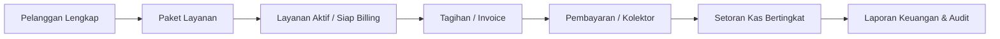
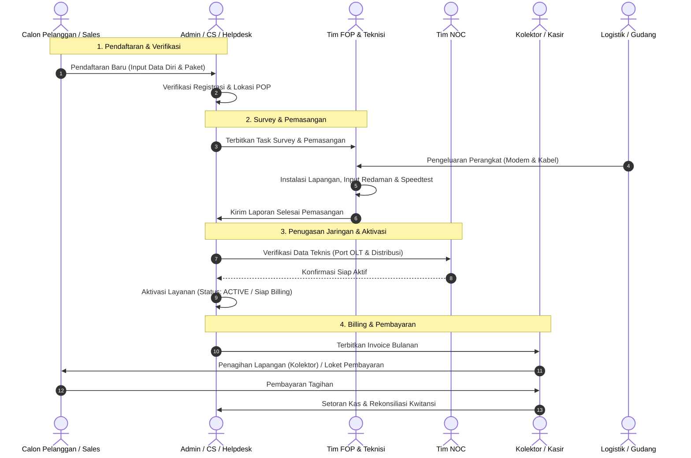

<div align="center">

# 🌐 WHUSNET Operasional
### *Platform Manajemen Billing ISP & Operasional Terpadu Berbasis Master Data Pelanggan*

[](https://laravel.com)
[](https://php.net)
[](https://tailwindcss.com)
[](https://laravel.com/docs/reverb)
[](https://docker.com)
[](LICENSE)

<p align="center">
  <b>WHUSNET Operasional</b> adalah sistem operasional ISP (Internet Service Provider) enterprise internal yang dirancang untuk mengintegrasikan seluruh siklus hidup pelanggan (<i>Customer Lifecycle</i>), verifikasi lapangan, penugasan teknisi FOP, pengelolaan tiket gangguan NOC/Helpdesk, inventaris gudang bertingkat, hingga alur penagihan (<i>billing</i>) dan setoran kas bertingkat.
</p>

[Fitur Utama](#-fitur-utama-sistem) •
[Aturan CID & REQ ID](#-aturan-cid--req-id-pelanggan) •
[Alur Bisnis](#-alur-proses-bisnis-utama) •
[Peta Modul & Dokumentasi](#-peta-navigasi-modul--tautan-dokumentasi) •
[Direktori Dokumen](#-direktori-lengkap-dokumentasi-fitur) •
[Instalasi](#-panduan-instalasi) •
[Teknologi](#-stack-teknologi)

---

</div>

## 📌 Filosofi & Prinsip Sistem

Sistem WHUSNET Operasional menempatkan **Master Data Pelanggan** sebagai pusat dari semua transaksi bisnis operasional ISP:


```mermaid
flowchart LR
    CP[Pelanggan Lengkap] --> IP[Paket Layanan]
    IP --> LA[Layanan Aktif / Siap Billing]
    LA --> TG[Tagihan / Invoice]
    TG --> PB[Pembayaran / Kolektor]
    PB --> SK[Setoran Kas Bertingkat]
    SK --> LP[Laporan Keuangan & Audit]
```

> [!IMPORTANT]
> **Prinsip Utama:** Billing dan penagihan tidak dapat berdiri sendiri tanpa validitas data pelanggan, riwayat verifikasi instalasi, dan penugasan POP yang sah.

---

## 🚀 Fitur Utama Sistem

### 1. 🔐 Hierarchical Dynamic RBAC (Role & Permission Management)
* **Pemisahan Role & Data Scope:** Role menentukan *kapabilitas fitur*, sedangkan Scope menentukan *wilayah data* (`all_pop`, `selected_pop`, `pop_tree`, `assigned_only`, `own_created`).
* **Matrix Role Interaktif:** Konfigurasi izin granular berbasis string format lowercase (misal: `customers.view`, `invoices.create`, `cash_deposit.verify`).
* **Audit Trail Komprehensif:** Setiap tindakan mutasi data penting dicatat lengkap dengan actor ID, IP, snapshot sebelum & sesudah perubahan.

### 2. 👥 Master Data Pelanggan & Customer Lifecycle (360° View)
* **Multi-Stage Onboarding Workflow:**
  * *Draft / Registrasi* ➔ *Verifikasi CS/Admin* ➔ *Verifikasi Tim Bisnis (BD)* ➔ *Survey Lapangan* ➔ *Pemasangan & Speedtest* ➔ *Validasi Final & Penugasan Jaringan OLT/ODP* ➔ *Aktivasi Siap Billing*.
* **Sistem QR Code & PIN Pelanggan:** Penerbitan token QR fisik unik untuk verifikasi cepat teknisi lapangan dan portal pelanggan.
* **Manajemen Perubahan & Terminasi:**
  * Putus Langganan (Terminasi dengan penarikan modem/DEAC).
  * Cuti Berlangganan & Pembebasan Tagihan Periode (*Billing Waiver*).
  * Pelanggan Gagal & Alasan Terminasi terarsip terpisah.
* **Import Pelanggan Batch:** Upload Excel/CSV massal dengan validasi baris real-time, deteksi anomali/warning, dan riwayat batch.

### 3. 💳 Billing, Invoice & Pembayaran Terintegrasi
* **Penerbitan Invoice Otomatis & Manual:** Perhitungan pro-rata, tanggal jatuh tempo dinamis, dan status tagihan (*Unpaid*, *Partial*, *Paid*, *Write-Off / Tak Tertagih*).
* **Alur Hapus Buku (Write-off) & Reversal:** Pengelolaan piutang macet dengan otorisasi bertingkat.
* **Kwitansi & Struk Pembayaran:** Cetak struk pembayaran resmi satuan maupun cetak massal.
* **Manajemen Lebih-Bayar (Overpay):** Pencatatan saldo lebih-bayar pelanggan secara akurat.

### 4. 🛵 Modul Kolektor & Alur Setoran Kas Bertingkat
* **Admin Collector Worksheet:** Pengaturan pembagian penugasan tagihan ke kolektor per wilayah/POP, monitoring progres penagihan, dan rekonsiliasi kwitansi.
* **Mobile Collector Worklist:** Antarmuka khusus kolektor lapangan untuk mencatat pembayaran langsung di tempat, input riwayat kunjungan tanpa hasil (janji bayar), dan rekap kas harian.
* **Setoran Bertingkat (Cash Deposit Engine):**
  $$\text{Pelanggan} \xrightarrow{\text{Bayar Tunai}} \text{Kolektor} \xrightarrow{\text{Setor \& Verifikasi}} \text{Admin POP} \xrightarrow{\text{Setoran Kas Admin}} \text{Owner / Bank}$$
* **Verifikasi & Validasi Selisih:** Pemeriksaan fisik uang setoran dengan proteksi *maker-checker* (penyetor tidak boleh memverifikasi setorannya sendiri).

### 5. 🎫 Helpdesk, NOC & Trouble Ticketing
* **Multi-Bucket Ticketing:** Kategori tiket Maintenance (MTN), Customer Request (C-REQ), dan Gangguan Internal.
* **Worksheet NOC & Helpdesk:** Drawer interaktif untuk eskalasi tiket instan antar divisi, pengembalian tiket, dan penutupan dengan bukti penanganan.
* **Batch / Mass Ticket:** Satu tiket gangguan backbone/ODC dapat dikaitkan ke puluhan pelanggan terdampak secara serentak.
* **SLA Monitoring:** Penghitungan batas waktu penanganan (SLA timeline) per paket internet dengan visualisasi indikator overdue.

### 6. 🛠️ FOP (Field Operation) & Task Scheduling
* **Kanban & Calendar Scheduler:** Manajemen antrean tugas teknisi berbasis drag-and-drop dengan deteksi konflik jadwal teknisi.
* **Live Technician Worksheet (`/tasks-saya`):** Dashboard teknisi lapangan dengan pembaruan real-time via WebSocket (Laravel Reverb & Echo).
* **Laporan Lapangan Khusus:**
  * Laporan Survey & Kelayakan Redaman (dBm).
  * Laporan Pemasangan & Uji Kecepatan (Speedtest).
  * Laporan Perbaikan Maintenance.
  * Laporan Penarikan Modem (DEAC Task).
* **Verifikasi Biaya C-REQ:** Validasi material tambahan dan biaya teknisi oleh CS/Helpdesk sebelum ditagihkan ke invoice pelanggan.

### 7. 📦 Gudang & Manajemen Inventaris (Warehouse Management)
* **Struktur Multi-Gudang (Pusat & Cabang/POP):** Penunjukan PIC Gudang resmi per cabang.
* **Dukungan 3 Tipe Barang:**
  1. *Barang Serialized:* Pelacakan per Unit Serial Number (Modem ONT, Router, OLT SFP).
  2. *Barang Non-Serial:* Manajemen stok kuantitas (Konektor SC/UPC, Dropcore clamp, Patchcord).
  3. *Barang Roll (Meteran):* Pelacakan sisa panjang kabel roll drum.
* **Siklus Mutasi Lengkap:**
  * Penerimaan Barang Masuk (Receive) + Cetak Barcode/QR SN & Roll.
  * Transfer Antar-Gudang (Surat Jalan & Invoice Transfer).
  * Pengeluaran Barang ke Teknisi (*Custody Tracking*).
  * Pengembalian & Retur Barang Bekas Pelanggan dengan inspeksi status kelayakan.
  * Penyesuaian Stok (Adjustment Rusak/Hilang & Stock Opname Fisik).
  * Permintaan Stok Cabang (*Stock Request Approval & Fulfillment*).
* **Traceability 360°:** Pelacakan jejak riwayat satu unit modem dari pabrik, rak gudang pusat, kurir transfer, tangan teknisi, hingga rumah pelanggan.
* **Scan-First Lookup:** Pencarian cepat status barang via barcode/QR scanner kamera atau barcode reader.

### 8. 📊 Laporan & Analytics Eksekutif
* **Laporan Keuangan & Kas:** Rekap tagihan bulanan, pembayaran harian, buku kas admin, dan mutasi deposit.
* **Laporan Kinerja Kolektor:** Matriks performa penagihan kolektor dan persentase keberhasilan.
* **Dashboard Omset Sales & Business Development:** Monitoring pertumbuhan pelanggan baru, referral agent mitra, dan pendapatan bulanan.
* **Laporan Konsumsi Material:** Rekap pemakaian material harian oleh teknisi di lapangan.

---

## 🆔 Aturan CID & REQ ID Pelanggan

Identitas pelanggan (`customers.customer_code` / `customers.cid`) mengikuti format berjenjang sesuai status pelanggan:

```
D    2      X6C          RQ001296
│    │      │            └─ REQ ID (nomor registrasi permanen, RQ + 6 digit)
│    │      └─ Kode Distribusi (Distribution.code, unik global, input manual admin)
│    └─ Nomor Mini POP (dari mini_pop yang di-assign, fallback pop_code Cabang, fallback olt_number teknis)
└─ Kode Cabang POP (Pop.cid_prefix, input manual admin)
```

**Format ID per status pelanggan:**

| Status | Format Tampil | Contoh | Keterangan |
|---|---|---|---|
| Baru daftar / Survey / Pemasangan | REQ ID murni | `RQ001296` | Belum ada distribusi jaringan |
| Active / Suspended + ada distribusi | CID lengkap | `D2X6CRQ001296_MANGKUJAYAN_DYAHGALUH` | Layanan aktif normal |
| Active / Suspended + belum ada distribusi | Default cabang | `C00RQ001296` | Fallback cabang induk |
| Terminated / Failed / Gagal / Putus | Balik ke REQ ID murni | `RQ001296` | Distribusi dilepas |

> [!NOTE]
> **REQ ID bersifat permanen** — dibuat sekali saat registrasi dan tidak pernah berubah. Detail lengkap dapat dibaca pada [Business Logic Master POP](docs/master/pop/business-logic.md).

---

## 🔄 Alur Proses Bisnis Utama


```mermaid
sequenceDiagram
    autonumber
    actor C as Calon Pelanggan / Sales
    actor CS as Admin / CS / Helpdesk
    actor FOP as Tim FOP & Teknisi
    actor NOC as Tim NOC
    actor K as Kolektor / Kasir
    actor G as Logistik / Gudang

    Note over C,CS: 1. Pendaftaran & Verifikasi
    C->>CS: Pendaftaran Baru (Input Data Diri & Paket)
    CS->>CS: Verifikasi Registrasi & Lokasi POP

    Note over CS,FOP: 2. Survey & Pemasangan
    CS->>FOP: Terbitkan Task Survey & Pemasangan
    G->>FOP: Pengeluaran Perangkat (Modem & Kabel)
    FOP->>FOP: Instalasi Lapangan, Input Redaman & Speedtest
    FOP->>CS: Kirim Laporan Selesai Pemasangan

    Note over CS,NOC: 3. Penugasan Jaringan & Aktivasi
    CS->>NOC: Verifikasi Data Teknis (Port OLT & Distribusi)
    NOC-->>CS: Konfirmasi Siap Aktif
    CS->>CS: Aktivasi Layanan (Status: ACTIVE / Siap Billing)

    Note over CS,K: 4. Billing & Pembayaran
    CS->>K: Terbitkan Invoice Bulanan
    K->>C: Penagihan Lapangan (Kolektor) / Loket Pembayaran
    C->>K: Pembayaran Tagihan
    K->>CS: Setoran Kas & Rekonsiliasi Kwitansi
```

---

## 🗺️ Peta Navigasi Modul & Tautan Dokumentasi

| Menu / Modul | Route URL | Fungsi & Kegunaan | Tautan Dokumentasi |
|---|---|---|---|
| **Dashboard** | `/` | KPI operasional utama, ringkasan pelanggan, status jaringan, dan grafik tren. | [Overview](docs/dashboard/README.md) • [Flow](docs/dashboard/flow.md) • [Schema](docs/dashboard/database-schema.md) |
| **Data Pelanggan** | `/customers` | Database pelanggan lengkap, filter multi-dimensi, detail timeline 360°, dan edit data. | [Overview](docs/data-pelanggan/README.md) • [Flow](docs/data-pelanggan/flow.md) • [Schema](docs/data-pelanggan/database-schema.md) |
| **Pendaftaran & Verifikasi** | `/customer-registration-verifications` | Form registrasi & antrean approval pendaftaran sebelum jadwal survey. | [Pendaftaran](docs/pendaftaran-pelanggan/README.md) • [User Flow](docs/pendaftaran-pelanggan/user-flow.md) • [Schema](docs/pendaftaran-pelanggan/database-schema.md) |
| **Pelanggan Putus / Gagal** | `/customers/terminated` | Arsip pelanggan terminasi/putus langganan dan pendaftaran gagal. | [Skema Putus](docs/plan/billing/skema-putus-langganan.md) • [Analisa Deaktivasi](docs/plan/billing/analisa-rancangan-request-deaktivasi-bebas-tagihan-periode.md) |
| **Import Data Pelanggan** | `/customers/import` | Upload batch data pelanggan lama beserta validasi, riwayat, dan log error. | [Import Spec](docs/IMPORT_SPEC.md) • [Panduan Import](docs/penunjang/import-pelanggan.md) |
| **Tagihan (Invoices)** | `/invoices` | Manajemen tagihan aktif, status lunas, belum lunas, invoice manual, dan write-off. | [Business Rules](docs/BUSINESS_RULES.md) • [Tagihan Manual](docs/plan/billing/analisa-rancangan-tagihan-manual.md) |
| **Pembayaran & Kwitansi** | `/payments` | Pencatatan transaksi pembayaran, penanganan overpay, dan cetak kuitansi. | [Rancangan Kwitansi](docs/plan/billing/kwitansi.md) • [Edit Bayar](docs/plan/billing/rancangan-edit-pembayaran-penuh.md) |
| **Worksheet Kolektor** | `/collector-worksheet` | Penugasan rute tagihan kolektor, monitoring setoran, dan cetak kwitansi massal. | [Overview](docs/kolektor/README.md) • [Logic](docs/kolektor/business-logic.md) • [User Flow](docs/kolektor/user-flow.md) |
| **Worklist Kolektor Mobile** | `/collector-worklist` | Portal mobile kolektor untuk input penagihan langsung dan setor kas. | [Alur 2.0](docs/plan/kolektor/analisa-alur-kolektor-2.0.md) • [Schema](docs/kolektor/database-schema.md) |
| **Setoran Kas Admin** | `/cash-deposits` | Rekonsiliasi dan verifikasi uang kas fisik admin cabang sebelum disetor ke bank. | [Analisa Setoran Kas](docs/plan/kolektor/analisa-setoran-kas-admin.md) |
| **Ticketing Gangguan** | `/tickets/new` | Pembuatan tiket keluhan, tracking SLA, eskalasi, dan histori gangguan. | [Overview](docs/ticketing/README.md) • [Logic](docs/ticketing/business-logic.md) • [Flowchart](docs/ticketing/flowchart.md) |
| **Worksheet NOC** | `/noc/worksheet` | Ruang kerja teknis NOC untuk diagnosa gangguan backbone/distribusi. | [Worksheet NOC](docs/ticketing/Redesign-Worksheet-NOC.md) • [NOC Dashboard](docs/plan/noc-dashboard-analysis.md) |
| **FOP Task Management** | `/fop` & `/fop-tasks` | Kanban task scheduling, kalender penugasan, dan manajemen beban kerja. | [FOP Dashboard](docs/fop-task/fop-dashboard.md) • [Flowchart](docs/fop-task/flowchart.md) • [Schema](docs/fop-task/database-schema.md) |
| **Task Saya (Teknisi)** | `/tasks-saya` | Dashboard kerja mobile teknisi untuk pelaporan status kerja real-time. | [Overview](docs/task-teknisi/README.md) • [Logic](docs/task-teknisi/business-logic.md) • [User Flow](docs/task-teknisi/user-flow.md) |
| **Verifikasi C-REQ** | `/tasks-creq-billing` | Approval penagihan biaya pekerjaan teknisi / permintaan khusus oleh CS. | [Rancangan C-REQ](docs/plan/task-teknisi/rancangan-biaya-creq-verifikasi-cs.md) |
| **Gudang (Warehouse)** | `/warehouse` & `/warehouse/stock`| Monitoring stok barang serial/roll/non-serial, mutasi, dan surat jalan. | [Overview](docs/warehouse/README.md) • [Logic](docs/warehouse/business-logic.md) • [User Flow](docs/warehouse/user-flow.md) |
| **Lacak Barang (Traceability)**| `/warehouse/traceability` | Riwayat perjalanan lengkap serial number perangkat (ONT/Router). | [Traceability Advanced](docs/plan/warehouse/warehouse_inventory_asset_traceability_analysis_advanced.md) |
| **Business Development** | `/business-development/agents` | Manajemen mitra agent referral, restriksi paket, dan dashboard omset. | [Tabel Bisnis](docs/plan/bussiness-development/tabel_paket_bisnis.md) |
| **Master Wilayah** | `/master/wilayah` | Referensi Kota, Kecamatan, Desa/Kelurahan, dan API search. | [Overview](docs/master/wilayah/README.md) • [User Flow](docs/master/wilayah/user-flow.md) • [Schema](docs/master/wilayah/database-schema.md) |
| **Master POP / Cabang** | `/master/pop` | Pengelolaan Cabang POP & Mini POP hierarkis. | [Overview](docs/master/pop/README.md) • [Business Logic](docs/master/pop/business-logic.md) • [Flowchart](docs/master/pop/flowchart.md) |
| **Master Distribusi** | `/master/distribusi` | Referensi titik distribusi ODP / ODC jaringan. | [Overview](docs/master/distribution/README.md) • [Business Logic](docs/master/distribution/business-logic.md) |
| **Master Paket Internet** | `/master/paket` | Katalog paket layanan internet Home, Bisnis, & Dedicated. | [Overview](docs/master/internet-package/README.md) • [Schema](docs/master/internet-package/database-schema.md) |
| **Master Timeline SLA** | `/master/sla-timeline` | Matriks batas waktu penanganan tiket per paket internet. | [Overview](docs/master/sla-timeline/README.md) • [Business Logic](docs/master/sla-timeline/business-logic.md) |
| **Master Status Pelanggan**| `/master/status-langganan`| State machine status alur hidup langganan. | [Overview](docs/master/status-pelanggan/README.md) • [User Flow](docs/master/status-pelanggan/user-flow.md) |
| **Manajemen Akses (RBAC)** | `/roles` & `/users` | Pengaturan Role, Hak Akses Granular, User Scope, dan Log Audit. | [Overview](docs/rbac/README.md) • [RBAC Matrix](docs/RBAC_MATRIX.md) • [User Flow](docs/rbac/user-flow.md) |

---

## 📖 Direktori Lengkap Dokumentasi Fitur

Gunakan tautan di bawah untuk mempelajari arsitektur, user flow, dan skema teknis setiap modul:

### 1. Dashboard
* 📄 [Overview Dashboard](docs/dashboard/README.md)
* 🔀 [Alur Kerja (Flow) Dashboard](docs/dashboard/flow.md)
* 📊 [Flowchart Diagram Dashboard](docs/dashboard/flowchart.md)
* 🗄️ [Database Schema Dashboard](docs/dashboard/database-schema.md)

### 2. Data Pelanggan & Pendaftaran
* 📄 [Overview Data Pelanggan](docs/data-pelanggan/README.md)
* 🔀 [Alur Kerja Data Pelanggan](docs/data-pelanggan/flow.md)
* 📊 [Flowchart Siklus Pelanggan](docs/data-pelanggan/flowchart.md)
* 🗄️ [Database Schema Pelanggan](docs/data-pelanggan/database-schema.md)
* 📄 [Spesifikasi Pendaftaran Pelanggan](docs/pendaftaran-pelanggan/README.md)
* 🔀 [User Flow Pendaftaran](docs/pendaftaran-pelanggan/user-flow.md)
* 📑 [Spesifikasi Import Pelanggan](docs/IMPORT_SPEC.md)
* 📱 [Rancangan QR Code & Token Pelanggan](docs/plan/qr-code/rancangan-qr-pelanggan-final.md)

### 3. Master Data
* 📄 [Overview Modul Master](docs/master/README.md)
* 📍 **Master Wilayah:** [Dokumentasi](docs/master/wilayah/README.md) • [User Flow](docs/master/wilayah/user-flow.md) • [Schema](docs/master/wilayah/database-schema.md)
* 🏢 **Master POP (Cabang & Mini POP):** [Dokumentasi](docs/master/pop/README.md) • [Business Logic](docs/master/pop/business-logic.md) • [Flowchart](docs/master/pop/flowchart.md)
* 🔌 **Master Distribusi Jaringan:** [Dokumentasi](docs/master/distribution/README.md) • [Business Logic](docs/master/distribution/business-logic.md)
* 🌐 **Master Paket Internet:** [Dokumentasi](docs/master/internet-package/README.md) • [User Flow](docs/master/internet-package/user-flow.md)
* ⏱️ **Master Timeline SLA:** [Dokumentasi](docs/master/sla-timeline/README.md) • [Business Logic](docs/master/sla-timeline/business-logic.md)
* 🔄 **Master Status Pelanggan:** [Dokumentasi](docs/master/status-pelanggan/README.md) • [Flowchart](docs/master/status-pelanggan/flowchart.md)

### 4. Billing, Tagihan & Pembayaran
* 📑 [Aturan Bisnis Baku (Business Rules)](docs/BUSINESS_RULES.md)
* 💳 [Rancangan Tagihan Manual](docs/plan/billing/analisa-rancangan-tagihan-manual.md)
* 🧾 [Standar Format Kwitansi Pembayaran](docs/plan/billing/kwitansi.md)
* ⚠️ [Skema Putus Langganan & Piutang Tak Tertagih](docs/plan/billing/skema-putus-langganan.md)
* ⏸️ [Rancangan Deaktivasi & Bebas Tagihan Periode (Cuti)](docs/plan/billing/analisa-rancangan-request-deaktivasi-bebas-tagihan-periode.md)
* 🏦 [Master Rekening Bank Transfer](docs/plan/billing/analisa-rancangan-master-rekening-transfer.md)

### 5. Modul Kolektor & Setoran Kas
* 📄 [Overview Modul Kolektor](docs/kolektor/README.md)
* 💼 [Business Logic Kolektor](docs/kolektor/business-logic.md)
* 🔀 [User Flow Kolektor](docs/kolektor/user-flow.md)
* 📊 [Flowchart Sistem Kolektor](docs/kolektor/flowchart.md)
* 🗄️ [Database Schema Kolektor](docs/kolektor/database-schema.md)
* 💰 [Analisa & Validasi Setoran Kas Admin](docs/plan/kolektor/analisa-setoran-kas-admin.md)

### 6. Ticketing & Trouble Handling
* 📄 [Overview Ticketing](docs/ticketing/README.md)
* 💼 [Business Logic Ticketing & SLA](docs/ticketing/business-logic.md)
* 🔀 [User Flow Penanganan Tiket](docs/ticketing/user-flow.md)
* 📊 [Flowchart Auto-Sync & Pembatalan](docs/ticketing/flowchart.md)
* 🗄️ [Database Schema Ticketing](docs/ticketing/database-schema.md)
* 🖥️ [Redesign Worksheet NOC & Helpdesk](docs/ticketing/Redesign-Worksheet-NOC.md)

### 7. FOP (Field Operation) & Task Teknisi
* 📊 [FOP Dashboard & Pipeline](docs/fop-task/fop-dashboard.md)
* 🔀 [User Flow Penugasan FOP](docs/fop-task/user-flow.md)
* 📊 [Flowchart Task FOP](docs/fop-task/flowchart.md)
* 🗄️ [Database Schema Task FOP](docs/fop-task/database-schema.md)
* 📱 [Dashboard & Worksheet Teknisi Lapangan](docs/task-teknisi/README.md)
* 💼 [Business Logic Task Teknisi](docs/task-teknisi/business-logic.md)
* 💵 [Verifikasi Biaya C-REQ oleh CS](docs/plan/task-teknisi/rancangan-biaya-creq-verifikasi-cs.md)

### 8. Gudang & Manajemen Inventaris (Warehouse)
* 📄 [Overview Modul Gudang](docs/warehouse/README.md)
* 💼 [Business Logic Inventaris & Mutasi](docs/warehouse/business-logic.md)
* 🔀 [User Flow Gudang & Logistik](docs/warehouse/user-flow.md)
* 📊 [Flowchart Alur Barang Gudang](docs/warehouse/flowchart.md)
* 🗄️ [Database Schema Gudang](docs/warehouse/database-schema.md)
* 🔍 [Analisa Traceability & Pelacakan Serial Number](docs/plan/warehouse/warehouse_inventory_asset_traceability_analysis_advanced.md)
* 🚚 [Rancangan Surat Jalan & Invoice Transfer](docs/plan/warehouse/rancangan-invoice-surat-jalan-transfer.md)
* 🔄 [Alur Retur & Penerimaan Modem Bekas Pelanggan](docs/plan/warehouse/analisa-riwayat-dan-terima-modem-dari-pelanggan.md)

### 9. Hierarchical Dynamic RBAC & Keamanan
* 📄 [Overview RBAC System](docs/rbac/README.md)
* 🛡️ [RBAC Matrix Lengkap (Role & Permission)](docs/RBAC_MATRIX.md)
* 💼 [Business Logic Hak Akses & Scope](docs/rbac/business-logic.md)
* 🔀 [User Flow Manajemen User & Role](docs/rbac/user-flow.md)
* 🗄️ [Database Schema RBAC](docs/rbac/database-schema.md)
* 🔒 [Pemisahan Role & User Scope POP](docs/docs/analisa-rbac-dinamis-whusnett.md)

### 10. Sistem & Database Utama
* 📑 [Indeks Dokumentasi Pusat](docs/README.md)
* 🏗️ [Konsep Basis Data Utama](docs/DATABASE_CONCEPT.md)
* 🗄️ [Database Schema Aktual](docs/database-schema.md)
* 📊 [Flowchart Sistem Menyeluruh](docs/flowchart-system.md)
* 🚀 [Project Context & Roadmap](docs/PROJECT_CONTEXT.md)

---

## 💻 Stack Teknologi

| Komponen | Teknologi | Keterangan |
|---|---|---|
| **Backend Framework** | [Laravel 13.x](https://laravel.com) | Arsitektur modern dengan Service Layer, Action classes, & Policy Guards |
| **Bahasa Pemrograman**| [PHP 8.4](https://php.net) | Tipe data kuat (*strict types*), constructor property promotion |
| **Frontend & UI** | [Blade](https://laravel.com/docs/blade) + [Tailwind CSS v4](https://tailwindcss.com) + [Alpine.js](https://alpinejs.dev) | UI responsif modern, dark/light harmonious color palette |
| **Asset Bundler** | [Vite](https://vitejs.dev) | Hot Module Replacement (HMR) & build frontend super cepat |
| **Realtime WebSockets**| [Laravel Reverb](https://laravel.com/docs/reverb) + Laravel Echo | Push event instan untuk task teknisi & status update tanpa reload |
| **Database** | [MySQL 8.0+](https://mysql.com) / MariaDB | Relasi data transaksional terindeks dengan foreign key integrity |
| **Asynchronous Queue** | [Laravel Horizon](https://laravel.com/docs/horizon) + Redis | Pemrosesan background job (import batch, mutasi, notifikasi) |
| **Containerization** | [Docker](https://docker.com) & Docker Compose | Setup lingkungan terisolasi (Nginx, PHP-FPM, MySQL, phpMyAdmin) |
| **Testing Suite** | [PHPUnit](https://phpunit.de) | Unit & Feature tests dengan automated seeders |
| **Code Formatter** | [Laravel Pint](https://laravel.com/docs/pint) | Standarisasi PSR-12 code style |

---

## 🛠️ Panduan Instalasi

### 1. Kebutuhan Sistem
* PHP $\ge$ 8.3 (Disarankan PHP 8.4)
* Composer $\ge$ 2.6
* Node.js $\ge$ 18.x & NPM
* MySQL $\ge$ 8.0 atau MariaDB $\ge$ 10.5
* Redis (Opsional untuk background queue & caching)

---

### 2. Instalasi Lokal (Native)

```bash
# 1. Clone repository
git clone https://github.com/YofhiFauda/whusnet-operasional.git
cd whusnet-operasional

# 2. Salin konfigurasi environment
cp .env.example .env

# 3. Install dependency PHP & Node.js
composer install
npm install

# 4. Generate application key
php artisan key:generate

# 5. Konfigurasikan database pada file .env, kemudian jalankan migrasi & seeder
php artisan migrate --seed

# 6. Buat symbolic link untuk storage upload dokumen
php artisan storage:link

# 7. Jalankan server aplikasi & asset compiler
composer run dev
```

> [!TIP]
> Perintah `composer run dev` akan otomatis menjalankan `php artisan serve`, `npm run dev`, dan worker secara simultan.

---

### 3. Instalasi Menggunakan Docker

Tersedia konfigurasi Docker Compose siap pakai untuk kemudahan deployment lingkungan pengembangan:

```bash
# 1. Salin environment
cp .env.example .env

# 2. Build dan jalankan container di background
docker compose up -d --build

# 3. Jalankan migrasi dan seeder di dalam container
docker compose exec app php artisan migrate --seed
docker compose exec app php artisan storage:link
```

**Akses Endpoint Docker:**
* 🌐 **Aplikasi Utama:** `http://localhost:8000`
* 🗄️ **phpMyAdmin:** `http://localhost:8080`

---

## 🧪 Menjalankan Pengujian (Testing)

Aplikasi dilengkapi dengan test suite otomatis menggunakan PHPUnit:

```bash
# Jalankan seluruh automated tests
php artisan test --compact

# Jalankan pengujian pada file tertentu
php artisan test tests/Feature/CustomerTest.php

# Jalankan linter dan code formatter
vendor/bin/pint --dirty --format agent
```

---

## 🔒 Standar Keamanan & Keandalan

* **Anti-Bypass Guard:** Seluruh mutasi kas, status tiket, dan aktivasi dilindungi oleh *Policy & Authorization Service* terpusat.
* **Idempoten & Concurrency Safe:** Transaksi kas dan perpindahan status menggunakan database locking untuk mencegah *double payment* atau *race conditions*.
* **Defense-in-Depth:** Rute sensitif diamankan berlapis melalui Middleware Permission, Route Constraints, dan Policy Check di tingkat controller.

---

<div align="center">

**WHUSNET Operasional** • Dikembangkan dengan ❤️ untuk Keunggulan Operasional ISP Nusantara.

</div>
