# Design System Master File — Enterprise Grade

**Project:** Whusnet Operasional  
**Category:** Enterprise Analytics Dashboard  
**Theme:** Sky Blue & Slate Corporate Mode  
**Version:** `v2.0.0-enterprise`  
**Status:** Enterprise Ready  
**Last Updated:** 2026-06-16  

---

## 1. Purpose

This document defines the complete visual, interaction, layout, accessibility, and implementation standards for **Whusnet Operasional**, an enterprise analytics dashboard for ISP operations, billing, customer management, tickets, POP/branch management, audit logs, and operational reporting.

The design system must ensure that every page feels:

- Professional.
- Consistent.
- Compact but readable.
- Data-oriented.
- Accessible.
- Suitable for enterprise operations.
- Easy to implement using Laravel, Blade, Tailwind CSS, Livewire, Alpine.js, and/or Filament.

---

## 2. Design System Logic

When building a specific page, always check page-level design rules first:

```txt
design-system/pages/[page-name].md
```

If that file exists, it overrides this master file only for that page.

If it does not exist, strictly follow this master file.

### Override Priority

```txt
1. Page-specific design rule
2. Module-specific design rule
3. Component-specific design rule
4. This master design system
5. Browser/framework default
```

Framework defaults must never override this design system silently.

---

## 3. Enterprise Design Principles

### 3.1 Clarity Over Decoration

The dashboard is used for operational decision-making. Visual design must support clarity, scanning, filtering, and fast interpretation.

Avoid:

- Decorative gradients without function.
- Excessive shadows.
- Overly rounded elements.
- Low-contrast text.
- UI that looks like a marketing landing page.

Prefer:

- Clear hierarchy.
- Compact tables.
- Strong alignment.
- Predictable actions.
- Consistent spacing.
- High readability.

### 3.2 Data First

Whusnet Operasional contains operational data such as:

- Customer IDs.
- Registration IDs.
- Billing amounts.
- Invoice numbers.
- Payment status.
- POP/branch scope.
- Ticket status.
- Audit logs.
- Network-related values.

Therefore, all data-heavy sections must prioritize:

- Alignment.
- Scannability.
- Filtering.
- Sorting.
- Status visibility.
- Consistent number formatting.

### 3.3 Enterprise Calmness

Use restrained colors. Sky Blue is the primary action color, while Slate provides a calm corporate foundation.

Color should communicate state, not decorate randomly.

### 3.4 Predictability

Users should always know:

- Where they are.
- What they can do.
- Which action is primary.
- Whether data is loading, empty, failed, or successfully saved.
- Whether an action is safe, destructive, or restricted by RBAC.

### 3.5 Accessibility Is Mandatory

Accessibility is not optional. Every interactive component must support:

- Keyboard navigation.
- Visible focus state.
- Adequate contrast.
- Clear labels.
- Error messages that do not rely only on color.

---

# 4. Design Tokens

Design tokens are the single source of truth for color, typography, spacing, radius, border, shadow, motion, breakpoints, z-index, and component density.

Do not hardcode values unless a token does not exist yet.

---

## 4.1 Color System

The color system uses a modern **Sky Blue** and **Slate Blue-Gray** palette.

Slate grays have a subtle blue undertone that harmonizes with the Sky Blue primary color. This creates a more cohesive, premium, and enterprise-grade look compared to pure neutral grays.

### 4.1.1 Core Colors

| Role | Hex | CSS Variable | Usage |
|---|---:|---|---|
| Primary | `#0284C7` | `--color-primary` | Main action, active menu, selected state |
| Primary Hover | `#0369A1` | `--color-primary-hover` | Primary hover state |
| Primary Soft | `#E0F2FE` | `--color-primary-soft` | Soft selected background |
| Primary Border | `#BAE6FD` | `--color-primary-border` | Active subtle border |
| App Background | `#F8FAFC` | `--color-background` | Application body |
| Surface | `#FFFFFF` | `--color-surface` | Cards, tables, modals, drawers |
| Surface Muted | `#F1F5F9` | `--color-surface-muted` | Disabled input, subtle sections |
| Border | `#E2E8F0` | `--color-border` | Default border |
| Border Strong | `#CBD5E1` | `--color-border-strong` | Strong divider, table header boundary |
| Text Main | `#0F172A` | `--color-text-main` | Main text, headings |
| Text Secondary | `#334155` | `--color-text-secondary` | Secondary body text |
| Text Muted | `#64748B` | `--color-text-muted` | Helper text, placeholders |
| Text Disabled | `#94A3B8` | `--color-text-disabled` | Disabled text |
| White | `#FFFFFF` | `--color-white` | Text on dark/primary backgrounds |

### 4.1.2 Semantic Colors

| Role | Text | Background | Border | CSS Variable |
|---|---:|---:|---:|---|
| Success | `#16A34A` | `#F0FDF4` | `#BBF7D0` | `--color-success` |
| Warning | `#D97706` | `#FFFBEB` | `#FDE68A` | `--color-warning` |
| Error / Danger | `#DC2626` | `#FEF2F2` | `#FECACA` | `--color-error` |
| Info | `#0284C7` | `#EFF6FF` | `#BFDBFE` | `--color-info` |
| Neutral | `#475569` | `#F8FAFC` | `#E2E8F0` | `--color-neutral` |

### 4.1.3 Operational Status Colors

Use semantic colors consistently for ISP operational states.

| Status | Text Color | Background | Meaning |
|---|---:|---:|---|
| Active / Paid / Completed | `#16A34A` | `#F0FDF4` | Healthy, completed, paid |
| Pending / Waiting / Scheduled | `#D97706` | `#FFFBEB` | Awaiting action |
| Failed / Overdue / Disconnected | `#DC2626` | `#FEF2F2` | Error, late, failed, risky |
| Draft / In Review | `#475569` | `#F8FAFC` | Not final |
| Processing / In Progress | `#0284C7` | `#E0F2FE` | Currently being processed |
| Suspended | `#7C3AED` | `#F5F3FF` | Temporarily restricted |

### 4.1.4 Color Rules

- Use Primary only for important actions or active states.
- Use semantic colors only for status and feedback.
- Do not use muted text for important values.
- Do not rely on color alone. Add text labels, icons, or descriptions.
- Avoid using red unless the state is destructive, failed, overdue, or dangerous.
- Avoid using too many saturated colors in one viewport.

---

## 4.2 Typography System

Typography is optimized for **UI clarity**, **dashboard readability**, and **tabular alignment**.

| Usage | Font | Reason |
|---|---|---|
| UI, Headings, Paragraphs, Navigation, Forms | Inter | Main font for enterprise UI |
| Numbers, IDs, Currency, Codes, Logs | JetBrains Mono | Monospaced font for numeric and code alignment |

### 4.2.1 Font Import

```css
@import url('https://fonts.googleapis.com/css2?family=Inter:wght@400;500;600;700&family=JetBrains+Mono:wght@400;500;600&display=swap');
```

### 4.2.2 Font Tokens

```css
:root {
  --font-ui: 'Inter', sans-serif;
  --font-data: 'JetBrains Mono', monospace;
}
```

### 4.2.3 Type Scale

| Token | Size | Line Height | Weight | Usage |
|---|---:|---:|---:|---|
| `--text-xs` | `12px` | `16px` | 400/500 | Badges, metadata, helper text |
| `--text-sm` | `14px` | `20px` | 400/500 | Body, table, input, button |
| `--text-md` | `16px` | `24px` | 400/500 | Larger body, modal text |
| `--text-lg` | `18px` | `28px` | 600 | Section title |
| `--text-xl` | `20px` | `30px` | 600 | Page subtitle, card heading |
| `--text-2xl` | `24px` | `32px` | 700 | Page title |
| `--text-3xl` | `30px` | `38px` | 700 | Dashboard hero heading only |

### 4.2.4 Typography Rules

Use `Inter` for:

- Page headings.
- Section titles.
- Card titles.
- Paragraphs.
- Descriptions.
- Navigation menus.
- Sidebar items.
- Buttons.
- Form labels.
- Input text.
- Helper text.
- Table headers.
- Table text labels.
- Empty states.
- Modal content.
- Alert messages.

Use `JetBrains Mono` only for:

- Numbers.
- Currency values.
- Billing amounts.
- Transaction IDs.
- Customer IDs.
- Registration IDs.
- Invoice numbers.
- Counters.
- Analytics values.
- Percentages.
- IP addresses.
- Coordinates.
- Timestamps.
- Dates inside data tables or logs.
- System codes or reference codes.

Do not use `JetBrains Mono` for:

- Headings.
- Paragraphs.
- Buttons.
- Labels.
- Menus.
- Long descriptions.

---

## 4.3 Spacing System

Use an 8px-based spacing system with smaller 4px support for tight UI.

| Token | Value | Usage |
|---|---:|---|
| `--space-0` | `0px` | No gap |
| `--space-1` | `4px` | Icon gap, tight metadata |
| `--space-2` | `8px` | Small gap, compact padding |
| `--space-3` | `12px` | Input horizontal padding, table compact gap |
| `--space-4` | `16px` | Default component padding |
| `--space-5` | `20px` | Medium section spacing |
| `--space-6` | `24px` | Card groups, page sections |
| `--space-8` | `32px` | Major section separation |
| `--space-10` | `40px` | Empty-state spacing |
| `--space-12` | `48px` | Large layout separation |

### Spacing Rules

- Use compact spacing for data-heavy dashboards.
- Use larger spacing only for page sections, empty states, or high-level layout.
- Never use arbitrary spacing values when a token exists.
- Tables should stay compact but readable.
- Forms should use clear vertical rhythm to reduce input errors.

---

## 4.4 Radius System

| Token | Value | Usage |
|---|---:|---|
| `--radius-xs` | `4px` | Checkbox, tiny badge |
| `--radius-sm` | `6px` | Button, input, badge, dropdown item |
| `--radius-md` | `8px` | Card, table, modal, drawer |
| `--radius-lg` | `12px` | Empty state, large panel |
| `--radius-full` | `999px` | Avatar, pill badge |

### Radius Rules

- Use `6px` for controls.
- Use `8px` for panels.
- Avoid overly rounded corners because the product should feel precise and enterprise-oriented.

---

## 4.5 Border System

| Token | Value | Usage |
|---|---:|---|
| `--border-width` | `1px` | Default border |
| `--border-width-strong` | `2px` | Active/focus border only |
| `--color-border` | `#E2E8F0` | Default divider |
| `--color-border-strong` | `#CBD5E1` | Strong divider |

### Border Rules

- Use borders more often than shadows for enterprise UI.
- Use subtle dividers in tables and cards.
- Avoid heavy outlines except for focus or validation states.

---

## 4.6 Elevation / Shadow System

Enterprise dashboards should use restrained elevation.

| Token | Value | Usage |
|---|---|---|
| `--shadow-none` | `none` | Default card/table |
| `--shadow-sm` | `0 1px 2px rgba(15, 23, 42, 0.06)` | Dropdown, small popover |
| `--shadow-md` | `0 8px 24px rgba(15, 23, 42, 0.08)` | Modal, drawer |
| `--shadow-lg` | `0 16px 40px rgba(15, 23, 42, 0.12)` | Critical overlay only |

### Shadow Rules

- Cards should normally use borders, not shadows.
- Dropdowns and overlays may use shadows.
- Do not use colorful shadows.
- Do not use intense elevation for dashboard panels.

---

## 4.7 Z-Index System

| Token | Value | Usage |
|---|---:|---|
| `--z-base` | `1` | Normal content |
| `--z-sticky` | `20` | Sticky table header, sticky topbar |
| `--z-dropdown` | `40` | Dropdown, select menu |
| `--z-drawer` | `60` | Side drawer |
| `--z-modal` | `80` | Modal |
| `--z-toast` | `100` | Toast notification |
| `--z-tooltip` | `120` | Tooltip |

---

## 4.8 Motion System

Motion must be subtle and functional.

| Token | Value | Usage |
|---|---:|---|
| `--duration-fast` | `100ms` | Micro hover |
| `--duration-normal` | `150ms` | Input focus, button hover |
| `--duration-slow` | `250ms` | Drawer/modal entrance |
| `--ease-standard` | `cubic-bezier(0.2, 0, 0, 1)` | Standard UI motion |

### Motion Rules

- Use transitions only when they improve feedback.
- Avoid bouncing, elastic, or decorative animations.
- Respect `prefers-reduced-motion`.

```css
@media (prefers-reduced-motion: reduce) {
  * {
    animation-duration: 0.01ms !important;
    animation-iteration-count: 1 !important;
    scroll-behavior: auto !important;
    transition-duration: 0.01ms !important;
  }
}
```

---

## 4.9 Breakpoint System

| Token | Width | Usage |
|---|---:|---|
| `sm` | `640px` | Large phone |
| `md` | `768px` | Tablet |
| `lg` | `1024px` | Small laptop |
| `xl` | `1280px` | Desktop dashboard |
| `2xl` | `1536px` | Large monitor / NOC screen |

### Responsive Rules

- Primary dashboard experience is desktop-first.
- Mobile must remain usable for quick checks, approvals, and ticket updates.
- Tables must not be squeezed into unreadable layouts.
- On mobile, data tables may become stacked cards if needed.
- Sidebar must collapse to drawer on smaller screens.

---

## 4.10 Density System

Enterprise dashboards need density control.

| Density | Use Case | Padding | Row Height |
|---|---|---:|---:|
| Compact | Data-heavy table, audit log, billing list | `8px 12px` | `40px` |
| Default | General dashboard | `12px 16px` | `48px` |
| Comfortable | Forms, review pages, onboarding | `16px 20px` | `56px` |

### Density Rules

- Billing, customer list, audit log, and tickets should default to **compact** or **default**.
- Create/edit forms should default to **comfortable**.
- Dashboard summary cards should use **default**.

---

## 4.11 Iconography System

Standarisasi penggunaan icon sangat penting untuk menjaga konsistensi visual di seluruh aplikasi *enterprise*.

### Iconography Rules

- **Gunakan Lucide Icons atau Heroicons**: Pastikan seluruh *icon* di aplikasi diambil dari satu *library* yang sama (direkomendasikan **Lucide** atau **Heroicons**).
- **Hindari Penggunaan Emoji**: Jangan pernah menggunakan emoji (seperti 🚀, ⚙️, 🎨) sebagai ikon antarmuka utama. Gunakan format SVG yang resmi.
- **Konsistensi Ukuran**: 
  - Gunakan ukuran standar `20px` atau `24px` (`w-5 h-5` atau `w-6 h-6` di Tailwind) dengan `viewBox` yang konsisten.
  - Untuk ikon kecil di dalam teks atau *badge*, gunakan ukuran `16px` (`w-4 h-4`).
- **Stroke Width Konsisten**: Gunakan ketebalan garis (*stroke width*) `1.5px` atau `2px` untuk semua *icon*. Jangan mencampur *icon* dengan gaya *outline* tebal dan tipis, atau mencampur gaya *outline* dengan *solid* secara acak tanpa alasan hierarki yang jelas.
- **Aksesibilitas Label**: Jika *button* atau *link* hanya berisi *icon* tanpa teks, elemen tersebut **wajib** memiliki atribut `aria-label` atau `<title>` untuk aksesibilitas (*screen reader*).
- **Brand Logo SVG**: Untuk logo eksternal (misalnya WhatsApp, Bank, MikroTik), pastikan mencari aset SVG resmi (misalnya dari Simple Icons), jangan menebak bentuk logo menggunakan *icon* umum.

---

# 5. Global CSS Variables

Use this as the base token system.

```css
:root {
  /* Colors */
  --color-primary: #0284C7;
  --color-primary-hover: #0369A1;
  --color-primary-soft: #E0F2FE;
  --color-primary-border: #BAE6FD;

  --color-background: #F8FAFC;
  --color-surface: #FFFFFF;
  --color-surface-muted: #F1F5F9;

  --color-border: #E2E8F0;
  --color-border-strong: #CBD5E1;

  --color-text-main: #0F172A;
  --color-text-secondary: #334155;
  --color-text-muted: #64748B;
  --color-text-disabled: #94A3B8;
  --color-white: #FFFFFF;

  --color-success: #16A34A;
  --color-success-bg: #F0FDF4;
  --color-success-border: #BBF7D0;

  --color-warning: #D97706;
  --color-warning-bg: #FFFBEB;
  --color-warning-border: #FDE68A;

  --color-error: #DC2626;
  --color-error-bg: #FEF2F2;
  --color-error-border: #FECACA;

  --color-info: #0284C7;
  --color-info-bg: #EFF6FF;
  --color-info-border: #BFDBFE;

  /* Typography */
  --font-ui: 'Inter', sans-serif;
  --font-data: 'JetBrains Mono', monospace;

  --text-xs: 12px;
  --text-sm: 14px;
  --text-md: 16px;
  --text-lg: 18px;
  --text-xl: 20px;
  --text-2xl: 24px;
  --text-3xl: 30px;

  /* Spacing */
  --space-0: 0px;
  --space-1: 4px;
  --space-2: 8px;
  --space-3: 12px;
  --space-4: 16px;
  --space-5: 20px;
  --space-6: 24px;
  --space-8: 32px;
  --space-10: 40px;
  --space-12: 48px;

  /* Radius */
  --radius-xs: 4px;
  --radius-sm: 6px;
  --radius-md: 8px;
  --radius-lg: 12px;
  --radius-full: 999px;

  /* Shadows */
  --shadow-none: none;
  --shadow-sm: 0 1px 2px rgba(15, 23, 42, 0.06);
  --shadow-md: 0 8px 24px rgba(15, 23, 42, 0.08);
  --shadow-lg: 0 16px 40px rgba(15, 23, 42, 0.12);

  /* Z-index */
  --z-base: 1;
  --z-sticky: 20;
  --z-dropdown: 40;
  --z-drawer: 60;
  --z-modal: 80;
  --z-toast: 100;
  --z-tooltip: 120;

  /* Motion */
  --duration-fast: 100ms;
  --duration-normal: 150ms;
  --duration-slow: 250ms;
  --ease-standard: cubic-bezier(0.2, 0, 0, 1);
}
```

---

# 6. Application Layout System

## 6.1 App Shell

The application must use a consistent shell layout.

```txt
┌──────────────────────────────────────────────────────────────┐
│ Topbar                                                       │
├───────────────┬──────────────────────────────────────────────┤
│ Sidebar       │ Main Content                                 │
│ Navigation    │ Page Header                                  │
│               │ Filter / Action Bar                          │
│               │ Cards / Tables / Forms                       │
└───────────────┴──────────────────────────────────────────────┘
```

### App Shell Rules

- Sidebar is the primary navigation.
- Topbar is for global search, notifications, user menu, and quick actions.
- Main content uses a consistent max width when the page is form-heavy.
- Data-heavy pages may use full width.
- Page actions must be placed consistently in the page header or action bar.

---

## 6.2 Sidebar

### Sidebar Size

| State | Width |
|---|---:|
| Expanded | `256px` |
| Collapsed | `72px` |
| Mobile drawer | `280px` |

### Sidebar Rules

- Active menu uses primary soft background and primary text.
- Menu item height: `40px` compact, `44px` default.
- Icon size: `18px` to `20px`.
- Menu labels use `Inter`, `14px`, `500` for active, `400/500` for inactive.
- Group labels use uppercase `11px`, muted text, letter spacing.
- RBAC-restricted menu items should be hidden by default, not disabled, unless users need to understand that access exists but is restricted.

```css
.sidebar-item {
  display: flex;
  align-items: center;
  gap: 10px;
  min-height: 40px;
  padding: 8px 12px;
  border-radius: var(--radius-sm);
  color: var(--color-text-secondary);
  font-family: var(--font-ui);
  font-size: var(--text-sm);
  cursor: pointer;
}

.sidebar-item:hover {
  background: var(--color-surface-muted);
  color: var(--color-text-main);
}

.sidebar-item-active {
  background: var(--color-primary-soft);
  color: var(--color-primary-hover);
  font-weight: 600;
}
```

---

## 6.3 Topbar

### Topbar Size

| Token | Value |
|---|---:|
| Height | `64px` |
| Horizontal padding | `24px` |
| Border bottom | `1px solid var(--color-border)` |

### Topbar Content

Recommended order:

```txt
[Sidebar Toggle] [Global Search] [Quick Action] [Notifications] [Help] [User Menu]
```

### Topbar Rules

- Topbar must stay visually calm.
- Do not overload topbar with page-specific filters.
- Global search may search customer, invoice, ticket, and ID.
- User menu contains profile, settings, and logout.

---

## 6.4 Page Header

Page header contains:

- Page title.
- Short description.
- Breadcrumb when needed.
- Primary page action.
- Optional secondary action.

```txt
Pelanggan
Kelola data pelanggan, layanan, status billing, dan dokumen pendukung.

[Import Excel] [Tambah Pelanggan]
```

### Page Header Rules

- Title uses `24px`, `700`.
- Description uses `14px`, muted color.
- Primary action is placed on the right on desktop.
- On mobile, actions stack below title.

---

## 6.5 Content Width

| Page Type | Width Rule |
|---|---|
| Dashboard overview | Full width |
| Data table/list page | Full width |
| Create/edit form | Max width `960px` |
| Detail page | Max width `1180px` |
| Settings page | Max width `960px` |
| Report/analytics | Full width |

---

## 6.6 Grid System

Use CSS grid for dashboard panels.

| Layout | Grid |
|---|---|
| Summary cards desktop | `grid-template-columns: repeat(4, minmax(0, 1fr))` |
| Summary cards tablet | `repeat(2, minmax(0, 1fr))` |
| Summary cards mobile | `1fr` |
| Detail page | `2fr 1fr` or `3fr 1fr` |
| Form page | single column or two-column grouped sections |

```css
.dashboard-grid {
  display: grid;
  grid-template-columns: repeat(4, minmax(0, 1fr));
  gap: var(--space-4);
}

@media (max-width: 1024px) {
  .dashboard-grid {
    grid-template-columns: repeat(2, minmax(0, 1fr));
  }
}

@media (max-width: 640px) {
  .dashboard-grid {
    grid-template-columns: 1fr;
  }
}
```

---

# 7. Component System

All components must have documented:

- Default state.
- Hover state.
- Focus state.
- Active state where relevant.
- Disabled state.
- Loading state where relevant.
- Error state where relevant.

---

## 7.1 Buttons

### Button Hierarchy

| Type | Usage |
|---|---|
| Primary | Main action: Save, Create, Submit, Import, Confirm |
| Secondary | Supporting action: Cancel, Back, Filter, Export |
| Ghost | Low emphasis action: View, open menu, inline action |
| Danger | Destructive action: Delete, Disconnect, Cancel Invoice |
| Link Button | Lightweight navigation/action |

### Primary Button

```css
.btn-primary {
  display: inline-flex;
  align-items: center;
  justify-content: center;
  gap: 8px;
  min-height: 36px;
  padding: 8px 16px;
  border-radius: var(--radius-sm);
  border: 1px solid transparent;
  background: var(--color-primary);
  color: var(--color-white);
  font-family: var(--font-ui);
  font-size: var(--text-sm);
  font-weight: 500;
  line-height: 20px;
  cursor: pointer;
  transition: background var(--duration-normal) var(--ease-standard), box-shadow var(--duration-normal) var(--ease-standard);
}

.btn-primary:hover {
  background: var(--color-primary-hover);
}

.btn-primary:focus-visible {
  outline: none;
  box-shadow: 0 0 0 3px rgba(2, 132, 199, 0.25);
}

.btn-primary:disabled,
.btn-primary[aria-disabled="true"] {
  opacity: 0.6;
  cursor: not-allowed;
}
```

### Secondary Button

```css
.btn-secondary {
  display: inline-flex;
  align-items: center;
  justify-content: center;
  gap: 8px;
  min-height: 36px;
  padding: 8px 16px;
  border-radius: var(--radius-sm);
  border: 1px solid var(--color-border);
  background: var(--color-surface);
  color: var(--color-text-main);
  font-family: var(--font-ui);
  font-size: var(--text-sm);
  font-weight: 500;
  cursor: pointer;
  transition: background var(--duration-normal) var(--ease-standard), border-color var(--duration-normal) var(--ease-standard);
}

.btn-secondary:hover {
  background: var(--color-background);
}

.btn-secondary:focus-visible {
  outline: none;
  border-color: var(--color-primary);
  box-shadow: 0 0 0 3px rgba(2, 132, 199, 0.18);
}
```

### Danger Button

```css
.btn-danger {
  background: var(--color-error);
  color: var(--color-white);
  border: 1px solid transparent;
}

.btn-danger:hover {
  background: #B91C1C;
}
```

### Button Rules

- A page should have only one primary button in the main action area.
- Destructive actions must not use primary blue.
- Danger actions require confirmation if they affect customer, billing, invoice, POP, or user permissions.
- Loading buttons must show spinner and disable repeated click.
- Icon-only buttons must have accessible label.

---

## 7.2 Links

```css
.link {
  color: var(--color-primary);
  font-weight: 500;
  text-decoration: none;
}

.link:hover {
  color: var(--color-primary-hover);
  text-decoration: underline;
}

.link:focus-visible {
  outline: none;
  box-shadow: 0 0 0 3px rgba(2, 132, 199, 0.2);
  border-radius: var(--radius-xs);
}
```

### Link Rules

- Use links for navigation, not for destructive actions.
- Use buttons for actions that mutate data.
- External links should visually indicate they open external destination when applicable.

---

## 7.3 Form Inputs

### Input

```css
.input {
  width: 100%;
  min-height: 38px;
  padding: 8px 12px;
  border: 1px solid var(--color-border);
  border-radius: var(--radius-sm);
  background: var(--color-surface);
  color: var(--color-text-main);
  font-family: var(--font-ui);
  font-size: var(--text-sm);
  line-height: 20px;
  transition: border-color var(--duration-normal) var(--ease-standard), box-shadow var(--duration-normal) var(--ease-standard);
}

.input::placeholder {
  color: var(--color-text-muted);
}

.input:focus {
  outline: none;
  border-color: var(--color-primary);
  box-shadow: 0 0 0 3px rgba(2, 132, 199, 0.18);
}

.input:disabled {
  background: var(--color-surface-muted);
  color: var(--color-text-disabled);
  cursor: not-allowed;
}

.input-error {
  border-color: var(--color-error);
}

.input-error:focus {
  border-color: var(--color-error);
  box-shadow: 0 0 0 3px rgba(220, 38, 38, 0.16);
}
```

### Field Group

```css
.field {
  display: flex;
  flex-direction: column;
  gap: 6px;
}

.field-label {
  font-family: var(--font-ui);
  font-size: var(--text-sm);
  font-weight: 500;
  color: var(--color-text-main);
}

.field-helper {
  font-size: var(--text-xs);
  color: var(--color-text-muted);
}

.field-error {
  font-size: var(--text-xs);
  color: var(--color-error);
  font-weight: 500;
}
```

### Form Rules

- Every input must have a visible label.
- Placeholder must not replace label.
- Required fields must be marked consistently.
- Error message must explain how to fix the input.
- Numeric, currency, coordinate, IP, ID, and code inputs may use `JetBrains Mono`.
- Long forms must be grouped into sections.

---

## 7.4 Select, Checkbox, Radio, Switch

### Select Rules

- Use searchable select for large datasets such as POP, package, customer, sales, technician.
- Use normal select for small static options.
- Select dropdown must support keyboard navigation.

### Checkbox Rules

- Use checkbox for multi-select.
- Checkbox labels must be clear and clickable.
- Do not use checkbox for mutually exclusive options.

### Radio Rules

- Use radio for mutually exclusive options.
- Keep radio options visible when there are fewer than 5 options.

### Switch Rules

- Use switch for immediate binary state such as active/inactive.
- For destructive or high-impact state changes, use confirmation instead of instant switch.

---

## 7.5 Cards

Cards are used for dashboard widgets, statistics, tables, summaries, forms, and grouped content.

```css
.card {
  background: var(--color-surface);
  border: 1px solid var(--color-border);
  border-radius: var(--radius-md);
  padding: var(--space-4);
  box-shadow: var(--shadow-none);
}

.card-header {
  display: flex;
  align-items: flex-start;
  justify-content: space-between;
  gap: var(--space-4);
  margin-bottom: var(--space-4);
}

.card-title {
  font-family: var(--font-ui);
  font-size: var(--text-md);
  font-weight: 600;
  color: var(--color-text-main);
}

.card-description {
  margin-top: 4px;
  font-size: var(--text-sm);
  color: var(--color-text-muted);
}
```

### Card Rules

- Cards use white background.
- Cards use subtle border.
- Cards should not look floating unless they are overlays.
- Avoid nested cards unless absolutely necessary.

---

## 7.6 Dashboard Summary Cards

Dashboard summary cards are used to present high-priority operational information at the top of dashboard or module overview pages. Do not name every summary card as KPI. Use **KPI** only when the number directly represents a formal business target or performance indicator.

Use three summary card categories:

```txt
Dashboard Summary Area
├── Metric Card
│   ├── Total Pelanggan Aktif
│   ├── Invoice Belum Dibayar
│   ├── Pembayaran Hari Ini
│   └── Ticket Open
│
├── Operational Status Card
│   ├── POP Bermasalah
│   ├── Pelanggan Isolir
│   ├── Router Down
│   └── Gangguan Aktif
│
└── Insight Card
    ├── Tren Pembayaran
    ├── Pertumbuhan Pelanggan
    ├── Paket Terlaris
    └── Area dengan Tunggakan Tertinggi
```

### 7.6.1 Metric Card

Metric Card is used for direct numeric summaries that help users understand the current state of a module or dashboard.

Recommended examples:

- Total Pelanggan Aktif.
- Invoice Belum Dibayar.
- Pembayaran Hari Ini.
- Ticket Open.

```txt
┌────────────────────────────┐
│ Total Pelanggan Aktif      │
│ 1.284                      │
│ Naik 8,2% dari bulan lalu  │
└────────────────────────────┘
```

Metric Card rules:

- Label: `14px`, muted.
- Value: `24px` or `30px`, `JetBrains Mono`, `600`.
- Optional delta: semantic color with text.
- Do not rely only on arrow color. Include text such as “naik”, “turun”, or “tetap”.
- Use Metric Card for operational numbers, not only business KPIs.

### 7.6.2 Operational Status Card

Operational Status Card is used for condition-based operational monitoring. It should help users quickly identify issues that need attention.

Recommended examples:

- POP Bermasalah.
- Pelanggan Isolir.
- Router Down.
- Gangguan Aktif.

```txt
┌────────────────────────────┐
│ Gangguan Aktif             │
│ 7                          │
│ 3 POP terdampak            │
│ [Lihat Detail]             │
└────────────────────────────┘
```

Operational Status Card rules:

- Use semantic status treatment: success, warning, error, or info.
- Include short context below the main value.
- If the card represents an incident or outage, provide a clear action such as “Lihat Detail”.
- Do not use decorative colors. Color must communicate operational severity.
- Critical operational cards may appear before normal metric cards when the issue is urgent.

### 7.6.3 Insight Card

Insight Card is used for trend, pattern, and decision-support information. It should explain what is happening, not only display a number.

Recommended examples:

- Tren Pembayaran.
- Pertumbuhan Pelanggan.
- Paket Terlaris.
- Area dengan Tunggakan Tertinggi.

```txt
┌────────────────────────────┐
│ Area Tunggakan Tertinggi   │
│ Siman                      │
│ 42 invoice belum dibayar   │
│ [Buka Laporan]             │
└────────────────────────────┘
```

Insight Card rules:

- Must include a short interpretation, not only raw data.
- May include mini trend text, percentage change, or top category.
- Use charts only when they add clarity.
- Avoid making insight cards look like advertisements or marketing blocks.
- Every insight should be traceable to a detail page, report, or filtered table when possible.

### Summary Card Grid Rules

- Summary cards should be aligned in a responsive grid.
- Desktop: 4 columns when content length allows.
- Tablet: 2 columns.
- Mobile: 1 column.
- Keep card height visually consistent within the same row.
- Do not mix unrelated summary card categories randomly. Group by purpose when there are many cards.

---

## 7.7 Tables

Tables are a primary component for enterprise dashboard pages.

### Table Base

```css
.table-wrapper {
  width: 100%;
  overflow-x: auto;
  background: var(--color-surface);
  border: 1px solid var(--color-border);
  border-radius: var(--radius-md);
}

.table {
  width: 100%;
  border-collapse: collapse;
  font-family: var(--font-ui);
  font-size: var(--text-sm);
  color: var(--color-text-main);
}

.table th {
  height: 44px;
  padding: 10px 12px;
  background: var(--color-background);
  border-bottom: 1px solid var(--color-border);
  color: var(--color-text-muted);
  font-weight: 600;
  text-align: left;
  white-space: nowrap;
}

.table td {
  height: 48px;
  padding: 10px 12px;
  border-bottom: 1px solid var(--color-border);
  vertical-align: middle;
}

.table tr:hover td {
  background: #F8FAFC;
}

.table .data-cell {
  font-family: var(--font-data);
  font-variant-numeric: tabular-nums;
  font-weight: 500;
}
```

### Advanced Table Rules

- Table must support loading, empty, error, and pagination states.
- Numeric columns are right-aligned when used for amount, count, or percentage.
- ID and code columns use `JetBrains Mono`.
- Status columns use badges.
- Action column is right-aligned.
- Long text should truncate with tooltip or expand pattern.
- Use sticky header for long tables.
- Use bulk selection only when bulk actions exist.
- Bulk destructive action requires confirmation.

### Table Column Alignment

| Data Type | Alignment | Font |
|---|---|---|
| Name / label | Left | Inter |
| ID / invoice / code | Left | JetBrains Mono |
| Currency | Right | JetBrains Mono |
| Count / percentage | Right | JetBrains Mono |
| Date / time | Left or right depending context | JetBrains Mono |
| Status | Left | Inter badge |
| Actions | Right | Inter/icon |

---

## 7.8 Badges

Badges are used for status indicators.

```css
.badge {
  display: inline-flex;
  align-items: center;
  gap: 4px;
  min-height: 22px;
  padding: 2px 8px;
  border-radius: var(--radius-sm);
  border: 1px solid transparent;
  font-family: var(--font-ui);
  font-size: var(--text-xs);
  font-weight: 600;
  line-height: 16px;
  white-space: nowrap;
}

.badge-success {
  color: var(--color-success);
  background: var(--color-success-bg);
  border-color: var(--color-success-border);
}

.badge-warning {
  color: var(--color-warning);
  background: var(--color-warning-bg);
  border-color: var(--color-warning-border);
}

.badge-error {
  color: var(--color-error);
  background: var(--color-error-bg);
  border-color: var(--color-error-border);
}

.badge-info {
  color: var(--color-info);
  background: var(--color-info-bg);
  border-color: var(--color-info-border);
}

.badge-neutral {
  color: var(--color-neutral);
  background: var(--color-background);
  border-color: var(--color-border);
}
```

---

## 7.9 Pagination

### Pagination Rules

- Use pagination for datasets larger than 25 rows.
- Default page size: 25.
- Available page sizes: 10, 25, 50, 100.
- Always show current result range.

```txt
Menampilkan 1–25 dari 1.284 data
[Prev] [1] [2] [3] [...] [52] [Next]
```

---

## 7.10 Tabs

Tabs are used for switching related views inside the same context.

Example in customer detail:

```txt
[Overview] [Layanan] [Tagihan] [Tiket] [Dokumen] [Audit Log]
```

### Tab Rules

- Use tabs only when content belongs to the same entity or workflow.
- Active tab uses primary text and bottom border.
- Tabs must be keyboard accessible.
- Do not use tabs for main navigation.

---

## 7.11 Breadcrumbs

Use breadcrumbs for deep pages.

```txt
Dashboard / Pelanggan / Detail Pelanggan / REG-20260616-0001
```

### Breadcrumb Rules

- Use muted text for parent levels.
- Last item is current page and not clickable.
- Keep breadcrumb compact.

---

## 7.12 Modals

Use modal for focused confirmation or short forms.

### Modal Sizes

| Size | Width | Usage |
|---|---:|---|
| Small | `400px` | Confirmation |
| Medium | `560px` | Short form |
| Large | `720px` | Complex form |
| XL | `960px` | Review/import summary |

### Modal Rules

- Use modal for focused tasks only.
- Do not place long multi-section forms in modal unless unavoidable.
- Modal must trap focus.
- `Esc` closes non-destructive modals.
- Destructive confirmation modal must make consequence clear.

---

## 7.13 Drawers

Use drawer for side detail preview, filter panel, or quick edit.

### Drawer Rules

- Right drawer is preferred for detail preview.
- Drawer width: `420px`, `560px`, or `720px` depending complexity.
- Drawer must be scrollable independently.
- Drawer must not hide critical unsaved changes without warning.

---

## 7.14 Dropdowns

### Dropdown Rules

- Use for action menus and compact options.
- Menu item height: `36px`.
- Destructive menu item uses error color.
- Dropdown must close after action unless multi-select.
- Must support keyboard navigation.

---

## 7.15 Toast Notifications

Use toast for temporary feedback.

| Type | Use Case |
|---|---|
| Success | Data saved, import completed |
| Error | Failed save, failed upload |
| Warning | Partial import, validation warning |
| Info | Background process started |

### Toast Rules

- Toast should not replace inline validation.
- Error toast must contain a clear message.
- Long-running process should use progress state, not only toast.

---

## 7.16 Tooltips

Use tooltip only for short clarification.

### Tooltip Rules

- Tooltip is not a replacement for labels.
- Do not put critical information only in tooltip.
- Keep tooltip under 120 characters.

---

# 8. Data Visualization System

Whusnet Operasional is an analytics dashboard. Charts must be consistent and readable.

## 8.1 Chart Color Tokens

| Role | Hex | Usage |
|---|---:|---|
| Chart Primary | `#0284C7` | Main series |
| Chart Secondary | `#64748B` | Secondary series |
| Chart Success | `#16A34A` | Positive/healthy series |
| Chart Warning | `#D97706` | Warning series |
| Chart Error | `#DC2626` | Error/overdue series |
| Chart Purple | `#7C3AED` | Suspended/special category |
| Chart Grid | `#E2E8F0` | Axis/grid |
| Chart Text | `#64748B` | Axis label |

## 8.2 Chart Rules

- Use line chart for trends over time.
- Use bar chart for category comparison.
- Use stacked bar only when composition matters.
- Use donut/pie sparingly, only for simple part-to-whole views.
- Use table when exact values matter more than visual trend.
- Do not use 3D charts.
- Do not use excessive chart colors.
- Always show empty state when no chart data is available.
- Chart tooltip values must use correct localization format.

## 8.3 Chart Typography

- Axis label: `12px`, muted.
- Tooltip label: `12px/14px`.
- Chart title: `16px`, `600`.
- Numeric chart values: `JetBrains Mono` where possible.

---

# 9. State Management UI

Every page and component must handle these states.

## 9.1 Loading State

Use skeleton for content-heavy pages.

```txt
[████████████] [██████]
[████████████████████]
[████████] [████████] [████████]
```

### Loading Rules

- Use spinner for button-level loading.
- Use skeleton for table/card/page loading.
- Do not show empty state while data is still loading.

## 9.2 Empty State

Empty state must explain what is missing and what the user can do.

Example:

```txt
Belum ada data pelanggan
Tambahkan pelanggan baru atau import data pelanggan dari Excel.
[Import Excel] [Tambah Pelanggan]
```

### Empty State Rules

- Include title.
- Include helpful description.
- Include primary action when relevant.
- Do not make empty state overly decorative.

## 9.3 Error State

Error state must explain failure and recovery action.

Example:

```txt
Data gagal dimuat
Periksa koneksi atau coba muat ulang halaman.
[Coba Lagi]
```

### Error State Rules

- Always provide recovery action where possible.
- Do not expose raw technical error to normal users.
- Technical details can be shown to admin/developer role if needed.

## 9.4 Success State

Use success state after data mutation.

Example:

```txt
Pelanggan berhasil dibuat.
```

### Success Rules

- Use toast for simple success.
- Use summary screen for complex operations such as import.

## 9.5 Partial Success State

Important for import and bulk actions.

Example:

```txt
Import selesai sebagian
185 data berhasil, 15 data gagal divalidasi.
[Download Error Report]
```

---

# 10. Enterprise Workflow Patterns

## 10.1 List Page Pattern

Used for:

- Pelanggan.
- Billing.
- Invoice.
- Ticket.
- POP.
- Users.
- Audit Log.

Structure:

```txt
Page Header
Filter Bar
Bulk Action Bar if selected
Data Table
Pagination
```

Rules:

- Filters are placed above table.
- Primary action is in page header.
- Bulk action appears only after row selection.
- Table keeps action column at the right.

---

## 10.2 Detail Page Pattern

Used for:

- Customer detail.
- Invoice detail.
- Ticket detail.
- POP detail.

Structure:

```txt
Breadcrumb
Page Header + Status Badge
Primary Info Card
Tabs
Main Detail Content
Side Summary / Activity Log
```

Rules:

- Entity ID must be visible near title.
- Status must be visible near title.
- Critical actions must be grouped in an action menu.
- Audit/history should be accessible.

---

## 10.3 Create/Edit Form Pattern

Structure:

```txt
Page Header
Form Sections
Sticky Action Bar or Bottom Action Row
```

Rules:

- Group related fields.
- Show required markers.
- Validate inline.
- Use autosave only if clearly indicated.
- Save button should be primary.
- Cancel/back should be secondary.

---

## 10.4 Import Flow Pattern

Used for Excel/CSV customer import.

Structure:

```txt
1. Upload File
2. Map Columns
3. Validate Preview
4. Confirm Import
5. Import Result
```

Rules:

- Show sample template.
- Validate before import.
- Show row-level errors.
- Allow download error report.
- Never silently skip invalid data.

---

## 10.5 Destructive Action Pattern

Destructive actions include:

- Delete customer.
- Disconnect service.
- Cancel invoice.
- Delete payment.
- Remove user role.
- Delete POP.

Rules:

- Use danger button.
- Show confirmation modal.
- Explain impact.
- For critical actions, require typing confirmation.
- Log action in audit log.

---

# 11. RBAC-Aware UI Rules

Whusnet Operasional uses role-based access control.

## 11.1 Permission-Based Visibility

If user does not have permission:

| UI Element | Preferred Behavior |
|---|---|
| Main navigation item | Hide |
| Page action button | Hide |
| Table row action | Hide or disabled with reason |
| Field in form | Disable if view-only |
| Sensitive data | Mask or hide |

## 11.2 Disabled vs Hidden

Use **hidden** when:

- User should not know the feature exists.
- Feature is outside their role scope.

Use **disabled with reason** when:

- User can see the workflow but cannot act due to status.
- Permission can be requested.
- Action is unavailable due to business rule.

Example:

```txt
[Proses Refund] disabled
Tooltip: Hanya Finance Pusat yang dapat memproses refund.
```

## 11.3 Scope-Aware UI

If user scope is POP Cabang, do not show data from other POP unless explicitly allowed.

Example:

```txt
NOC Pusat: sees all POP
Admin Cabang: sees assigned POP only
Teknisi: sees assigned tickets/work orders only
```

---

# 12. Accessibility Standards

## 12.1 Contrast

- Normal text must meet minimum contrast ratio `4.5:1`.
- Large text must meet minimum contrast ratio `3:1`.
- Interactive component boundary must remain visible.

## 12.2 Keyboard Navigation

All interactive components must be reachable and usable by keyboard:

- Buttons.
- Links.
- Inputs.
- Selects.
- Dropdowns.
- Tabs.
- Modals.
- Drawers.
- Pagination.
- Table row action menus.

## 12.3 Focus State

Focus must be visible.

```css
.focus-ring:focus-visible {
  outline: none;
  box-shadow: 0 0 0 3px rgba(2, 132, 199, 0.25);
}
```

## 12.4 Target Size

- Minimum clickable target: `36px` for dense dashboard.
- Preferred target: `40px`.
- Mobile target: minimum `44px`.

## 12.5 Screen Reader Rules

- Icon-only button must have `aria-label`.
- Form input must be associated with label.
- Error message must be linked to input using `aria-describedby`.
- Modal must have accessible title.
- Loading state should announce when needed.

---

# 13. Localization & Data Formatting

The system is used in Indonesia. Use Indonesian-friendly formatting.

## 13.1 Currency

Use Rupiah format:

```txt
Rp 1.250.000
Rp 138.000
```

Rules:

- Use `Rp` prefix.
- Use dot as thousands separator.
- No decimal unless required.
- Currency values use `JetBrains Mono` in tables and Metric Cards.

## 13.2 Date & Time

Recommended display:

| Context | Format |
|---|---|
| Short date | `16 Jun 2026` |
| Date + time | `16 Jun 2026, 08:30` |
| Table/log timestamp | `2026-06-16 08:30` if technical/log-oriented |
| User-facing long date | `Selasa, 16 Juni 2026` |

## 13.3 Timezone

Default timezone:

```txt
Asia/Jakarta / WIB
```

## 13.4 Coordinates

Use `JetBrains Mono`:

```txt
-7.865123, 111.469876
```

## 13.5 Phone Number

Display consistently:

```txt
+62 812-3456-7890
0812-3456-7890
```

Choose one standard per product decision and keep it consistent.

---

# 14. Iconography

## 14.1 Icon Rules

- Use outline-style icons for navigation and actions.
- Icon size: `18px` or `20px`.
- Avoid mixing icon families.
- Icons must support text labels where possible.
- Do not use icons without clear meaning.

## 14.2 Recommended Icon Mapping

| Feature | Icon Concept |
|---|---|
| Dashboard | Layout dashboard |
| Pelanggan | Users |
| Billing | Receipt / invoice |
| Pembayaran | Credit card / wallet |
| Ticket | Life buoy / ticket |
| POP | Network / building |
| Paket | Box / layers |
| Audit Log | List checks / history |
| Settings | Gear |

---

# 15. Page-Specific Enterprise Patterns

## 15.1 Dashboard Overview

Must include:

- Metric Cards.
- Operational Status Cards.
- Insight Cards.
- Billing summary.
- Customer growth.
- Ticket status.
- POP performance.
- Recent audit or activity.

Rules:

- Do not overload first screen.
- Use charts only when they answer an operational question.
- Use tables for recent actionable items.

---

## 15.2 Customer List

Recommended columns:

```txt
[ ] ID REG | Nama | POP | Paket | Status Layanan | Status Billing | No HP | Tanggal Daftar | Action
```

Rules:

- ID REG uses `JetBrains Mono`.
- Status uses badge.
- Phone uses consistent format.
- Action column uses dropdown if more than 2 actions.

---

## 15.3 Customer Detail

Recommended tabs:

```txt
Overview | Layanan | Billing | Tiket | Dokumen | Audit Log
```

Header should show:

- Customer name.
- ID REG.
- POP.
- Service status.
- Billing status.
- Primary action.

---

## 15.4 Billing / Invoice List

Recommended columns:

```txt
Invoice | Pelanggan | Periode | Jumlah | Jatuh Tempo | Status | Metode Bayar | Action
```

Rules:

- Invoice number uses `JetBrains Mono`.
- Amount right-aligned and uses `JetBrains Mono`.
- Overdue status must be visually clear.
- Payment action only appears when allowed by status and RBAC.

---

## 15.5 Audit Log

Recommended columns:

```txt
Waktu | Aktor | Role | Aksi | Modul | Entity | IP Address | Detail
```

Rules:

- Timestamp, IP, entity ID use `JetBrains Mono`.
- Audit log is compact density.
- Audit log must be read-only.
- Do not provide delete action for audit log.

---

# 16. Tailwind CSS Mapping

If using Tailwind CSS, map tokens into `tailwind.config.js`.

```js
export default {
  theme: {
    extend: {
      colors: {
        primary: {
          DEFAULT: '#0284C7',
          hover: '#0369A1',
          soft: '#E0F2FE',
          border: '#BAE6FD',
        },
        surface: '#FFFFFF',
        background: '#F8FAFC',
        border: '#E2E8F0',
        slateText: {
          main: '#0F172A',
          secondary: '#334155',
          muted: '#64748B',
          disabled: '#94A3B8',
        },
        success: '#16A34A',
        warning: '#D97706',
        error: '#DC2626',
      },
      fontFamily: {
        ui: ['Inter', 'sans-serif'],
        data: ['JetBrains Mono', 'monospace'],
      },
      borderRadius: {
        xs: '4px',
        sm: '6px',
        md: '8px',
        lg: '12px',
      },
      boxShadow: {
        sm: '0 1px 2px rgba(15, 23, 42, 0.06)',
        md: '0 8px 24px rgba(15, 23, 42, 0.08)',
        lg: '0 16px 40px rgba(15, 23, 42, 0.12)',
      },
    },
  },
};
```

---

# 17. Laravel / Blade / Filament Implementation Rules

## 17.1 Blade Components

Recommended reusable Blade components:

```txt
components/ui/button.blade.php
components/ui/input.blade.php
components/ui/badge.blade.php
components/ui/card.blade.php
components/ui/table.blade.php
components/ui/modal.blade.php
components/ui/drawer.blade.php
components/ui/dropdown.blade.php
components/layout/app-shell.blade.php
components/layout/sidebar.blade.php
components/layout/topbar.blade.php
components/layout/page-header.blade.php
```

## 17.2 Component Naming

Use clear and predictable names:

```txt
<x-ui.button variant="primary" />
<x-ui.badge variant="success" />
<x-ui.card />
<x-layout.page-header />
```

## 17.3 Filament Rules

If using Filament:

- Align Filament theme with this token system.
- Primary color must use `#0284C7`.
- Table columns for money/ID/date should use monospace class.
- Status columns should use consistent badge colors.
- Bulk actions must follow destructive action rules.
- Resource pages should follow list/detail/form patterns in this file.

---

# 18. Design Governance

## 18.1 Versioning

Use semantic versioning:

```txt
v1.0.0 = Foundation
v1.1.0 = New components added
v1.2.0 = Component behavior improved
v2.0.0 = Enterprise-grade expansion
v2.x.x = Iterative enterprise improvements
```

## 18.2 Change Rules

Any design system change must document:

- What changed.
- Why it changed.
- Which components/pages are affected.
- Migration notes if needed.

## 18.3 Design Review Checklist

Before approving a new page:

- Does it follow layout shell?
- Does it use correct typography?
- Does it use correct colors?
- Does it support loading/empty/error states?
- Does it respect RBAC visibility?
- Does it support responsive behavior?
- Does it meet accessibility rules?
- Does it use correct data formatting?
- Does it use reusable components?

---

# 19. Visual Architecture

```mermaid
flowchart TD
    A[Design System Enterprise Grade] --> B[Design Tokens]
    A --> C[Layout System]
    A --> D[Component System]
    A --> E[Data Visualization]
    A --> F[State Management UI]
    A --> G[Accessibility]
    A --> H[RBAC-Aware UI]
    A --> I[Implementation Mapping]
    A --> J[Governance]

    B --> B1[Color]
    B --> B2[Typography]
    B --> B3[Spacing]
    B --> B4[Radius]
    B --> B5[Shadow]
    B --> B6[Motion]
    B --> B7[Breakpoint]

    C --> C1[App Shell]
    C --> C2[Sidebar]
    C --> C3[Topbar]
    C --> C4[Page Header]
    C --> C5[Grid]
    C --> C6[Responsive]

    D --> D1[Buttons]
    D --> D2[Forms]
    D --> D3[Cards]
    D --> D4[Tables]
    D --> D5[Badges]
    D --> D6[Modal/Drawer]
    D --> D7[Tabs/Pagination]

    F --> F1[Loading]
    F --> F2[Empty]
    F --> F3[Error]
    F --> F4[Success]
    F --> F5[Partial Success]

    I --> I1[Tailwind]
    I --> I2[Blade]
    I --> I3[Filament]
```



---

# 20. Enterprise Pre-Delivery Checklist

Before delivering any page or component, verify:

## Foundation

- [ ] Page follows app shell structure.
- [ ] Typography split is respected: `Inter` for UI/general text, `JetBrains Mono` only for numbers, IDs, currency, timestamps, and tabular data.
- [ ] Primary app background uses `#F8FAFC`.
- [ ] Cards, modals, drawers, and tables use `#FFFFFF`.
- [ ] Colors use the Slate and Sky Blue system consistently.
- [ ] No arbitrary color is introduced without token.

## Layout

- [ ] Sidebar/topbar behavior is consistent.
- [ ] Page header contains title, description, and actions.
- [ ] Content width follows page type.
- [ ] Grid is responsive.
- [ ] Mobile/tablet behavior is handled.

## Components

- [ ] Buttons use correct hierarchy.
- [ ] Forms have labels, helper text, and validation state.
- [ ] Tables have loading, empty, error, and pagination states.
- [ ] Badges use semantic status colors.
- [ ] Modal/drawer/dropdown behavior is keyboard accessible.

## Data

- [ ] Currency uses Indonesian Rupiah format.
- [ ] Dates and times are formatted consistently.
- [ ] IDs, invoice numbers, IPs, and timestamps use `JetBrains Mono`.
- [ ] Numeric columns are aligned correctly.
- [ ] Long values are truncated safely.

## Accessibility

- [ ] Minimum contrast ratio `4.5:1` is maintained for normal text.
- [ ] Focus states are visible on all interactive components.
- [ ] Keyboard navigation works.
- [ ] Icon-only buttons have accessible labels.
- [ ] Error messages do not rely only on color.
- [ ] Motion respects reduced-motion preference.

## Enterprise Behavior

- [ ] RBAC-restricted actions are hidden or disabled correctly.
- [ ] Destructive actions require confirmation.
- [ ] Important actions are audit-log ready.
- [ ] Loading, empty, error, success, and partial success states are covered.
- [ ] Import/export flow provides validation and error report when needed.

---

# 21. Final Standard

A page can be considered enterprise-grade only when it is:

```txt
Consistent + Accessible + Responsive + Data-readable + RBAC-aware + State-complete + Governed
```

If any of those are missing, the page is not yet enterprise-grade.
