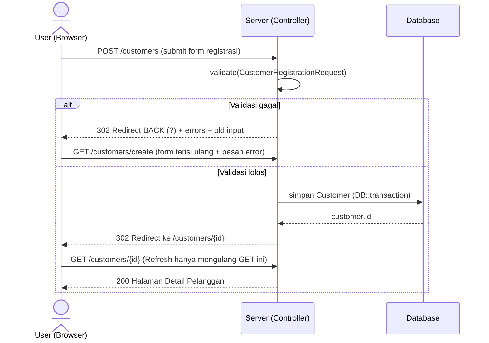
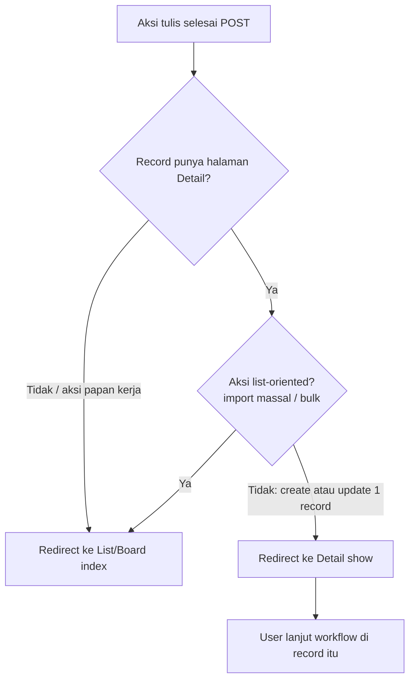

# Analisa Bug: List Pelanggan, Restore Gagal, Redirect, & Tumpang-Tindih REQ ID Migrasi

Tanggal: 2026-07-21
Modul terdampak: Data Pelanggan (`CustomerController`), Migrasi Legacy (importer `confirmMigrationImport`).

Dokumen ini merangkum verifikasi 4 keluhan terhadap kode + data dump legacy, status masing-masing,
dan perbaikan yang sudah dikerjakan untuk **Bug #1 (tumpang-tindih REQ ID lintas cabang)**.

---

## Ringkasan Verdict

| # | Keluhan | Verdict | Status |
|---|---------|---------|--------|
| 1 | Tumpang-tindih REQ ID `RQ000005` lintas cabang (jetis vs sand) → "penggunannya Hanif Saifulloh" | **BENAR** (korupsi relasi pembayaran) | **SUDAH DIPERBAIKI** |
| 2 | Pelanggan gagal "hilang" setelah tombol **Kembalikan** | **BENAR** (bug UX — status ke limbo) | **SUDAH DIPERBAIKI** |
| 3 | Search/filter di List Pelanggan Gagal/Putus selalu balik ke List Pelanggan | **BENAR** (bug form filter) | **SUDAH DIPERBAIKI** |
| 4 | Tambah/ubah Pelanggan/Task/Ticket selalu redirect ke halaman lain | **BUKAN bug** (pola PRG standar); ada inkonsistensi tujuan | **DISERAGAMKAN** (registrasi → detail) |

---

## Bug #1 — Tumpang-Tindih REQ ID Lintas Cabang (SUDAH DIPERBAIKI)

### Bukti data legacy

`RQ000005` muncul di **dua** dump dengan pemilik berbeda:

- `jetis_db_aplikasi_jetis.sql`: `RQ000005` ↔ `PE000003` = **Hanif Saifulloh**
- `sand_db_sandya.sql`: `RQ000005` ↔ `PE000005` = **Eva Rosdiana Sari**

Tiap cabang menomori ulang dari 1 (PE000001, RQ000001, IDBIAYA…), jadi nomor legacy
**tidak unik lintas cabang**.

### Yang sudah aman sebelum perbaikan ini

- `customer_code` → unique **per POP** (`unique(['pop_id','customer_code'])`, migration
  `2026_07_20_141841_scope_customer_code_unique_to_pop.php`). CID tetap unik meski dua cabang
  sama-sama `customer_code=RQ000005`.
- Duplicate-check di tahap validasi & lookup layanan/tech-detail/invoice sudah di-scope per cabang
  lewat `scopeToBranchPopDirect()` / `scopeToBranchPopViaCustomer()` / `findScopedCustomerId()`.

### Akar bug yang tersisa (penyebab "penggunannya Hanif")

`CustomerController::resolveLegacyInvoiceId()` — resolver invoice untuk baris **pembayaran** —
punya 3 fallback lookup ke tabel `invoices` **tanpa scope pelanggan/cabang**:

1. `Invoice::where('old_invoice_id', …)`
2. `Invoice::where('old_cost_id', old_transaction_id)`
3. `Invoice::where('old_request_id', …)->where('billing_period', …)`

Loop pembayaran juga **tidak** meresolusi `customerId` lebih dulu, jadi tidak ada konteks pelanggan
yang membatasi lookup. Akibatnya, jika **jetis di-import lebih dulu**, pembayaran milik Eva
(`RQ000005`, periode sama) resolve ke **invoice Hanif** (match pertama). `payment.customer_id`
diisi dari `invoice->customer_id` → pembayaran Eva menempel ke Hanif.

### Perbaikan

File: `app/Http/Controllers/CustomerController.php`

1. **Loop pembayaran** (`confirmMigrationImport`): resolusi `paymentCustomerId` dulu, di-scope per
   cabang — via `customersMap[old_customer_id]` → `findScopedCustomerId()` → fallback
   `CustomerService.old_request_id` yang di-scope `scopeToBranchPopViaCustomer()`. Lalu diteruskan
   ke `resolveLegacyInvoiceId(..., $paymentCustomerId)`.
2. **`resolveLegacyInvoiceId()`**: tambah parameter `?int $customerId`. Semua fallback DB dibungkus
   `$scope = fn ($q) => $customerId ? $q->where('customer_id', $customerId) : $q;` sehingga lookup
   dibatasi ke pelanggan pemilik pembayaran. Fallback in-run `$invoicesMap` (per-batch, per-cabang)
   tetap aman, tidak diubah.

Tidak ada perubahan skema DB. `old_request_id`/`old_customer_id` sengaja tetap disimpan **mentah**
(jejak legacy) — keunikan dijaga lewat scope query, konsisten dengan pola `customer_code`.

### Test regresi

`tests/Feature/LegacyPaymentAttachesToWrongBranchInvoiceTest.php` — import dua cabang (C/Jetis lalu
D/Sandya) dengan `RQ000005` + periode tagihan yang sama; pembayaran Eva hanya membawa
`old_request_id` (memaksa fallback #3). Assert: pembayaran & invoice Eva tetap milik Eva, bukan Hanif.
Sudah diverifikasi **gagal tanpa fix** (bocor ke Hanif) dan **lolos dengan fix**.

### Catatan re-import data lama

Data yang **sudah** di-import dengan bug ini bisa punya pembayaran salah-tempel. Path pemulihan:
rollback + re-import (lihat `docs/CHECKLIST_ROLLBACK_REIMPORT.md`) — importer sudah idempoten &
scoped per cabang. Repair langsung di DB bersifat destruktif → jangan dijalankan tanpa konfirmasi.

---

## Bug #2 — Pelanggan Gagal "Hilang" Setelah Kembalikan (SUDAH DIPERBAIKI)

### Akar bug

`CustomerController::restoreFromFailed()` mengembalikan `status` ke `previousStatus` (status sebelum
`rejected`). Keluar dari grup **Gagal** = benar. Tapi peta grup di `index()` **dulu** hanya mencakup:

- `survey` → `waiting_survey`, `surveyed`
- `verification` → `waiting_installation`, `installed`
- default → `active`, `suspended`

Status `survey_in_progress`, `waiting_acc`, `installation_in_progress`, `verification_admin`,
`revision_installation` **tidak masuk grup mana pun dan bukan default** → pelanggan yang dikembalikan
ke salah satu status itu lenyap dari semua daftar. Ini sebenarnya bug visibilitas yang lebih luas:
SEMUA pelanggan in-progress di status tersebut invisible, bukan cuma yang habis di-restore.

### Perbaikan

File: `app/Http/Controllers/CustomerController.php`

1. **Peta grup `index()` diperluas** menutup seluruh pipeline:
   - `survey` → `waiting_survey`, `survey_in_progress`, `surveyed`, `waiting_acc`
   - `verification` → `waiting_installation`, `installation_in_progress`, `installed`,
     `verification_admin`, `revision_installation`
2. **`restoreFromFailed()` redirect ke `customers.show`** (bukan `back()` ke daftar Gagal), dengan
   pesan menyebut tahap tujuan (label dari `subscription_statuses.name`). Pelanggan langsung terlihat
   di detail, tidak "menghilang", dan pesan memberi tahu di tab mana ia bisa dicari.

### Test regresi

`tests/Feature/RestoredFailedCustomerStaysVisibleTest.php` — (a) restore dari `rejected`
(asal `verification_admin`) mendarat di detail & muncul kembali di tab Verifikasi, tidak lagi di tab
Gagal; (b) pelanggan `survey_in_progress` & `waiting_acc` tampil di tab Survey. Diverifikasi **gagal
tanpa fix** (lenyap) dan **lolos dengan fix**.

## Bug #3 — Search di List Gagal/Putus Balik ke List Pelanggan (SUDAH DIPERBAIKI)

### Akar bug

Form filter `resources/views/customers/index.blade.php` (`<form action="/customers" method="GET">`)
**tidak** membawa hidden input `status_group` (dan `status`). Submit "Cari" dari
`?status_group=terminated|failed` kehilangan konteks tab → `index()` jatuh ke default
(`active+suspended`). Pencarian di grup Gagal/Putus jadi mustahil.

### Perbaikan

File: `resources/views/customers/index.blade.php` — tambah hidden input di dalam form filter yang
mempertahankan konteks saat submit (hanya di-render bila nilainya ada):

```blade
@if($statusGroup !== '')
    <input type="hidden" name="status_group" value="{{ $statusGroup }}">
@endif
@if($status !== '')
    <input type="hidden" name="status" value="{{ $status }}">
@endif
```

### Test regresi

`tests/Feature/CustomerListFilterKeepsStatusGroupTest.php` — (a) render daftar terminated memuat hidden
input `status_group=terminated`; (b) search di dalam grup terminated tetap ter-scope (pelanggan aktif
bernama mirip tidak ikut muncul). Diverifikasi **gagal tanpa fix** (hidden input hilang) dan **lolos
dengan fix**.

## Bug #4 — Redirect Setelah Simpan (BUKAN BUG, tapi DISERAGAMKAN)

### Kenapa selalu redirect (bukan "tetap di halaman")

Sistem ini pakai pola **PRG (Post/Redirect/Get)** — standar web untuk form yang menulis data.
Setelah `POST` berhasil menyimpan, server **tidak** merender HTML langsung, melainkan mengirim
`302 Redirect` ke sebuah URL `GET`. Browser lalu memuat URL itu. Efeknya: kalau user menekan
**Refresh**, yang diulang cuma `GET` (baca), **bukan** `POST` (tulis) — jadi data tidak dobel.

Kalau form **tetap** di halaman POST (tanpa redirect), tiap refresh = kirim ulang form = pelanggan/
tagihan/task dobel. Jadi "tetap di halaman" bukan opsi yang aman; pertanyaannya bukan *diam atau
pindah*, tapi *pindah ke mana*.

#### Visualisasi alur PRG di sistem ini



Poin kunci: panah terakhir yang dipegang browser adalah **GET** — refresh aman, tidak menulis ulang.

### Temuan: tujuan redirect tidak konsisten (sudah diseragamkan)

Perilaku **lama** berbeda-beda antar aksi:

| Aksi | Tujuan LAMA | Tujuan BARU | Berubah? |
|---|---|---|---|
| Registrasi Pelanggan (`store`) | List `customers.index` | **Detail** `customers.show` | ✅ diubah |
| Ubah Pelanggan (`update`) | Detail `customers.show` | Detail `customers.show` | — |
| Buat Ticket (`store`) | Detail `tickets.show` | Detail `tickets.show` | — |
| Ubah Task (`update`) | Detail `tasks.show` | Detail `tasks.show` | — |
| Assign/Switch tim FOP Task | List `fop-tasks.index` | List `fop-tasks.index` | — (sengaja) |
| Import massal pelanggan | List `customers.index` | List `customers.index` | — (sengaja) |

### Aturan baku tujuan redirect (keputusan)



- **Create/Update satu record → halaman Detail.** Konfirmasi tersimpan + permalink; registrasi = awal
  workflow pelanggan (draft → survey → verifikasi) jadi user langsung lanjut di record itu.
- **List/Board** hanya untuk aksi yang memang list-oriented: **import massal**, dan **aksi papan FOP**
  (assign team / switch teknisi) — FOP Task tidak punya halaman detail; papan `fop-tasks.index` adalah
  surface kerjanya, jadi redirect ke situ benar dan **tidak diubah**.

### Perbaikan

File: `app/Http/Controllers/CustomerController.php` — `store()` diubah dari
`redirect()->route('customers.index')` menjadi `redirect()->route('customers.show', $customer->id)`.
Tidak menyentuh update/ticket/task (sudah ke detail) maupun FOP Task & import (sengaja ke list).

### Test

`tests/Feature/CustomerCreateTest.php` — 2 assertion redirect di-update dari `/customers` ke
`/customers/{id}`; 4 test lolos. (`CustomerRegistrationTest` di-update assertion-nya juga, tapi test
itu **pre-existing broken** di baseline — registrasi menolak data valid di env test, tidak terkait
perubahan redirect ini.)

---

## Residual (di luar scope Bug #1, dicatat untuk sprint berikut)

- Dedup nomor HP di validasi customer (`Customer::where('phone', …)->orWhere('primary_phone', …)`,
  ~`CustomerController` line 1368) **tidak** di-scope cabang — dua cabang dengan HP sama bisa saling
  memblokir. Kelas tabrakan berbeda (HP, bukan REQ ID); tangani terpisah.
