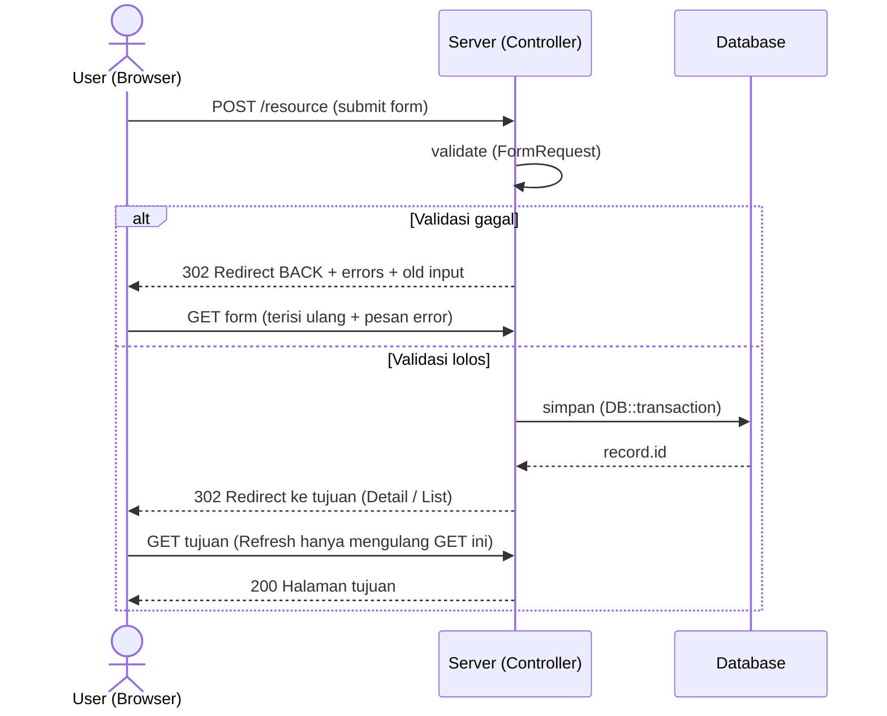
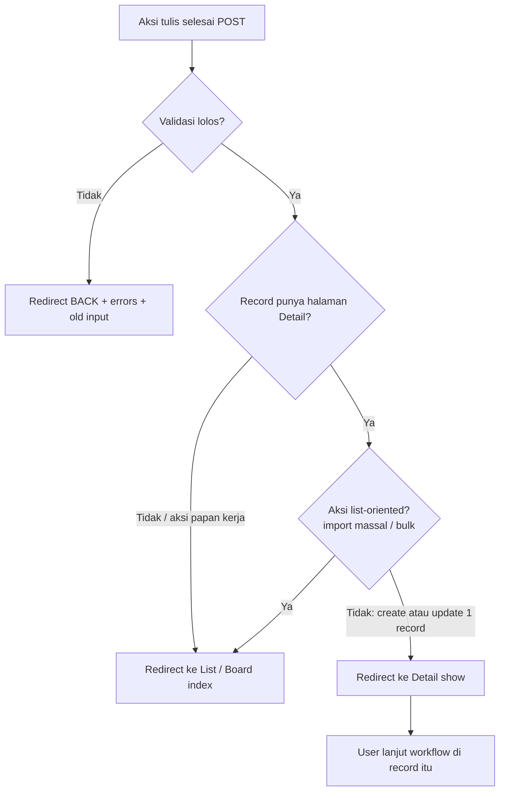

# Konvensi PRG & Tujuan Redirect Setelah Simpan

Berlaku untuk **semua** fitur yang menulis data lewat form (`POST`/`PUT`/`PATCH`/`DELETE`):
Pelanggan, Ticketing, Task Teknisi, FOP Task, Billing/Pembayaran, Pendaftaran, RBAC (User/Role).

Dokumen ini adalah **sumber kebenaran tunggal** untuk pola PRG di repo. Dok fitur cukup menunjuk ke
sini. Latar belakang keputusan: `docs/ANALISA_BUG_LIST_PELANGGAN_DAN_MIGRASI_REQ_ID.md` (Bug #4).

---

## Apa itu PRG (Post/Redirect/Get)

Setelah `POST` berhasil menyimpan, controller **tidak** merender HTML langsung, melainkan mengirim
`302 Redirect` ke sebuah URL `GET`. Browser lalu memuat URL itu. Halaman terakhir yang dipegang
browser adalah hasil **GET** (baca) — jadi kalau user menekan **Refresh**, yang diulang cuma GET,
**bukan** POST. Tanpa PRG, refresh = kirim ulang form = data dobel (pelanggan/tagihan/task ganda).

> **"Tetap di halaman" setelah simpan bukan opsi.** Pertanyaannya bukan *diam atau pindah*, tapi
> *pindah ke mana*.

### Alur PRG di sistem ini

---

## Aturan tujuan redirect (WAJIB diikuti kode baru)

1. **Validasi gagal → `back()`** dengan `->withErrors()` + `->withInput()` (form terisi ulang).
2. **Create/Update satu record → halaman Detail (`*.show`).** Konfirmasi tersimpan + permalink;
   biasanya record itu jadi springboard ke langkah berikutnya.
3. **List/Board (`*.index`)** hanya untuk aksi yang memang list-oriented: import massal, atau aksi di
   papan kerja yang tidak punya halaman detail (mis. papan FOP).
4. **Aksi pada child → Detail parent-nya.** Mis. catat pembayaran → detail invoice.
5. **Selalu** sertakan flash `->with('success'|'error'|'warning', ...)`.

---

## Peta tujuan redirect aktual per modul

| Modul | Aksi | Tujuan | Kategori |
|---|---|---|---|
| Pelanggan | Registrasi (`store`) | `customers.show` | Detail |
| Pelanggan | Ubah (`update`) | `customers.show` | Detail |
| Pelanggan | Kembalikan dari Gagal (`restoreFromFailed`) | `customers.show` | Detail |
| Pelanggan | Aktivasi manual (`activate`) | `customers.show` | Detail |
| Pelanggan | Import massal | `customers.index` | List (sengaja) |
| Ticketing | Buat tiket dari Worksheet (`store`, AJAX) | — stay-on-page | Pengecualian (sengaja) |
| Ticketing | Buat tiket dari halaman Task FOP (`store`, `origin=fop_tasks`) | `fop-tasks.index` | Board (sengaja) |
| Ticketing | Aksi tiket dari halaman **detail** (close/escalate/oncheck-noc/return/cancel) | `tickets.show` | Detail |
| Ticketing | Aksi tiket dari **list/worksheet** (AJAX) | — baris hilang in-place | Pengecualian (sengaja) |
| Task Teknisi | Ubah task (`update`) | `tasks.show` | Detail |
| Task Teknisi | Batalkan task (`cancel`) | `fop.dashboard` | Board (sengaja) |
| FOP Task | Assign team / switch teknisi | `fop-tasks.index` | Board (sengaja — tak ada detail) |
| Billing | Catat pembayaran (`store`) | `invoices.show` | Detail parent (invoice) |

> Kolom **"sengaja"** = pengecualian sadar dari aturan #2, sesuai aturan #3/#4. FOP Task **tidak
> punya** halaman detail (hanya index + edit modal + history); papan `fop-tasks.index` adalah surface
> kerjanya.
>
> **Ticketing punya dua mode**, tergantung dari mana aksinya dipicu — dan ini bukan
> inkonsistensi:
> - **Dari halaman detail** (`tickets/show`): POST native → redirect ke `tickets.show`. PRG normal.
> - **Dari worksheet/list**: `fetch()` JSON, controller bercabang di `$request->wantsJson()`.
>   Tidak ada navigasi sama sekali — baris tiket dihapus in-place, form submit auto-reset dan
>   fokus balik ke kolom pencarian. Redirect di sini justru **melanggar tujuan** halamannya:
>   Helpdesk/NOC memproses banyak tiket beruntun dari satu layar, ke-bounce ke halaman detail
>   tiap satu klik bikin mereka harus navigasi balik terus-terusan.
>
> Prinsip PRG tetap terjaga di dua-duanya: tidak ada entry `POST` di history browser yang
> bisa di-refresh dan resubmit.

---

## Kesalahan yang harus dihindari

- ❌ Render view langsung dari handler `POST` (tanpa redirect) → refresh = double-submit.
- ❌ Create record lalu redirect ke List padahal record punya Detail → user harus cari ulang record
  yang barusan dibuat (ini persis Bug #4 pada registrasi pelanggan, sudah diperbaiki).
- ❌ Redirect ke halaman yang menyembunyikan record hasil aksi (mis. `back()` ke daftar yang record-nya
  sudah keluar dari situ — Bug #2 restore pelanggan gagal).
