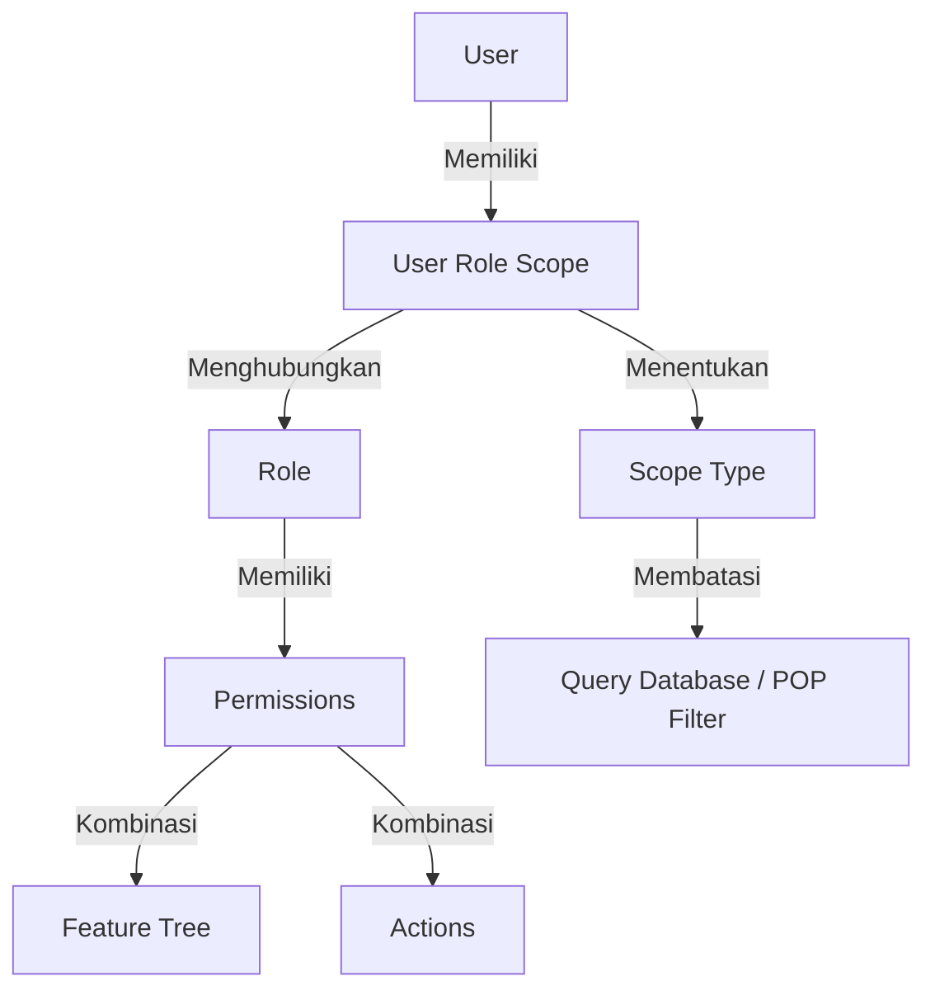

# RBAC_MATRIX.md - Advanced Hierarchical RBAC Design

# Website Billing ISP Berbasis Master Data Pelanggan

## 1. Tujuan Dokumen

Dokumen ini mendefinisikan desain **Advanced Hierarchical RBAC (Role-Based Access Control)** yang menggabungkan konsep **Role**, **Feature Tree**, **Action Permission**, dan **User Scope**. 

Pengembang/AI wajib merujuk ke dokumen ini saat membangun atau memodifikasi:
- Menu Navigasi & Sidebar
- Route & Controller Middleware
- Eloquent Queries & Model Policies
- Global Data Scopes (POP/Cabang)
- Tampilan Field Sensitif (PPPoE, WiFi, Data Teknis)
- Audit Logs

---

## 2. Prinsip Utama Desain Advanced RBAC

Untuk menghindari kompleksitas berlebih dan menjaga sistem tetap fleksibel, desain ini memisahkan secara tegas tiga dimensi keamanan:

1. **Role (Siapa Anda):** Menentukan profil umum pekerjaan (misal: NOC, Teknisi, Sales). **Dilarang keras membuat Role per cabang** (seperti *NOC Cabang Ponorogo* atau *Teknisi Siman*).
2. **Permission (Aksi Apa yang Bisa Dilakukan):** Ditentukan dengan format `{feature_code}.{action_code}` yang merepresentasikan akses spesifik pada node Feature Tree.
3. **User Scope (Data Wilayah Mana yang Bisa Dilihat):** Menentukan cakupan data (POP/Cabang) yang boleh diakses oleh user.



### Kasus Contoh Riil:
- **NOC Pusat:** 
  - Role: `NOC`
  - Scope: `all_pop` (Dapat memantau dan mengelola seluruh POP di Indonesia)
- **POP Admin Siman:** 
  - Role: `POP Admin`
  - Scope: `selected_pop` dengan target `POP Siman` (Hanya dapat mengelola operasional untuk wilayah POP Siman saja)
- **Teknisi Lapangan Jetis:** 
  - Role: `Teknisi`
  - Scope: `assigned_only` atau `selected_pop` dengan target `POP Jetis` (Hanya melihat tugas survey/pemasangan miliknya atau data di POP Jetis)

---

## 3. Daftar Role Utama

Sistem memiliki **9 Role Utama** berikut:

| No | Role Code | Role Name | Deskripsi Singkat |
|---|---|---|---|
| 1 | `owner` | Owner | Pemilik bisnis dengan akses penuh tanpa batas ke seluruh fitur dan cabang. |
| 2 | `atasan` | Atasan / Manager | Manajemen pusat untuk memantau dashboard, laporan, audit log, tanpa akses mengubah konfigurasi sistem inti. |
| 3 | `admin` | Admin | Operator pusat yang mengelola konfigurasi master data (paket, user, POP) dan operasional nasional. |
| 4 | `noc` | NOC (Network Operations) | Tim teknis jaringan pusat/cabang yang mengelola data teknis pelanggan (IP, VLAN, OLT, PPPoE). |
| 5 | `helpdesk` | Helpdesk / CS Pusat | Layanan pelanggan tingkat pusat/cabang untuk pendaftaran, keluhan awal, dan informasi billing dasar. |
| 6 | `fop` | FOP (Field Operations) | Koordinator lapangan yang mengatur penjadwalan survey, pemasangan, dan tim teknisi di cabang. |
| 7 | `teknisi` | Teknisi | Eksekutor lapangan yang mengisi laporan survey, melakukan instalasi fisik, dan mencatat perangkat. |
| 8 | `sales` | Sales / Marketing | Agen penjualan yang berfokus menginput registrasi calon pelanggan baru. |
| 9 | `pop_admin` | POP Admin | Administrator lokal POP/Cabang yang mengelola operasional harian cabang terkait. |

---

## 4. Feature Tree & Action Permission

Akses kontrol diatur menggunakan permission dinamis berbasis kombinasi **Feature** (Modul/Fitur bertingkat) dan **Action** (Aksi yang diizinkan).

### 4.1 Format Permission Code
Format kode permission wajib berupa string lowercase:
```
{feature_code}.{action_code}
```
*Contoh:* `customers.view`, `customers.detail.devices.view_sensitive`, `invoices.print`.

### 4.2 Standard Actions
Daftar action standar yang didukung oleh sistem:
- `view`: Melihat daftar data / halaman utama.
- `create`: Menambah data baru.
- `update`: Mengubah data umum.
- `delete`: Menghapus data (soft delete).
- `import`: Mengimpor data dari Excel/CSV.
- `export`: Mengekspor data ke PDF/Excel.
- `print`: Mencetak dokumen (seperti invoice/tanda terima).
- `validate`: Memvalidasi atau menyetujui langkah workflow (misal: verifikasi berkas).
- `activate`: Mengaktifkan layanan / status.
- `cancel`: Membatalkan transaksi / tagihan / status.
- `upload`: Mengunggah berkas lampiran (KTP, bukti bayar).
- `download`: Mengunduh berkas template atau lampiran.
- `view_sensitive`: Melihat field sensitif (password PPPoE, password WiFi).
- `update_sensitive`: Mengubah field sensitif.

---

### 4.3 Peta Feature Tree & Allowed Actions (MVP Scope)

Berikut adalah struktur fitur MVP yang valid. **Dilarang memasukkan fitur post-MVP di sini.**

```
- dashboard (view)
- pops (view, create, update, delete, deactivate)
- users (view, create, update, delete, assign)
- roles (view, create, update, delete)
- packages (view, create, update, delete, deactivate)
- customers (view, create, update, delete)
    ├── customers.import (view, download, upload, validate, activate)
    └── customers.detail (view)
        ├── customers.detail.identity (view, update, view_sensitive, update_sensitive)
        ├── customers.detail.address (view, update)
        ├── customers.detail.packages (view, update)
        ├── customers.detail.survey (view, update, validate)
        ├── customers.detail.installation (view, update, validate, activate)
        ├── customers.detail.devices (view, update, view_sensitive, update_sensitive)
        └── customers.detail.documents (view, upload, download, delete)
- invoices (view, create, update, cancel, print)
- payments (view, create, update, validate, reject, upload, print)
- reports (view, export)
- audit_logs (view)
```

---

## 5. Matriks Permission Per Role (Default Mapping)

Matriks berikut menentukan permission default yang dimasukkan melalui database seeder.

| Feature / Sub-Feature | Owner | Atasan | Admin | NOC | Helpdesk | FOP | Teknisi | Sales | POP Admin |
|---|:---:|:---:|:---:|:---:|:---:|:---:|:---:|:---:|:---:|
| **dashboard.view** | Yes | Yes | Yes | Yes | Yes | Yes | Yes | Yes | Yes |
| **pops.*** | Yes | View | Yes | View | View | No | No | No | View |
| **users.*** | Yes | View | Yes | No | No | No | No | No | No |
| **roles.*** | Yes | View | Yes | No | No | No | No | No | No |
| **packages.*** | Yes | View | Yes | View | View | No | No | No | View |
| **customers.view** | Yes | Yes | Yes | Yes | Yes | Yes | Yes | Yes | Yes |
| **customers.create** | Yes | No | Yes | No | Yes | No | No | Yes | Yes |
| **customers.update** | Yes | No | Yes | No | Yes | No | No | Yes | Yes |
| **customers.delete** | Yes | No | Yes | No | No | No | No | No | No |
| **customers.import.*** | Yes | No | Yes | No | No | No | No | No | Yes |
| **customers.detail.survey.view** | Yes | Yes | Yes | Yes | Yes | Yes | Yes | No | Yes |
| **customers.detail.survey.update** | Yes | No | Yes | Yes | No | Yes | Yes | No | Yes |
| **customers.detail.survey.validate** | Yes | No | Yes | Yes | No | Yes | No | No | Yes |
| **customers.detail.installation.view** | Yes | Yes | Yes | Yes | Yes | Yes | Yes | No | Yes |
| **customers.detail.installation.update**| Yes | No | Yes | Yes | No | Yes | Yes | No | Yes |
| **customers.detail.installation.validate**| Yes | No | Yes | Yes | No | Yes | No | No | Yes |
| **customers.detail.installation.activate**| Yes | No | Yes | Yes | No | Yes | Yes | No | Yes |
| **customers.detail.devices.view** | Yes | Yes | Yes | Yes | Yes | Yes | Yes | No | Yes |
| **customers.detail.devices.update** | Yes | No | Yes | Yes | No | Yes | Yes | No | Yes |
| **customers.detail.devices.view_sensitive**| Yes | No | No | Yes | No | No | Yes | No | No |
| **customers.detail.devices.update_sensitive**| Yes | No | No | Yes | No | No | Yes | No | No |
| **invoices.view** | Yes | Yes | Yes | View | Yes | No | No | No | Yes |
| **invoices.create** | Yes | No | Yes | No | Yes | No | No | No | Yes |
| **invoices.update** | Yes | No | Yes | No | No | No | No | No | No |
| **invoices.cancel** | Yes | No | Yes | No | No | No | No | No | No |
| **invoices.print** | Yes | Yes | Yes | Yes | Yes | No | No | No | Yes |
| **payments.view** | Yes | Yes | Yes | No | Yes | No | No | No | Yes |
| **payments.create** | Yes | No | Yes | No | Yes | No | No | No | Yes |
| **payments.validate** | Yes | No | Yes | No | No | No | No | No | Yes |
| **payments.reject** | Yes | No | Yes | No | No | No | No | No | Yes |
| **payments.print** | Yes | Yes | Yes | Yes | Yes | No | No | No | Yes |
| **reports.view** | Yes | Yes | Yes | No | Yes | No | No | No | Yes |
| **reports.export** | Yes | Yes | Yes | No | Yes | No | No | No | Yes |
| **audit_logs.view** | Yes | Yes | Yes | No | No | No | No | No | No |

---

## 6. Aturan Khusus & Batasan Role (MVP Logic)

Untuk menjamin kepatuhan bisnis, batasan-batasan berikut wajib diterapkan baik di sisi UI (Front-end) maupun Backend (Policies & Controllers):

1. **Admin (dengan tugas Finance/Kasir):**
   - Tidak boleh mengubah data teknis pelanggan (modem, IP, VLAN) jika hanya bertugas sebagai kasir.
   - Tidak boleh melihat password PPPoE atau WiFi pelanggan (kecuali diberi override izin khusus).
   - Tagihan yang sudah berstatus Lunas tidak boleh dihapus atau diubah nominalnya.
2. **Teknisi:**
   - Sama sekali tidak boleh mengakses menu pembayaran atau mencatat pembayaran baru.
   - Tidak boleh membuat invoice tagihan atau mengubah nominal tagihan.
   - Tidak boleh mengakses laporan keuangan global maupun cabang.
3. **Helpdesk:**
   - Tidak boleh mengubah nominal tagihan yang sudah terbit.
   - Tidak boleh melakukan validasi pembayaran masuk.
   - Tidak boleh melihat/mengubah password PPPoE/WiFi teknis.
   - Tidak boleh menghapus data pelanggan dari sistem.
4. **Sales:**
   - Hanya boleh mendaftarkan pelanggan baru.
   - Tidak boleh melihat laporan keuangan maupun audit log.
   - Data pelanggan yang bisa dilihat dibatasi hanya pelanggan yang dia daftarkan (`own_created`) atau pelanggan dalam satu POP jika disetujui.

---

## 7. Definisi User Scope (Pembatasan Data Cabang)

User Scope menentukan baris data mana (wilayah POP/Cabang) yang boleh diakses oleh user. Filter scope harus dievaluasi secara otomatis pada query database.

### 7.1 Tipe-tipe Scope:
- **`all_pop`**: User memiliki akses ke seluruh data tanpa filter wilayah POP.
  - *Digunakan oleh:* Owner, Atasan, Admin Pusat, NOC Pusat.
- **`selected_pop`**: User hanya memiliki akses ke data yang terhubung dengan daftar POP tertentu yang telah ditugaskan secara eksplisit di tabel `user_role_scope_targets`.
  - *Digunakan oleh:* POP Admin, Helpdesk Cabang, Sales Cabang.
- **`pop_tree`**: User memiliki akses ke satu POP Cabang utama beserta seluruh Mini POP (sub-POP) di bawah hierarkinya.
- **`assigned_only`**: User hanya dapat melihat data pekerjaan (seperti survey/pemasangan) yang di-assign langsung kepada dirinya.
  - *Digunakan oleh:* Teknisi Lapangan.
- **`own_created`**: User hanya dapat melihat data yang dibuat oleh ID user yang bersangkutan.
  - *Digunakan oleh:* Sales Lapangan.

---

## 8. Panduan Teknis Implementasi (Route & Query Enforcement)

### 8.1 Proteksi Route Middleware
Setiap route harus diamankan hanya menggunakan **Permission Middleware** (`permission:{code}` atau `permission:{feature},{action}`). **Dilarang keras mengecek nama role di dalam route.**

*Contoh yang salah (Hardcoded Role):*
```php
// ❌ HINDARI CARA INI
Route::post('/payments', [PaymentController::class, 'store'])->middleware('role:Finance');
```

*Contoh yang benar (Permission-Based):*
```php
//  GUNAKAN CARA INI
Route::post('/payments', [PaymentController::class, 'store'])->middleware('permission:payments.create');
```

### 8.2 Enforcement Query (Global Scope)
Filter wilayah cabang wajib dilakukan di tingkat database menggunakan Eloquent Global Scope (misalnya `PopScope`) untuk menghindari kebocoran data tak sengaja.

```php
// Sketsa Penerapan Eloquent Global Scope
class PopScope implements Scope
{
    public function apply(Builder $builder, Model $model)
    {
        $user = auth()->user();
        if (!$user) return;

        // Ambil scope aktif user untuk role saat ini
        $activeScope = $user->activeRoleScope; 

        match ($activeScope->scope_type) {
            'all_pop'       => null, // Tanpa filter
            'selected_pop'  => $builder->whereIn($model->getTable().'.pop_id', $activeScope->target_pop_ids),
            'pop_tree'      => $builder->whereIn($model->getTable().'.pop_id', $activeScope->getDescendantPopIds()),
            'assigned_only' => $builder->where('assigned_user_id', $user->id),
            'own_created'   => $builder->where('created_by', $user->id),
        };
    }
}
```

### 8.3 Proteksi Field Sensitif (Field-Level Permission)
Field sensitif seperti password PPPoE/WiFi atau credential teknis tidak boleh langsung dikirim ke view jika user tidak memiliki izin `view_sensitive`.

*Contoh Implementasi Blade / Controller:*
```php
// Di Controller atau API Resource
$data = [
    'username' => $customer->username,
    'pppoe_username' => $customer->pppoe_username,
];

if ($user->hasPermission('customers.detail.devices.view_sensitive')) {
    $data['pppoe_password'] = $customer->pppoe_password;
    $data['wifi_password'] = $customer->wifi_password;
} else {
    $data['pppoe_password'] = '******';
    $data['wifi_password'] = '******';
}
```

---

## 9. Penanganan User Terhapus (Pencegahan Kehilangan History)

Sesuai aturan kritis sistem:
- **Dilarang keras menggunakan Cascade Delete** yang dapat menghapus data transaksi, riwayat survey, instalasi, tagihan, atau pembayaran secara permanen saat akun user (seperti Sales, FOP, atau Teknisi) dinonaktifkan atau dihapus.
- Gunakan **Soft Delete** pada model `User`.
- Semua relasi transaksi luar wajib menggunakan constraint `onDelete('restrict')` atau diset ke null (`nullable` dengan `onDelete('set null')`) agar histori keuangan dan audit log tetap utuh.
- Untuk log aktivitas penting, nama user pada saat transaksi disimpan dalam teks statis (snapshot text) pada log audit atau pembayaran untuk referensi masa depan.
