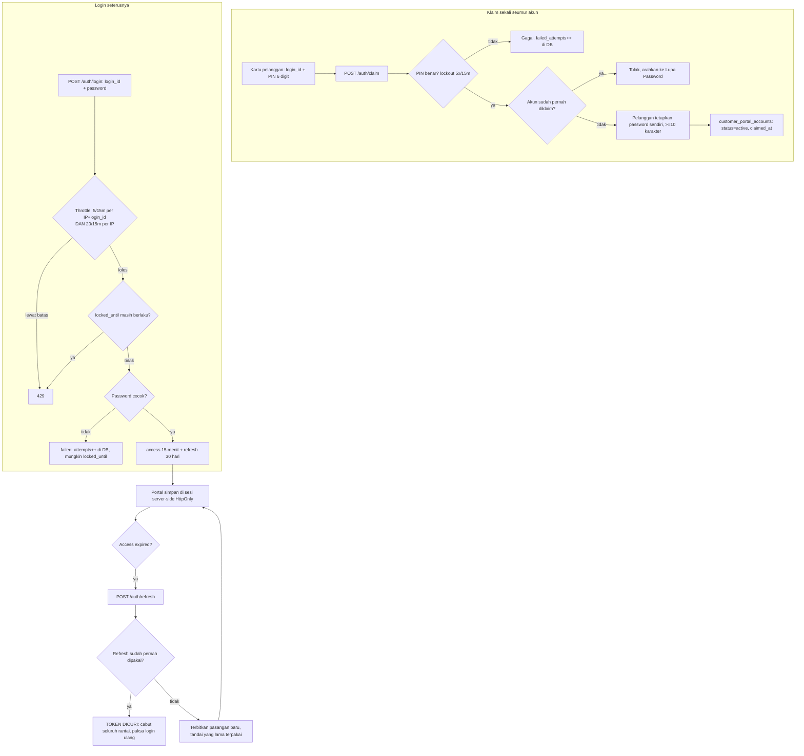
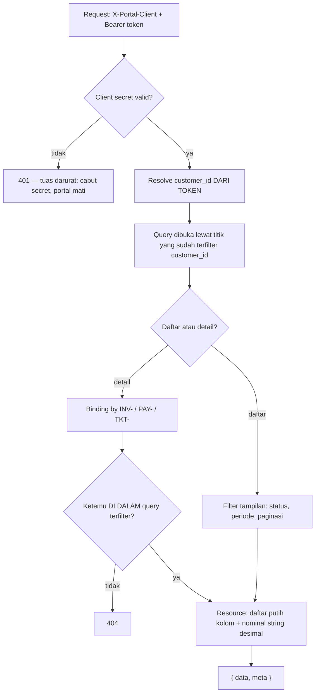
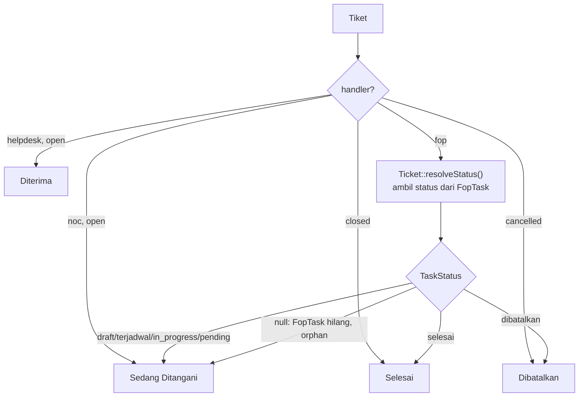
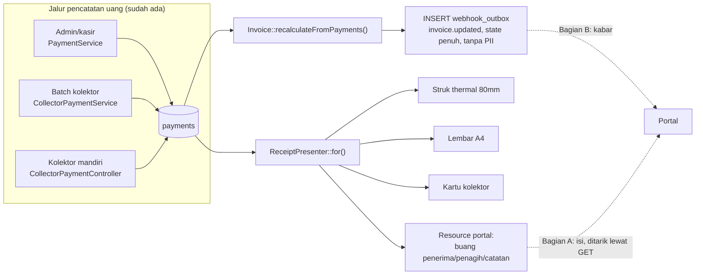

# Flowchart — API 2: Portal Pelanggan

## 1. Klaim akun, login, dan rotasi token

Hitungan kegagalan disimpan **di DB**, bukan hanya di rate limiter. Limiter tinggal di
cache, dan cache bisa di-flush — lockout ikut hilang bersamanya. Alasan yang sama
dipakai untuk lockout PIN di §6.5.4.

Dua limiter untuk kredensial, bukan satu. Kunci per-`login_id` saja memberi ember baru
untuk tiap login ID, jadi penyapuan satu percobaan × 1.900 akun dari satu IP tidak
pernah menyentuh batas. Limiter per-IP yang menghentikannya.

Pelanggan tanpa akun portal dijawab **401 kredensial salah**, bukan "akun belum
diaktifkan" — pesan kedua memberi tahu penebak bahwa login ID itu valid, dan seluruh
guna throttle hilang.

---

## 2. Pengambilan data dan penjaga kepemilikan

Penjaganya ada di **satu** tempat: query dibuka sudah terfilter, dan binding mencari
di dalam query itu — bukan `Invoice::where('invoice_number', ...)` lalu dicek
belakangan. Bedanya kelihatan saat controller keenam ditulis oleh orang yang belum
membaca dokumen ini: pola pertama gagal aman, pola kedua gagal terbuka.

Nomor milik pelanggan lain dijawab **404**, sama persis dengan nomor yang tidak ada.

---

## 3. Status tiket — kenapa `tickets.status` tidak boleh dibaca langsung

Begitu `handler = FOP`, `TicketHandlingStatus` **berhenti bermakna** — status
sesungguhnya turun dari FopTask/Task. Presenter yang cuma membaca `tickets.status`
akan menampilkan "Sedang Ditangani" selamanya untuk tiket yang sudah lama selesai di
lapangan.

`Ticket::resolveStatus()` (`app/Models/Ticket.php:439`) sudah menangani sisi itu —
pakai, jangan tulis resolusi kedua. Yang **tidak** dipakai adalah
`Ticket::statusLabel()` (`:447`): ia label untuk staf dan mengembalikan "Diproses NOC",
"Ditangani Helpdesk", "Terputus" — struktur organisasi internal yang §6.6.7 larang
keluar.

Tiket orphan tampil sebagai "Sedang Ditangani", bukan "Terputus". Orphan adalah
kegagalan data internal kita; memindahkannya ke layar pelanggan tidak menolong
siapa pun. `Ticket::isOrphan()` (`:83`) tetap memunculkannya di sisi internal.

---

## 4. Kwitansi — dua bagian, dua mekanisme

**Bagian A — isi kwitansi.** Tidak ada yang perlu dibangun: kwitansi turunan dari
baris `payments`, dirakit saat diminta oleh presenter yang sama untuk keempat
keluaran. Pembayaran yang dicatat kolektor di lapangan langsung tersedia begitu
barisnya tersimpan. Yang **wajib** ditambahkan hanyalah pemangkasan `penerima`,
`penagih`, dan `catatan` — ketiganya data pegawai, dan tanpa dipangkas satu endpoint
kwitansi membatalkan daftar putih endpoint `/me/payments` di sebelahnya.

**Bagian B — kabar bahwa pembayaran selesai.** Karena portal aplikasi terpisah tanpa
akses DB, ia tidak tahu ada pembayaran baru sampai seseorang membuka halaman. Titik
picunya `Invoice::recalculateFromPayments()` — **bukan** `PaymentObserver`, yang
melewatkan jalur penolakan pembayaran dan menembak sebelum invoice selesai dihitung.

Webhook memberi tahu, API yang jadi kebenaran. Kalau webhook hilang, portal tetap
benar begitu halaman dibuka, karena halamannya menarik dari `GET /me/invoices`.
