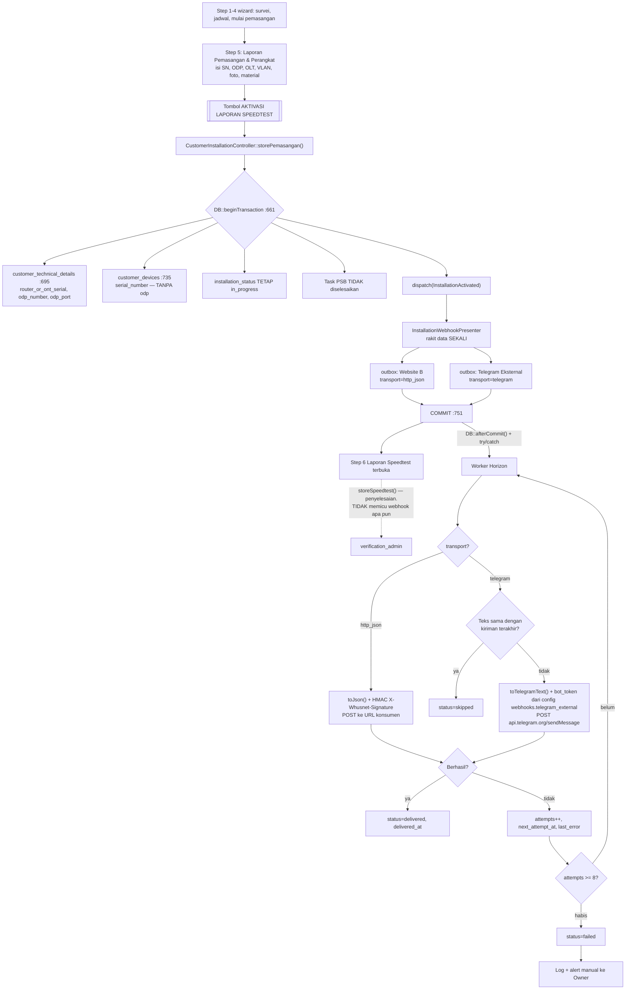
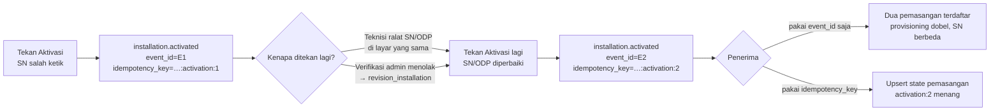

# Flowchart — API 1: Webhook Pemasangan

## 1. Dari tombol Aktivasi sampai sistem luar

Telegram **Internal** tidak muncul di diagram ini sama sekali — ia tetap berjalan
inline lewat `TelegramBotService` di enam tempat yang sudah ada, tidak disentuh, dan
tidak melewati outbox. Yang ada di sini hanya Telegram **Eksternal**.

Lima hal yang menentukan benar-tidaknya alur ini:

**Pemicunya tombol Aktivasi, bukan Mulai Pemasangan dan bukan penyelesaian laporan.**
Pada titik inilah keenam data yang diminta — nama, POP, desa, paket, SN, ODP — sudah
lengkap di database untuk pertama kalinya.

**Event `InstallationActivated` dibuat baru.** `storePemasangan()` tidak menyiarkan
apa pun sebelum perubahan ini — `broadcast()` di controller ini hanya ada di titik
lain (`start()`, `store()` legacy, `storeSpeedtest()`).

**Baris outbox ditulis di dalam transaksi, pengiriman terjadi setelah commit —
dibungkus try/catch eksplisit.** `storePemasangan()` memakai `DB::beginTransaction()`
manual (`:661`) dengan commit di `:751`. Dispatch job dibungkus
`DB::afterCommit(fn () => try { ... } catch (Throwable $e) { Log::error(...) })` di
`SendInstallationActivatedWebhooks::dispatchAfterCommitSafely()` — bukan
`->afterCommit()` polos, karena di queue `sync` itu mengeksekusi job inline saat
`DB::commit()` dipanggil, dan kalau job melempar, exception-nya bisa naik balik ke
`storePemasangan()`'s try/catch dan memicu `DB::rollBack()` padahal commit sudah
sukses. Kegagalan kirim webhook tidak boleh pernah menggagalkan alur yang
memicunya.

**Retry mengirim payload yang tersimpan, bukan merakit ulang.** Satu baris outbox =
satu event; `attempts` dinaikkan di tempat.

**Kegagalan tidak boleh hilang diam-diam.** Baris `failed` tetap tinggal sebagai
daftar rekonsiliasi. `delivered` yang dipruning 90 hari, bukan `failed`.

**Dua transport sengaja berbeda perilaku pada Aktivasi berulang.** Website B menerima
setiap penekanan. Telegram melewati kiriman yang teksnya tidak berubah.

---

## 2. Aktivasi ditekan berulang — kenapa `event_id` saja tidak cukup

`storePemasangan()` tidak mengunci apa pun setelah sukses — `updateOrCreate` di `:695`
dan `:735` memang dirancang supaya teknisi bisa meralat. Ditambah alur revisi
(`revision_installation` diterima di `:574`), penekanan berulang adalah **jalur
normal**, bukan kasus tepi.

`event_id` menjawab "apakah kiriman ini duplikat jaringan". `idempotency_key` menjawab
"apakah event ini menggantikan yang sebelumnya". Keduanya dibutuhkan, dan keduanya
punya aturan berbeda soal kapan nilainya sama.
