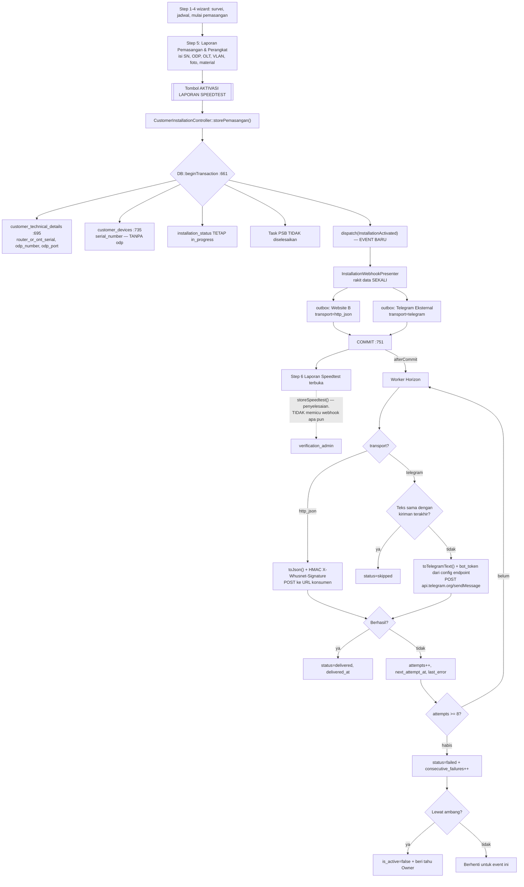
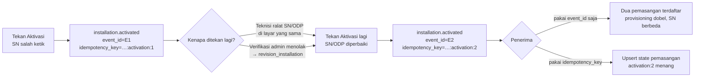
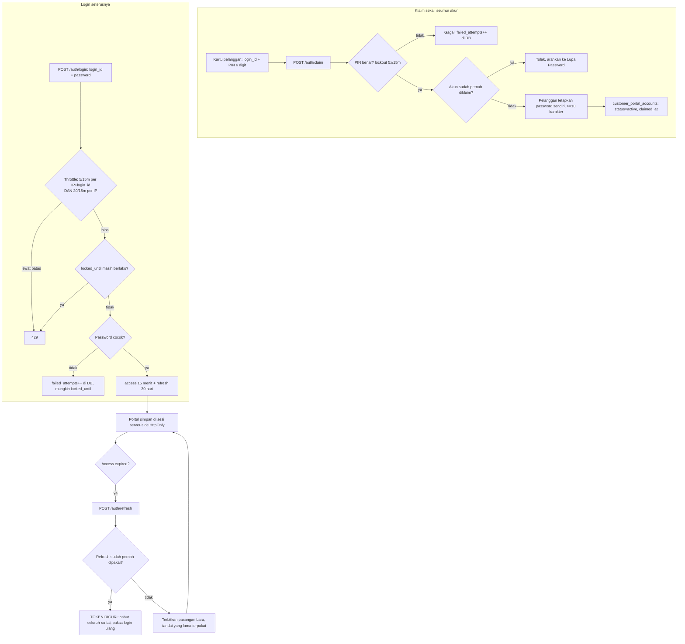
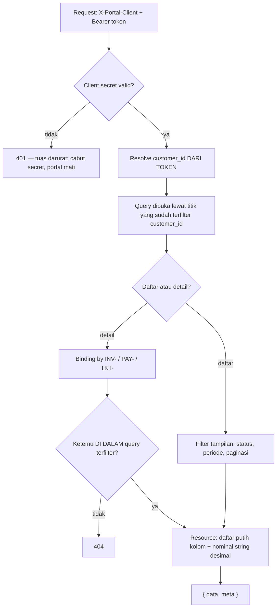
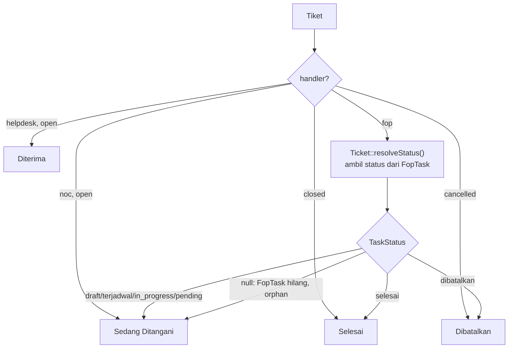
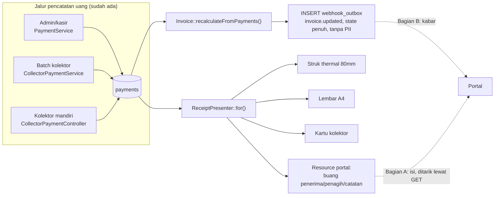

# Flowchart — API Eksternal

## 1. Webhook Pemasangan — dari tombol Aktivasi sampai sistem luar

Telegram **Internal** tidak muncul di diagram ini sama sekali — ia tetap berjalan
inline lewat `TelegramBotService` di enam tempat yang sudah ada, tidak disentuh, dan
tidak melewati outbox. Yang ada di sini hanya Telegram **Eksternal**.

Lima hal yang menentukan benar-tidaknya alur ini:

**Pemicunya tombol Aktivasi, bukan Mulai Pemasangan dan bukan penyelesaian laporan.**
Pada titik inilah keenam data yang diminta — nama, POP, desa, paket, SN, ODP — sudah
lengkap di database untuk pertama kalinya. Di tombol Mulai Pemasangan (`start()`)
SN dan ODP belum ada; di `storeSpeedtest()` sudah terlambat.

**Event `InstallationActivated` harus dibuat baru.** `storePemasangan()` tidak
menyiarkan apa pun hari ini — `broadcast()` di controller ini hanya ada di `:101`,
`:524`, dan `:873`. Ini satu-satunya bagian rancangan yang menuntut perubahan pada
`CustomerInstallationController`.

**Baris outbox ditulis di dalam transaksi, pengiriman terjadi setelah commit.**
`storePemasangan()` memakai `DB::beginTransaction()` manual (`:661`) dengan commit di
`:751`. Job yang berjalan sebelum commit membaca `customer_technical_details` yang
belum tertulis, jadi SN dan ODP terkirim `null` padahal teknisi baru saja mengisinya.
Kalau transaksi di-rollback, sistem luar sudah diberi tahu soal pemasangan yang tidak
pernah tercatat.

**Retry mengirim payload yang tersimpan, bukan merakit ulang.** Satu baris outbox =
satu event; `attempts` dinaikkan di tempat. Merakit ulang dari model berarti percobaan
ke-3 bisa membawa data yang sudah berubah, lalu dibuang penerima sebagai duplikat
`event_id` — perubahan itu hilang tanpa jejak.

**Kegagalan tidak boleh hilang diam-diam.** Baris `failed` tetap tinggal sebagai
daftar rekonsiliasi. `delivered` yang dipruning 90 hari, bukan `failed`.

**Pemilihan endpoint terjadi saat baris outbox dibuat.** Satu kejadian bisa punya
banyak pelanggan endpoint; data dirakit **sekali** oleh presenter, satu baris outbox
per endpoint, lalu tiap baris dirender dan diautentikasi menurut transport-nya
sendiri. Website B mati tidak menahan Telegram, dan sebaliknya.

**Dua transport sengaja berbeda perilaku pada Aktivasi berulang.** Website B menerima
setiap penekanan — penekanan kedua sering membawa SN/ODP yang benar. Telegram melewati
kiriman yang teksnya tidak berubah, karena kanal yang dibaca manusia punya batas
sekitar 20 pesan/menit dan membanjirinya berarti membuang pesan, bukan sekadar berisik.

---

## 2. Aktivasi ditekan berulang — kenapa `event_id` saja tidak cukup

`storePemasangan()` tidak mengunci apa pun setelah sukses — `updateOrCreate` di `:695`
dan `:735` memang dirancang supaya teknisi bisa meralat. Ditambah alur revisi
(`revision_installation` diterima di `:574`), penekanan berulang adalah **jalur
normal**, bukan kasus tepi.

`event_id` menjawab "apakah kiriman ini duplikat jaringan". `idempotency_key` menjawab
"apakah event ini menggantikan yang sebelumnya". Keduanya dibutuhkan, dan keduanya
punya aturan berbeda soal kapan nilainya sama.

---

## 3. Portal — klaim akun, login, dan rotasi token

Hitungan kegagalan disimpan **di DB**, bukan hanya di rate limiter. Limiter tinggal di
cache, dan cache bisa di-flush — lockout ikut hilang bersamanya. Alasan yang sama
dipakai untuk lockout PIN di §6.5.4.

Dua limiter untuk kredensial, bukan satu. Kunci per-`login_id` saja memberi ember baru
untuk tiap login ID, jadi penyapuan satu percobaan × 1.900 akun dari satu IP tidak
pernah menyentuh batas. Limiter per-IP yang menghentikannya.

Pelanggan tanpa akun portal dijawab **401 kredensial salah**, bukan "akun belum
diaktifkan" — pesan kedua memberi tahu penebak bahwa login ID itu valid, dan seluruh
guna throttle hilang.

---

## 4. Portal — pengambilan data dan penjaga kepemilikan

Penjaganya ada di **satu** tempat: query dibuka sudah terfilter, dan binding mencari
di dalam query itu — bukan `Invoice::where('invoice_number', ...)` lalu dicek
belakangan. Bedanya kelihatan saat controller keenam ditulis oleh orang yang belum
membaca dokumen ini: pola pertama gagal aman, pola kedua gagal terbuka.

Nomor milik pelanggan lain dijawab **404**, sama persis dengan nomor yang tidak ada.

---

## 5. Status tiket — kenapa `tickets.status` tidak boleh dibaca langsung

Begitu `handler = FOP`, `TicketHandlingStatus` **berhenti bermakna** — status
sesungguhnya turun dari FopTask/Task. Presenter yang cuma membaca `tickets.status`
akan menampilkan "Sedang Ditangani" selamanya untuk tiket yang sudah lama selesai di
lapangan.

`Ticket::resolveStatus()` (`app/Models/Ticket.php:439`) sudah menangani sisi itu —
pakai, jangan tulis resolusi kedua. Yang **tidak** dipakai adalah
`Ticket::statusLabel()` (`:447`): ia label untuk staf dan mengembalikan "Diproses NOC",
"Ditangani Helpdesk", "Terputus" — struktur organisasi internal yang §6.6.7 larang
keluar.

Tiket orphan tampil sebagai "Sedang Ditangani", bukan "Terputus". Orphan adalah
kegagalan data internal kita; memindahkannya ke layar pelanggan tidak menolong
siapa pun. `Ticket::isOrphan()` (`:83`) tetap memunculkannya di sisi internal.

---

## 6. Kwitansi — dua bagian, dua mekanisme

**Bagian A — isi kwitansi.** Tidak ada yang perlu dibangun: kwitansi turunan dari
baris `payments`, dirakit saat diminta oleh presenter yang sama untuk keempat
keluaran. Pembayaran yang dicatat kolektor di lapangan langsung tersedia begitu
barisnya tersimpan. Yang **wajib** ditambahkan hanyalah pemangkasan `penerima`,
`penagih`, dan `catatan` — ketiganya data pegawai, dan tanpa dipangkas satu endpoint
kwitansi membatalkan daftar putih endpoint `/me/payments` di sebelahnya.

**Bagian B — kabar bahwa pembayaran selesai.** Karena portal aplikasi terpisah tanpa
akses DB, ia tidak tahu ada pembayaran baru sampai seseorang membuka halaman. Titik
picunya `Invoice::recalculateFromPayments()` — **bukan** `PaymentObserver`, yang
melewatkan jalur penolakan pembayaran dan menembak sebelum invoice selesai dihitung.

Webhook memberi tahu, API yang jadi kebenaran. Kalau webhook hilang, portal tetap
benar begitu halaman dibuka, karena halamannya menarik dari `GET /me/invoices`.
