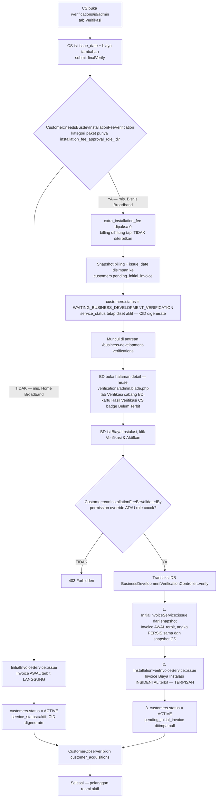
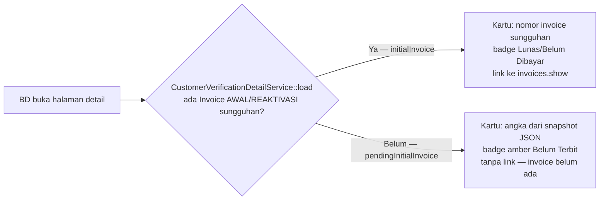

# Flowchart — Gate "Menunggu Verifikasi BD" & Invoice Awal

## Alur Utama: CS Verifikasi → (Gate?) → Invoice Awal → ACTIVE

## Kartu "Hasil Verifikasi CS" — Dua Bentuk

## Kenapa Dua Cabang Ini Penting

Sebelum fix 2026-09-14, cabang kanan (kategori Bisnis) langsung menerbitkan Invoice AWAL di titik **B**, sama seperti cabang kiri — cuma statusnya yang mampir ke `WAITING_BUSINESS_DEVELOPMENT_VERIFICATION`. Efeknya: pelanggan sudah punya tagihan resmi walau BD belum menyetujui apa pun. Sekarang titik penerbitan invoice untuk cabang kanan pindah ke **P1**, setelah BD ikut menyetujui — konsisten dengan makna "gate".

Lihat juga [business-logic.md §3](business-logic.md#3-gate-menunggu-verifikasi-bd--state-machine) untuk penjelasan tiap langkah, dan [docs/customer-lifecycle/flowchart.md](../customer-lifecycle/flowchart.md) untuk alur registrasi→survey→pemasangan sebelum titik **A**.
