> **Arsip.** Dokumen alur/rencana historis — sebagian sudah diimplementasi, sebagian berbeda dari kode aktual. Lihat [../README.md](../README.md), [../business-logic.md](../business-logic.md) untuk kondisi kode terkini.

# Alur Onboarding Pelanggan Baru (End-to-End)

Dokumen ini menjelaskan alur kerja (*workflow*) lengkap operasional mulai dari pendaftaran pelanggan baru hingga menjadi pelanggan aktif dan masuk siklus penagihan billing.

## 📊 Flowchart Workflow

```mermaid
stateDiagram-v2
    [*] --> Registrasi
    
    state Registrasi {
        state "Input Data Pendaftaran" as form_reg
        form_reg --> WaitingSurvey : Simpan
    }
    
    state Survey {
        state "Status: Waiting Survey\nAction: Mulai Survey" as wait_survey
        state "Status: Proses Survey\nAction: Lapor Data (Timer Jalan)" as proc_survey
        state "Form Laporan Survey" as form_survey
        
        WaitingSurvey --> wait_survey
        wait_survey --> proc_survey : Klik "Mulai Survey"
        proc_survey --> form_survey : Klik "Lapor Data"
        form_survey --> MenungguACC : Simpan Laporan
    }
    
    state "Verifikasi Admin (ACC)" as Verifikasi1 {
        state "Status: Menunggu ACC\nAction: Proses ke Tim" as wait_acc
        MenungguACC --> wait_acc
        wait_acc --> MenungguPemasangan : Klik "Proses ke Tim"
    }
    
    state Pemasangan {
        state "Status: Menunggu Pemasangan\nAction: Start Proses" as wait_install
        state "Status: Mulai Pasang\nAction: Lapor Pemasangan (Timer Jalan)" as proc_install
        state "Form Laporan Pemasangan & Pengujian" as form_install
        
        MenungguPemasangan --> wait_install
        wait_install --> proc_install : Klik "Start Proses"
        proc_install --> form_install : Klik "Lapor Pemasangan"
        form_install --> VerifikasiAkhir : Simpan Laporan
    }
    
    state "Aktivasi & Billing" as Verifikasi2 {
        state "Status: Verifikasi Admin\nAction: Verifikasi" as verify_admin
        state "Form Pembuatan Invoice Awal" as form_verify
        
        VerifikasiAkhir --> verify_admin
        verify_admin --> form_verify : Klik "Verifikasi"
        form_verify --> PelangganAktif : Simpan (Generate Tagihan)
    }
    
    PelangganAktif --> [*]
```

---

## 📝 Penjelasan Detail Step-by-Step

### 1. Registrasi Pelanggan (CS / Sales)
- **Kondisi:** CS / Sales mengisi form pendaftaran untuk pelanggan baru.
- **Form UI:** Tidak ada Dropdown *STATUS AWAL ALUR KERJA*.
- **Hasil Akhir (Save):** Ketika data pendaftaran disimpan, pelanggan otomatis masuk ke dalam antrean Survey dengan status **"Waiting Survey"**.

### 2. Survey Lapangan (Tim Survey)
- **Antrean:** Pelanggan muncul di tabel list pelanggan dengan status `Waiting Survey`.
- **Aksi 1:** Teknisi menekan action **"Mulai Survey"**.
  - *Efek:* Status pelanggan berubah menjadi **"Proses Survey"**.
  - *Efek:* Action/tombol berubah menjadi **"Lapor Data"**.
  - *Efek:* Countdown / Waktu live berjalan (menghitung SLA/waktu penanganan).
- **Aksi 2:** Setelah kembali dari lapangan, teknisi menekan action **"Lapor Data"**.
  - *Efek:* Akan memunculkan `FORM SURVEY` (Input titik ODP, estimasi kabel, foto lokasi, dsb).
- **Hasil Akhir (Save):** Setelah form survey disimpan, data akan masuk ke halaman Verifikasi Admin dengan status **"Menunggu ACC"**.

### 3. Verifikasi ACC (Admin / SPV)
- **Antrean:** Pelanggan muncul di daftar Verifikasi Admin dengan status **"Menunggu ACC"**.
- **Aksi:** Admin mengecek laporan survey dan menekan tombol action **"Proses ke Tim"**.
- **Hasil Akhir:** Status berubah menjadi **"Menunggu Pemasangan"** dan pelanggan masuk ke dalam antrean Tim Pemasangan. Action otomatis berubah menjadi **"Start Proses"**.

### 4. Pemasangan & Pengujian (Tim Teknisi Pemasangan)
- **Antrean:** Status saat ini adalah **"Menunggu Pemasangan"**.
- **Aksi 1:** Teknisi menekan action **"Start Proses"**.
  - *Efek:* Menghitung countdown / waktu live instalasi.
  - *Efek:* Status berubah menjadi **"Mulai Pasang"**.
  - *Efek:* Action/tombol berubah menjadi **"Lapor Pemasangan"**.
- **Aksi 2:** Setelah jaringan fisik terpasang, teknisi menekan action **"Lapor Pemasangan"**.
  - *Efek:* Membuka form yang berisi **FORM PEMASANGAN** (Input serial number, redaman, perangkat) dan **FORM PENGUJIAN** (Hasil Speedtest).
- **Hasil Akhir (Save):** Setelah form pemasangan dan pengujian disimpan, status pelanggan pada daftar di halaman Verifikasi Admin akan berubah menjadi **"Verifikasi Admin"** dan action-nya berganti menjadi **"Verifikasi"**.

### 5. Verifikasi Final & Aktivasi Billing (Finance / Admin)
- **Antrean:** Pelanggan berada di daftar Verifikasi Admin dengan status **"Verifikasi Admin"**.
- **Aksi:** Admin menekan action **"Verifikasi"**.
  - *Efek:* Membuka **Form Tagihan / Aktivasi**. Pada form ini, admin harus memasukkan data aktivasi layanan dan generate tagihan pertama (sama seperti pada modul **Buat Tagihan Manual**).
- **Hasil Akhir (Save):** Ketika invoice awal dan aktivasi di-save:
  - Pelanggan diubah menjadi status **Aktif**.
  - Masuk ke dalam **List Pelanggan Aktif**.
  - Sistem billing (penagihan bulanan otomatis) akan mulai berlaku untuk pelanggan ini.
