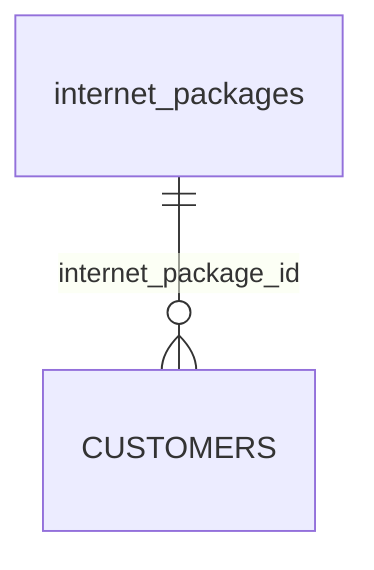

# Database Schema Dashboard

Dashboard tidak memiliki tabel sendiri. Semua data dashboard berasal dari tabel operasional dan master.

## Tabel Sumber

| Tabel | Pemakaian |
| --- | --- |
| `customers` | Statistik pelanggan, status, dan tren registrasi. |
| `internet_packages` | Total paket dan kategori paket. |
| `districts` | Total kecamatan. |

## Relasi untuk Chart Kategori Paket



Query konseptual:

```sql
select internet_packages.category, count(*) as count
from customers
join internet_packages on customers.internet_package_id = internet_packages.id
group by internet_packages.category;
```

