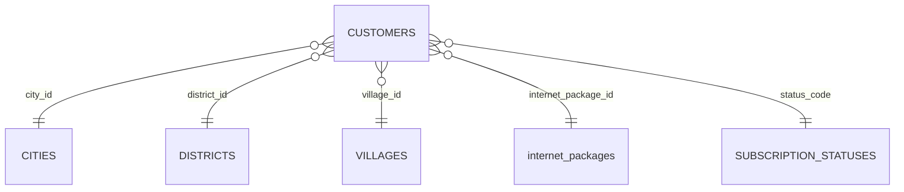

# Database Schema Data Pelanggan

## Tabel Utama

Fitur Data Pelanggan menggunakan tabel utama `customers` dan bergantung pada master `cities`, `districts`, `villages`, `internet_packages`, dan `subscription_statuses`.

## Field Wajib di Form Registrasi

| Field | Validasi |
| --- | --- |
| `full_name` | required, string, max 150 |
| `identity_number` | required, string, max 50 |
| `gender` | required, string, max 20 |
| `phone` | required, string, max 20 |
| `registration_date` | required, date |
| `address` | required, string |
| `city_id` | required, exists `cities.id` |
| `district_id` | required, exists `districts.id` |
| `village_id` | required, exists `villages.id` |
| `internet_package_id` | required, exists `internet_packages.id` |
| `contract_period_months` | required, integer, min 1 |
| `discount_amount` | required, numeric, min 0 |
| `tax_percent` | required, numeric, 0 sampai 100 |
| `status` | required, string, max 50 |

## Field Opsional

| Field | Keterangan |
| --- | --- |
| `email` | Email pelanggan. |
| `latitude`, `longitude` | Koordinat instalasi. |
| `sales_code`, `agent_code`, `referral_customer_code` | Referral. |
| `ont_sn`, `ip_address`, `odp_code`, `olt_code`, `vlan_id` | Data teknis. |
| `foto_ktp`, `foto_rumah`, `foto_kontrak` | Dokumen upload. |

## Dokumen Upload

| Field | Validasi | Storage |
| --- | --- | --- |
| `foto_ktp` | image, max 2048 KB | `storage/app/public/documents` |
| `foto_rumah` | image, max 2048 KB | `storage/app/public/documents` |
| `foto_kontrak` | jpeg, png, pdf, max 2048 KB | `storage/app/public/documents` |

## Catatan Teknis

1. `customer_code` dibuat otomatis pada proses `store()` dan `confirmImport()`.
2. Relasi status pada model menggunakan `customers.status` ke `subscription_statuses.code`.
3. Migration belum membuat foreign key eksplisit dari `customers.status` ke `subscription_statuses.code`.
4. Detail operasional masih belum memiliki tabel transaksi terpisah untuk survey, FOP, instalasi, aktivasi, invoice, dan pembayaran.

