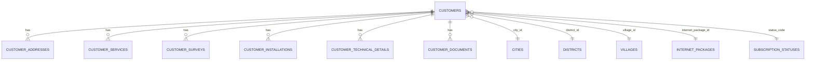

# Database Schema Data Pelanggan

## Tabel Utama

Fitur Data Pelanggan menggunakan tabel sentral `customers` yang berelasi dengan data master (`cities`, `districts`, `villages`, `internet_packages`, `subscription_statuses`, `pops`, dll) dan tabel-tabel transaksi workflow.

## Struktur Transaksi Workflow (Onboarding)

Setiap pelanggan melewati alur workflow, datanya disimpan pada tabel terpisah sesuai konteks proses:

### 1. `customer_surveys`
Pencatatan data survey pelanggan.
- `customer_id`
- `technician_id` (User)
- `surveyors` (JSON, Multi-petugas)
- `started_at`, `completed_at` (Countdown)
- `signal_quality`, `cable_length`, `fat_sn`, `fat_port`

### 2. `customer_installations`
Pencatatan proses pemasangan perangkat.
- `customer_id`
- `technician_id` (User)
- `technicians` (JSON, Multi-teknisi)
- `started_at`, `completed_at` (Countdown)
- `modem_sn`, `modem_mac`, `router_sn`

### 3. `customer_technical_details`
Detail konfigurasi teknis / FOP yang diisi saat verifikasi admin & pemasangan.
- `customer_id`
- `ip_address`, `vlan`, `olt_number`, `olt_slot`
- `odp_code`, `olt_code`
- `speedtest_download`, `speedtest_upload`, `speedtest_ping`

## Catatan Teknis
1. Proses perpindahan antar state diatur di `CustomerWorkflowService`.
2. Validasi antrean dan countdown di database mengandalkan kolom `started_at` dan `completed_at` di tabel survey maupun installation.
3. Field Multi-User (Petugas Survey, Teknisi Instalasi) menggunakan tipe data JSON array untuk mendukung >1 petugas.
