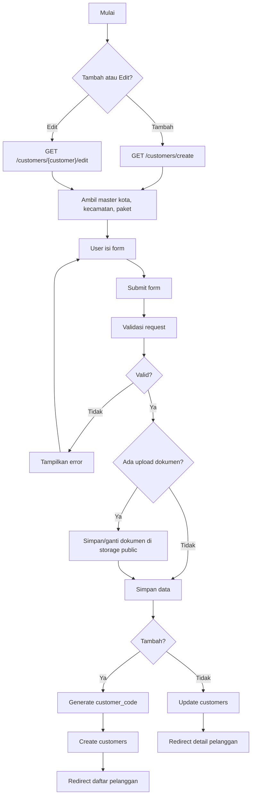
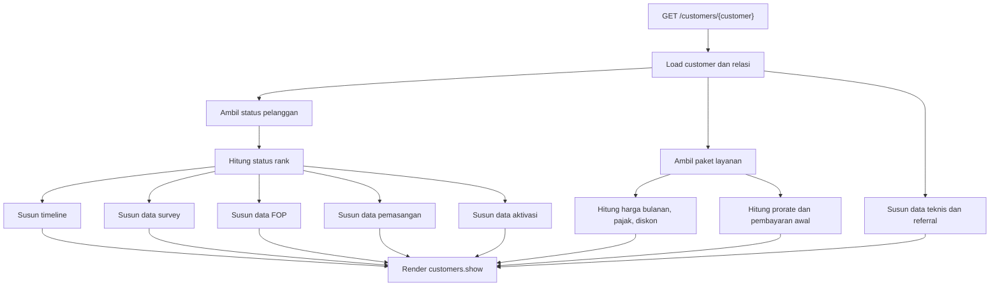
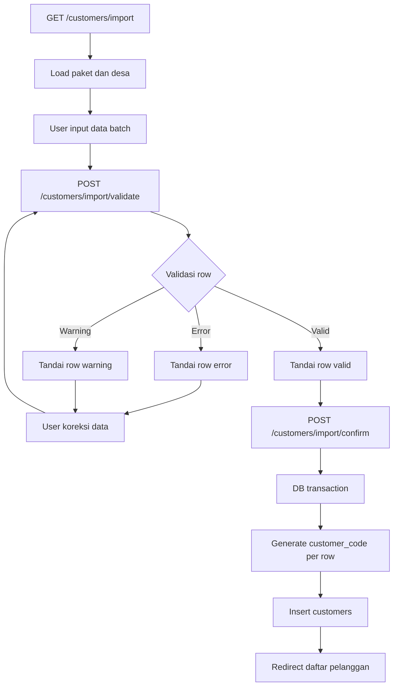
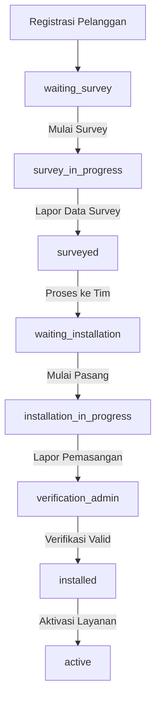

# Flowchart Data Pelanggan

## Flow Registrasi dan Edit

```mermaid
flowchart TD
    A[Mulai] --> B{Tambah atau Edit?}
    B -->|Tambah| C[GET /customers/create]
    B -->|Edit| D["GET /customers/{customer}/edit"]
    C --> E[Ambil master kota, kecamatan, paket]
    D --> E
    E --> F[User isi form]
    F --> G[Submit form]
    G --> H[Validasi request]
    H --> I{Valid?}
    I -->|Tidak| J[Tampilkan error]
    J --> F
    I -->|Ya| K{Ada upload dokumen?}
    K -->|Ya| L[Simpan/ganti dokumen di storage public]
    K -->|Tidak| M[Simpan data]
    L --> M
    M --> N{Tambah?}
    N -->|Ya| O[Generate customer_code]
    O --> P[Create customers]
    N -->|Tidak| Q[Update customers]
    P --> R[Redirect daftar pelanggan]
    Q --> S[Redirect detail pelanggan]
```

## Flow Detail Operasional

```mermaid
flowchart TD
    A["GET /customers/{customer}"] --> B[Load customer dan relasi]
    B --> C[Ambil status pelanggan]
    C --> D[Hitung status rank]
    D --> E[Susun timeline]
    D --> F[Susun data survey]
    D --> G[Susun data FOP]
    D --> H[Susun data pemasangan]
    D --> I[Susun data aktivasi]
    B --> J[Ambil paket layanan]
    J --> K[Hitung harga bulanan, pajak, diskon]
    J --> L[Hitung prorate dan pembayaran awal]
    B --> M[Susun data teknis dan referral]
    E --> N[Render customers.show]
    F --> N
    G --> N
    H --> N
    I --> N
    K --> N
    L --> N
    M --> N
```

## Flow Import

```mermaid
flowchart TD
    A[GET /customers/import] --> B[Load paket dan desa]
    B --> C[User input data batch]
    C --> D[POST /customers/import/validate]
    D --> E{Validasi row}
    E -->|Error| F[Tandai row error]
    E -->|Warning| G[Tandai row warning]
    E -->|Valid| H[Tandai row valid]
    F --> I[User koreksi data]
    G --> I
    I --> D
    H --> J[POST /customers/import/confirm]
    J --> K[DB transaction]
    K --> L[Generate customer_code per row]
    L --> M[Insert customers]
    M --> N[Redirect daftar pelanggan]
```

## Flow Onboarding Workflow (Sprint 2 & 3)

```mermaid
flowchart TD
    A[Registrasi Pelanggan] --> B[waiting_survey]
    B -->|Mulai Survey| C[survey_in_progress]
    C -->|Lapor Data Survey| D[surveyed]
    D -->|Proses ke Tim| E[waiting_installation]
    E -->|Mulai Pasang| F[installation_in_progress]
    F -->|Lapor Pemasangan| G[verification_admin]
    G -->|Verifikasi Valid| H[installed]
    H -->|Aktivasi Layanan| I[active]
```
