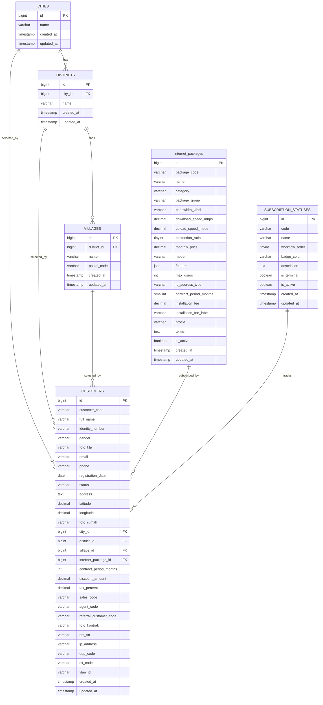

# Database Schema

Dokumen ini merangkum schema database aktual yang dibuat oleh migration project.

## Entity Relationship

## Tabel Master Wilayah

### `cities`

| Kolom | Tipe | Keterangan |
| --- | --- | --- |
| `id` | bigint | Primary key. |
| `name` | varchar(100) | Nama kota/kabupaten, unik. |
| `created_at`, `updated_at` | timestamp | Timestamp Laravel. |

### `districts`

| Kolom | Tipe | Keterangan |
| --- | --- | --- |
| `id` | bigint | Primary key. |
| `city_id` | foreignId | Relasi ke `cities.id`, cascade delete. |
| `name` | varchar(100) | Nama kecamatan. Kombinasi `city_id` dan `name` unik. |
| `created_at`, `updated_at` | timestamp | Timestamp Laravel. |

### `villages`

| Kolom | Tipe | Keterangan |
| --- | --- | --- |
| `id` | bigint | Primary key. |
| `district_id` | foreignId | Relasi ke `districts.id`, cascade delete. |
| `name` | varchar(100) | Nama desa/kelurahan. Kombinasi `district_id` dan `name` unik. |
| `postal_code` | varchar(10), nullable | Kode pos. |
| `created_at`, `updated_at` | timestamp | Timestamp Laravel. |

## Tabel Master Paket Layanan

### `internet_packages`

| Kolom | Tipe | Keterangan |
| --- | --- | --- |
| `id` | bigint | Primary key. |
| `package_code` | varchar(50) | Kode paket, unik. Contoh: `Net150`, `Dedicated100`. |
| `name` | varchar(150) | Nama paket. |
| `category` | varchar(100) | Kategori, misalnya Home Broadband, Bisnis Broadband, UKM, Dedicated. |
| `package_group` | varchar(150) | Grup paket dalam kategori. |
| `bandwidth_label` | varchar(50) | Label bandwidth yang tampil di UI. |
| `download_speed_mbps` | decimal(8,2), nullable | Kecepatan download. |
| `upload_speed_mbps` | decimal(8,2), nullable | Kecepatan upload. |
| `contention_ratio` | tinyint, nullable | Rasio kontensi, misalnya 4 atau 8. |
| `monthly_price` | decimal(12,2) | Harga bulanan. |
| `modem` | varchar(100), nullable | Tipe modem. |
| `features` | json, nullable | Fitur tambahan seperti IPTV, CCTV, AP. |
| `max_users` | int, nullable | Estimasi maksimal user. |
| `ip_address_type` | varchar(100), nullable | Tipe IP. |
| `contract_period_months` | smallint, nullable | Masa kontrak. |
| `installation_fee` | decimal(12,2), nullable | Biaya instalasi. |
| `installation_fee_label` | varchar(150), nullable | Label biaya instalasi. |
| `profile` | varchar(100), nullable | Profil layanan. |
| `terms` | text, nullable | Syarat dan ketentuan. |
| `is_active` | boolean | Status aktif paket. |
| `created_at`, `updated_at` | timestamp | Timestamp Laravel. |

## Tabel Master Status Langganan

### `subscription_statuses`

| Kolom | Tipe | Keterangan |
| --- | --- | --- |
| `id` | bigint | Primary key. |
| `code` | varchar(50) | Kode status, unik. |
| `name` | varchar(100) | Nama status. |
| `workflow_order` | tinyint | Urutan workflow, unik. |
| `badge_color` | varchar(30) | Warna badge UI. |
| `description` | text, nullable | Deskripsi status. |
| `is_terminal` | boolean | Penanda status akhir seperti `terminated` atau `rejected`. |
| `is_active` | boolean | Status aktif master. |
| `created_at`, `updated_at` | timestamp | Timestamp Laravel. |

## Tabel Pelanggan

### `customers`

| Kolom | Tipe | Keterangan |
| --- | --- | --- |
| `id` | bigint | Primary key. |
| `customer_code` | varchar(30) | Kode pelanggan, unik. Format dibuat `WHUS-YYYY-0001`. |
| `full_name` | varchar(150) | Nama lengkap pelanggan. |
| `identity_number` | varchar(50), nullable | Nomor identitas/NIK. |
| `gender` | varchar(20), nullable | Jenis kelamin. |
| `foto_ktp` | varchar, nullable | Path file KTP. |
| `email` | varchar(100), nullable | Email pelanggan. |
| `phone` | varchar(20) | Nomor telepon. |
| `registration_date` | date | Tanggal registrasi. |
| `status` | varchar(50) | Kode status, berelasi secara model ke `subscription_statuses.code`. |
| `address` | text, nullable | Alamat instalasi. |
| `latitude`, `longitude` | decimal | Koordinat lokasi. |
| `foto_rumah` | varchar, nullable | Path foto rumah. |
| `city_id` | foreignId, nullable | Relasi ke `cities.id`, null on delete. |
| `district_id` | foreignId, nullable | Relasi ke `districts.id`, null on delete. |
| `village_id` | foreignId, nullable | Relasi ke `villages.id`, null on delete. |
| `internet_package_id` | foreignId, nullable | Relasi ke `internet_packages.id`, null on delete. |
| `contract_period_months` | int | Masa kontrak. |
| `discount_amount` | decimal(15,2) | Diskon bulanan. |
| `tax_percent` | decimal(5,2) | Persentase pajak. |
| `sales_code` | varchar(30), nullable | Kode sales. |
| `agent_code` | varchar(30), nullable | Kode agent. |
| `referral_customer_code` | varchar(30), nullable | Kode pelanggan referral. |
| `foto_kontrak` | varchar, nullable | Path dokumen kontrak. |
| `ont_sn` | varchar(100), nullable | Serial number ONT. |
| `ip_address` | varchar(45), nullable | IP pelanggan. |
| `odp_code` | varchar(50), nullable | Kode ODP. |
| `olt_code` | varchar(50), nullable | Kode OLT. |
| `vlan_id` | varchar(20), nullable | VLAN layanan. |
| `created_at`, `updated_at` | timestamp | Timestamp Laravel. |

