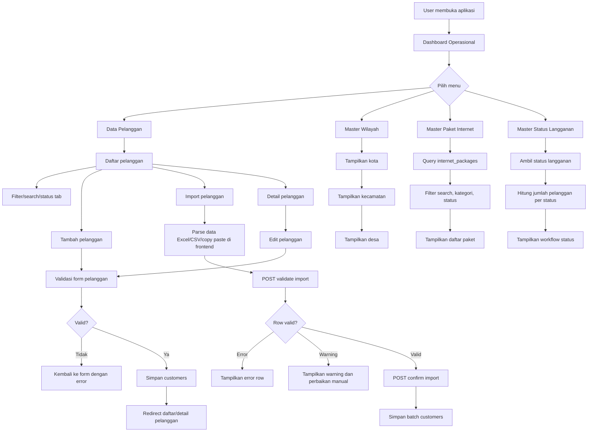
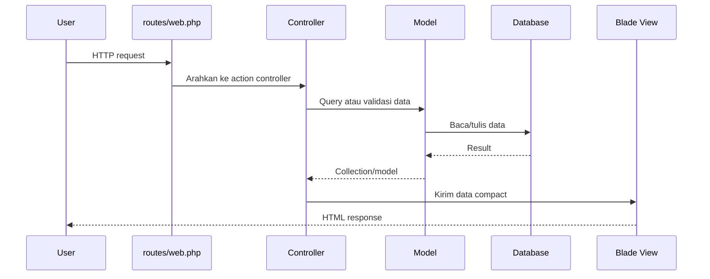

# Flowchart System

Dokumen ini menggambarkan alur sistem utama WHUSNET Operasional berdasarkan route dan controller yang tersedia.

## Flow Sistem Utama

## Flow Request MVC

## Modul dan Route Utama

| Modul | Route | Controller |
| --- | --- | --- |
| Dashboard | `GET /` | `DashboardController@index` |
| Daftar pelanggan | `GET /customers` | `CustomerController@index` |
| Form import | `GET /customers/import` | `CustomerController@importForm` |
| Validasi import | `POST /customers/import/validate` | `CustomerController@validateImport` |
| Simpan import | `POST /customers/import/confirm` | `CustomerController@confirmImport` |
| Form tambah pelanggan | `GET /customers/create` | `CustomerController@create` |
| Simpan pelanggan | `POST /customers` | `CustomerController@store` |
| Detail pelanggan | `GET /customers/{customer}` | `CustomerController@show` |
| Form edit pelanggan | `GET /customers/{customer}/edit` | `CustomerController@edit` |
| Update pelanggan | `PUT /customers/{customer}` | `CustomerController@update` |
| Master wilayah | `GET /master/wilayah` | `RegionController@index` |
| Master paket internet | `GET /master/paket` | `InternetPackageController@index` |
| Master status langganan | `GET /master/status-langganan` | `SubscriptionStatusController@index` |
| API kecamatan per kota | `GET /api/cities/{city}/districts` | Closure route |
| API desa per kecamatan | `GET /api/districts/{district}/villages` | Closure route |
