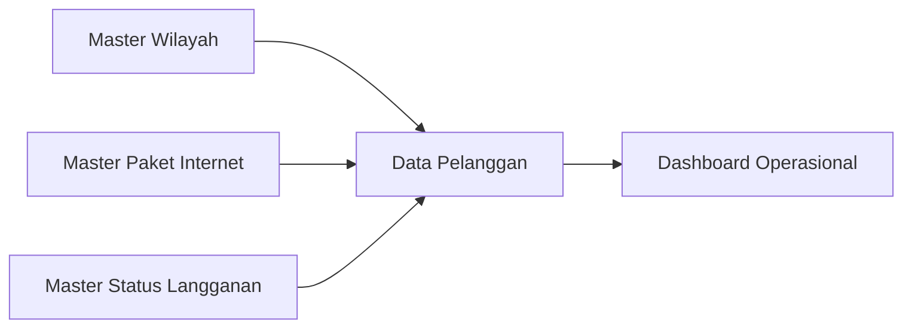

# Fitur Master

Folder ini mendokumentasikan master data yang digunakan sebagai referensi operasional.

## Master yang Tersedia

| Master | Route | Fungsi |
| --- | --- | --- |
| Wilayah | `GET /master/wilayah` | Referensi kota, kecamatan, dan desa untuk alamat pelanggan. |
| Paket Internet | `GET /master/paket` | Master paket internet yang bisa dipilih pelanggan. |
| Status Langganan | `GET /master/status-langganan` | Referensi status workflow pelanggan. |

## Ketergantungan ke Modul Pelanggan

## File Terkait

| Master | Controller | Model | View |
| --- | --- | --- | --- |
| Wilayah | `RegionController` | `City`, `District`, `Village` | `resources/views/master/wilayah.blade.php` |
| Paket Internet | `InternetPackageController` | `InternetPackage` | `resources/views/master/paket/*.blade.php` |
| Status Langganan | `SubscriptionStatusController` | `SubscriptionStatus` | `resources/views/master/status-langganan.blade.php` |
