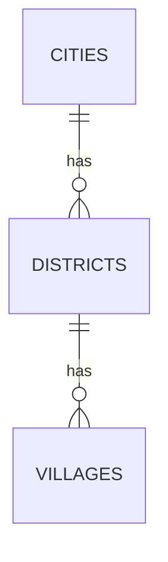
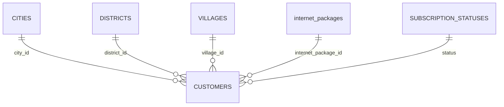

# Database Schema Master

## Master Wilayah

| Tabel | Primary Key | Unique | Index |
| --- | --- | --- | --- |
| `cities` | `id` | `name` | - |
| `districts` | `id` | `city_id`, `name` | - |
| `villages` | `id` | `district_id`, `name` | `postal_code` |

## Master Paket Layanan

| Tabel | Primary Key | Unique | Index |
| --- | --- | --- | --- |
| `internet_packages` | `id` | `package_code` | `category, package_group`, `is_active` |

## Master Status Langganan

| Tabel | Primary Key | Unique | Index |
| --- | --- | --- | --- |
| `subscription_statuses` | `id` | `code`, `workflow_order` | `is_active, workflow_order` |

## Relasi ke Pelanggan

