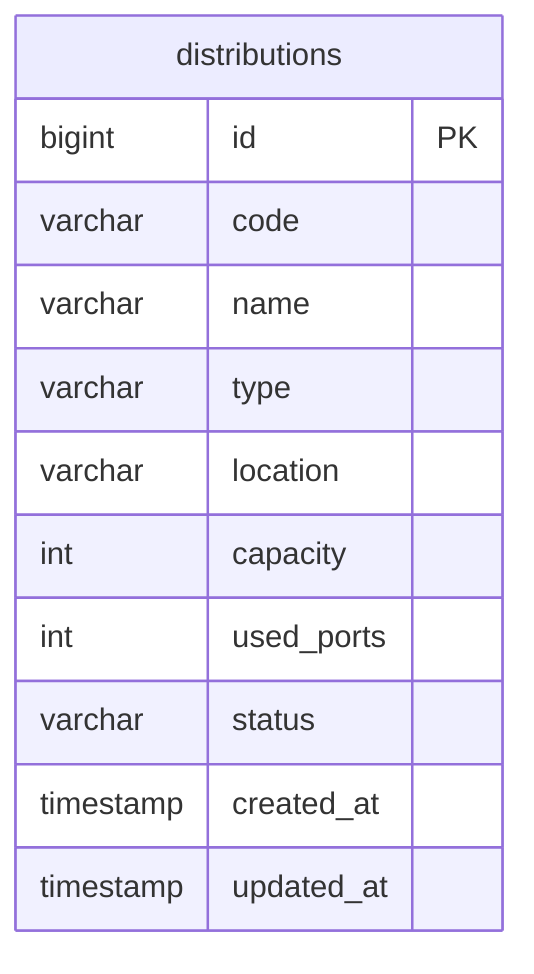

> **Arsip.** Dokumen lama/spesifikasi awal — sebagian tidak sesuai skema kode aktual (field fabrikasi seperti `capacity`/`used_ports`/`is_active` gak pernah ada). Lihat `../README.md`, `../business-logic.md`, `../database-schema.md` untuk kondisi kode terkini.

# Database Schema: Master Distribusi

## Entitas Tabel

Tabel `distributions` merepresentasikan inventaris infrastruktur titik sambung jaringan (OLT/Router/ODP).

## Field Penting
- `code`: Kode unik perangkat distribusi (misal: `OLT-MLG-01`). Biasa digunakan sebagai referensi penginputan manual saat teknisi memasukkan data FOP pelanggan.
- `type`: Tipe perangkat (misal: `OLT`, `ODC`, `ODP`, `Router`).
- `capacity` & `used_ports`: Mengontrol ketersediaan slot jaringan di alat tersebut untuk mencegah over-capacity.
