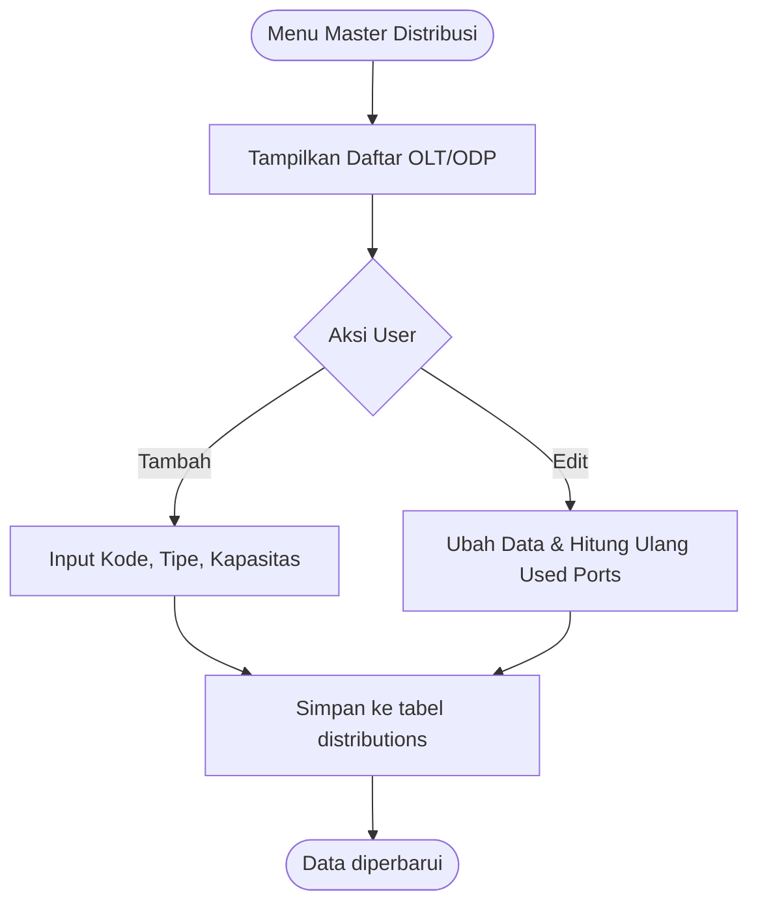

# Flowchart: Master Distribusi

Alur di bawah menjelaskan pengelolaan titik distribusi dan kaitannya dengan proses teknis pemasangan.

```mermaid
flowchart TD
    Start([Menu Master Distribusi]) --> ViewList[Tampilkan Daftar OLT/ODP]
    ViewList --> Action{Aksi User}
    
    Action -->|Tambah| AddNode[Input Kode, Tipe, Kapasitas]
    Action -->|Edit| UpdateNode[Ubah Data & Hitung Ulang Used Ports]
    
    AddNode --> SaveDB[Simpan ke tabel distributions]
    UpdateNode --> SaveDB
    
    SaveDB --> End([Data diperbarui])
```
