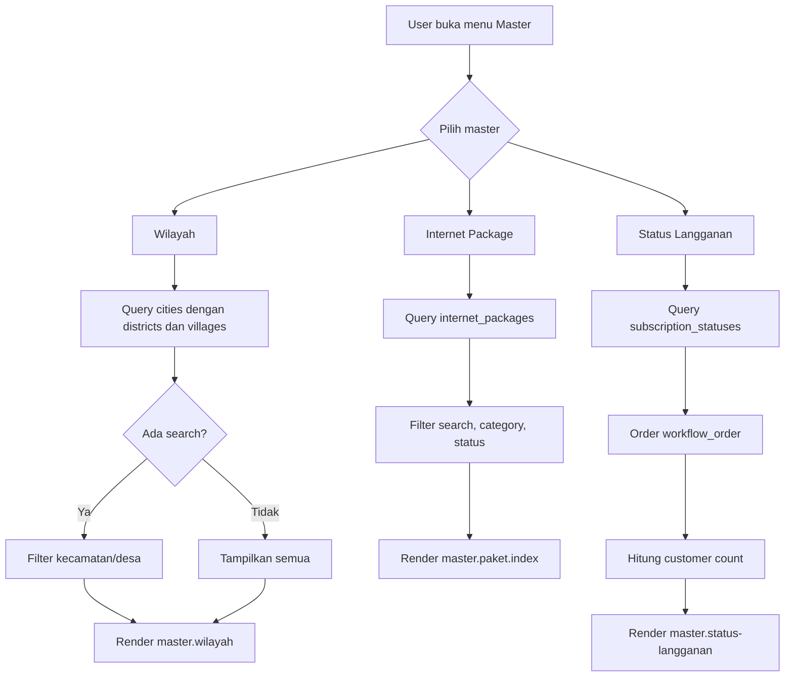

# Flowchart Master

## Flow Master Terpadu

```mermaid
flowchart TD
    A[User buka menu Master] --> B{Pilih master}
    B --> C[Wilayah]
    B --> D[Internet Package]
    B --> E[Status Langganan]

    C --> C1[Query cities dengan districts dan villages]
    C1 --> C2{Ada search?}
    C2 -->|Ya| C3[Filter kecamatan/desa]
    C2 -->|Tidak| C4[Tampilkan semua]
    C3 --> C5[Render master.wilayah]
    C4 --> C5

    D --> D1[Query internet_packages]
    D1 --> D2[Filter search, category, status]
    D2 --> D3[Render master.paket.index]

    E --> E1[Query subscription_statuses]
    E1 --> E2[Order workflow_order]
    E2 --> E3[Hitung customer count]
    E3 --> E4[Render master.status-langganan]
```
