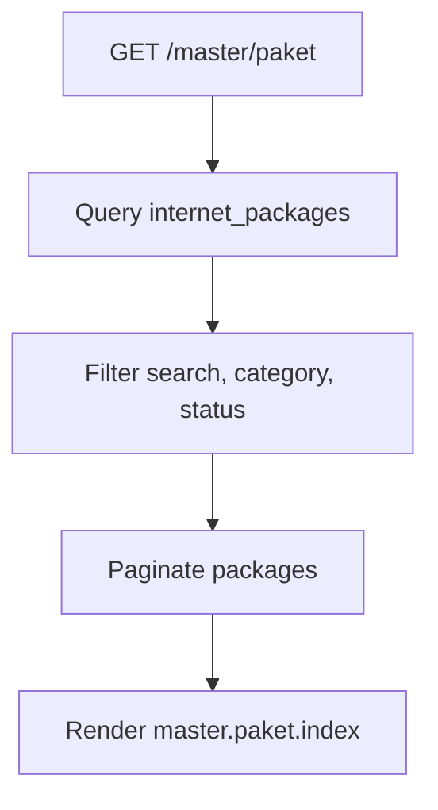

# Master Paket Internet

Master Paket Internet menyimpan daftar paket internet WHUSNET yang bisa dipilih pada registrasi pelanggan dan digunakan untuk perhitungan biaya.

Nama menu aplikasi adalah Paket Internet. Sumber data teknis tetap `internet_packages` sesuai Rancangan Master Paket WHUSNET.

## Route dan Controller

| Method | Route | Action |
| --- | --- | --- |
| GET | `/master/paket` | `InternetPackageController@index` |

## Flow

1. User membuka halaman Master Paket Internet.
2. Sistem membaca data dari `internet_packages`.
3. User dapat filter berdasarkan pencarian, kategori, dan status.
4. View `master.paket.index` menampilkan daftar paket.

## Kategori Seeder

Data default berasal dari `InternetPackageSeeder`:

| Kategori | Contoh kode |
| --- | --- |
| Paket Home Broadband | `Net138`, `Net150`, `Net165`, `Net198`, `NetTC150` |
| Paket Bisnis Broadband | `NetSoLite75`, `NetSo100`, `NetSo1G` |
| Paket Bisnis UKM | `NetBLite25`, `NetBLite330`, `NetBLite550` |
| Paket Bisnis Dedicated | `Dedicated100`, `Dedicated500`, `Dedicated1G` |

## Flowchart

## Schema Terkait

| Tabel | Keterangan |
| --- | --- |
| `internet_packages` | Master paket layanan. |
| `customers.internet_package_id` | Paket yang dipilih pelanggan. |
