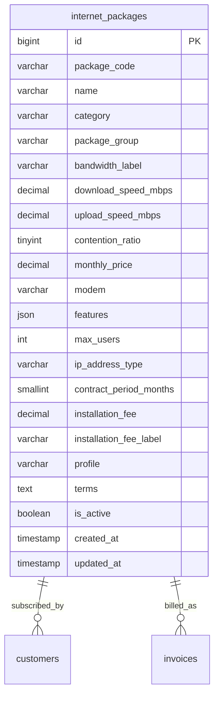

# Database Schema: Master Paket Internet

## Entitas Tabel

Tabel `internet_packages` adalah tabel master yang berdiri sendiri namun direferensikan oleh banyak entitas lain, utamanya tabel `customers` dan `invoices`.

## Field Penting
- `package_code`: Kode unik paket (misal: `Net138`).
- `monthly_price`: Harga dasar langganan bulanan paket, dipakai saat generate tagihan.
- `is_active`: Flag aktif/tidaknya paket. Hanya paket aktif yang dapat dipilih saat registrasi pelanggan.
