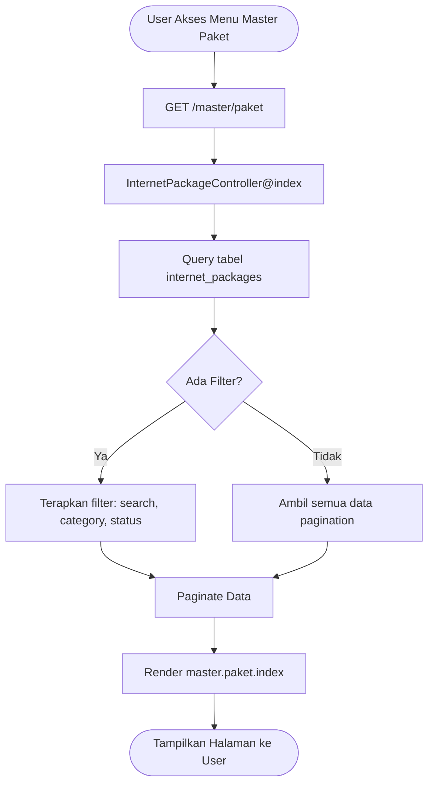

# Flowchart: Master Paket Internet

Diagram di bawah ini menggambarkan alur akses dan penampilan data pada halaman Master Paket Internet.

```mermaid
flowchart TD
    Start([User Akses Menu Master Paket]) --> Request[GET /master/paket]
    Request --> Controller["InternetPackageController@index"]
    Controller --> DBQuery[Query tabel internet_packages]
    
    DBQuery --> FilterCheck{Ada Filter?}
    FilterCheck -->|Ya| ApplyFilter[Terapkan filter: search, category, status]
    FilterCheck -->|Tidak| SkipFilter[Ambil semua data pagination]
    
    ApplyFilter --> Paginate[Paginate Data]
    SkipFilter --> Paginate
    
    Paginate --> View[Render master.paket.index]
    View --> End([Tampilkan Halaman ke User])
```
