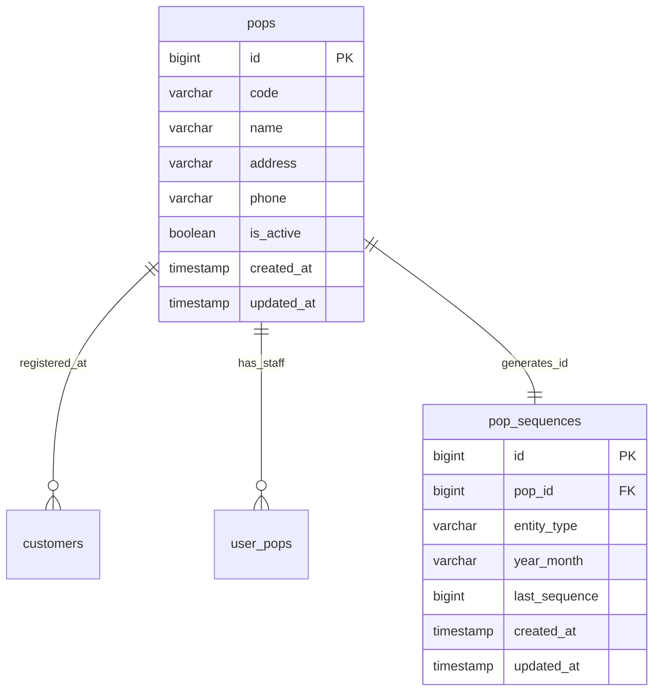

# Database Schema: Master POP

## Entitas Tabel

Tabel `pops` merepresentasikan data titik pusat (cabang), dan `pop_sequences` digunakan untuk menjamin agar urutan ID / kode pendaftaran pelanggan per POP tetap berurutan tanpa race condition.

## Field Penting
- `code` pada `pops`: Singkatan / inisial POP (misal: `MLG` untuk Malang). Seringkali digunakan sebagai Prefix penomoran.
- `last_sequence` pada `pop_sequences`: Mencatat angka terakhir ID pelanggan yang dibuat untuk suatu entitas (misal: "customer") pada rentang `year_month` tertentu di POP tersebut.
