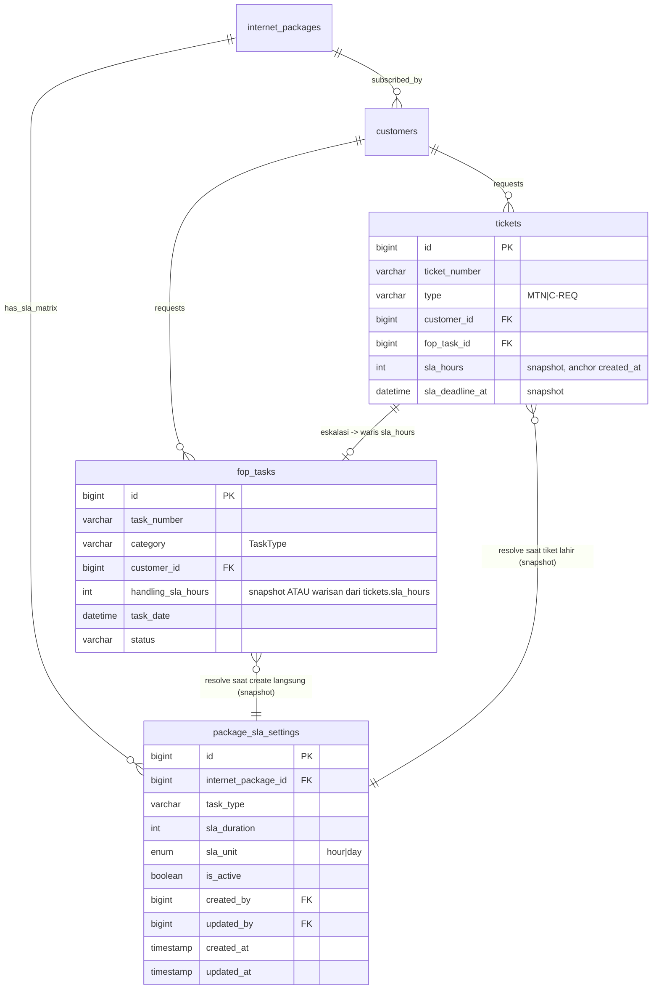

# Database Schema: Master Timeline SLA

## Entitas Tabel

`package_sla_settings` adalah tabel matrix (Paket × Jenis Tiket) yang menyimpan batas waktu wajib mulai ditangani. Direferensikan oleh `internet_packages`. Hasil resolve-nya di-snapshot ke `fop_tasks.handling_sla_hours` saat `FopTask` dibuat LANGSUNG (SURVEY, PEMASANGAN, MTN/C-REQ manual FOP) — **atau**, sejak `2026_08_05`, diwarisi dari `tickets.sla_hours` kalau `FopTask`-nya lahir dari eskalasi Ticketing (MTN/C-REQ lewat `/tickets`). Lihat `docs/ticketing/business-logic.md` § 16.

## Field Penting

- `package_sla_settings.task_type`: salah satu dari 8 nilai `App\Enums\TaskType` (`SURVEY`, `PSB`, `MTN`, `DEAC`, `RELOKASI`, `C-REQ`, `O-REQ`, `INFR REQ`).
- `package_sla_settings.sla_duration` + `sla_unit`: angka mentah yg diinput admin (mis. `1` + `day`, atau `24` + `hour`). Dinormalisasi ke jam lewat accessor `PackageSlaSetting::sla_hours`.
- Unique(`internet_package_id`, `task_type`) — satu paket cuma boleh punya 1 setting aktif per jenis tiket.
- `fop_tasks.handling_sla_hours`: **snapshot**, diisi otomatis (`FopTask::booted()` → `creating`) saat tiket dibuat, resolve dari `customer.internetPackage->getHandlingSla($category)`. Nilai ini beku — perubahan matrix SLA atau ganti paket customer setelahnya **tidak** mengubah tiket yang sudah ada.
- Kalau `package_sla_settings` belum ada baris utk kombinasi paket+jenis tertentu (atau `is_active=false`), fallback ke `TaskType::defaultHandlingSlaHours()` (hardcode di enum, bukan tabel).
- `tickets.sla_hours` + `tickets.sla_deadline_at` (migrasi `2026_08_05_091143_add_sla_fields_to_tickets_table`): snapshot yang SAMA prinsipnya dengan `fop_tasks.handling_sla_hours`, tapi resolve-nya dua jalur — `InternetPackage::getHandlingSla()` (default) ATAU `FopTaskPriority::slaHours()` kalau `ticket_issue_categories.sla_source = 'prioritas'`. Saat tiket dieskalasi ke FOP, `fop_tasks.handling_sla_hours` **diisi dari `tickets.sla_hours`**, bukan resolve ulang — satu clock, bukan dua snapshot independen.

## Relasi ke Skema Existing

- `internet_packages` ← `customers.internet_package_id` (skema lama, tidak berubah).
- `fop_tasks.customer_id` → `customers` (skema lama) — jalur resolve paket customer saat snapshot.
- Tidak ada FK langsung `fop_tasks` → `package_sla_settings` (resolve dilakukan sekali di momen create, hasilnya disalin sebagai angka biasa, bukan foreign key). Sama halnya `tickets` → `package_sla_settings`.
- `fop_tasks.handling_sla_hours` gak lagi SELALU resolve dari `package_sla_settings` langsung — kalau `FopTask` lahir dari eskalasi Ticketing, nilainya datang dari `tickets.sla_hours` (yang tetap ujungnya resolve dari `package_sla_settings`/`FopTaskPriority`, cuma titik hitungnya di `Ticket`, bukan di `FopTask`).
