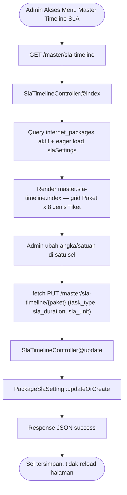
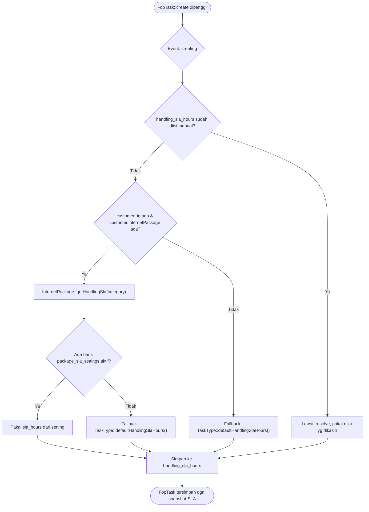
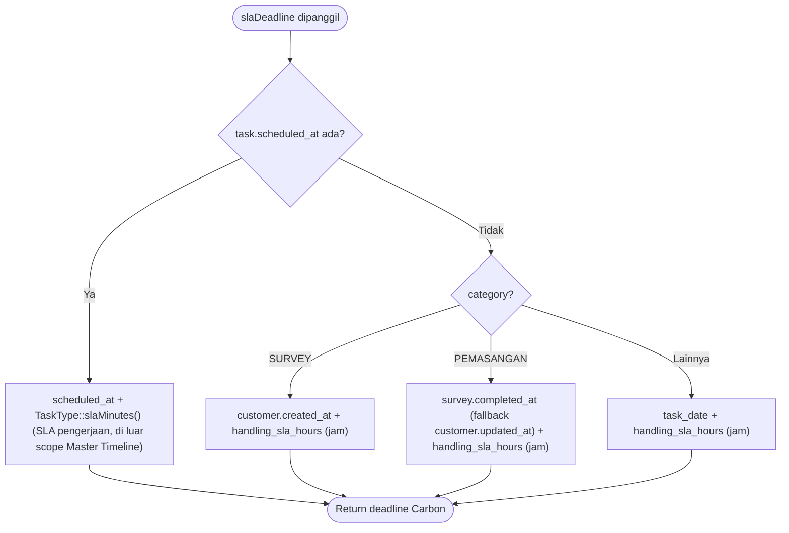

# Flowchart: Master Timeline SLA

## 1. Admin Atur Matrix SLA

```mermaid
flowchart TD
    Start([Admin Akses Menu Master Timeline SLA]) --> Request[GET /master/sla-timeline]
    Request --> Controller["SlaTimelineController@index"]
    Controller --> Query[Query internet_packages aktif + eager load slaSettings]
    Query --> View[Render master.sla-timeline.index — grid Paket x 8 Jenis Tiket]
    View --> Edit[Admin ubah angka/satuan di satu sel]
    Edit --> Fetch["fetch PUT /master/sla-timeline/{paket} (task_type, sla_duration, sla_unit)"]
    Fetch --> UpdateCtrl["SlaTimelineController@update"]
    UpdateCtrl --> Upsert[PackageSlaSetting::updateOrCreate]
    Upsert --> JsonOk[Response JSON success]
    JsonOk --> End([Sel tersimpan, tidak reload halaman])
```

## 2. Resolve & Snapshot SLA saat Tiket Dibuat

```mermaid
flowchart TD
    Start([FopTask::create dipanggil]) --> Creating{"Event: creating"}
    Creating --> HasSnapshot{handling_sla_hours sudah diisi manual?}
    HasSnapshot -->|Ya| Skip[Lewati resolve, pakai nilai yg dikasih]
    HasSnapshot -->|Tidak| HasCustomer{customer_id ada & customer.internetPackage ada?}
    HasCustomer -->|Ya| ResolvePkg["InternetPackage::getHandlingSla(category)"]
    ResolvePkg --> HasSetting{Ada baris package_sla_settings aktif?}
    HasSetting -->|Ya| UsePackage[Pakai sla_hours dari setting]
    HasSetting -->|Tidak| UseDefault1["Fallback: TaskType::defaultHandlingSlaHours()"]
    HasCustomer -->|Tidak| UseDefault2["Fallback: TaskType::defaultHandlingSlaHours()"]
    UsePackage --> Save[Simpan ke handling_sla_hours]
    UseDefault1 --> Save
    UseDefault2 --> Save
    Skip --> Save
    Save --> End([FopTask tersimpan dgn snapshot SLA])
```

## 3. Pakai Snapshot saat Hitung Deadline (`FopTask::slaDeadline()`)

```mermaid
flowchart TD
    Start([slaDeadline dipanggil]) --> Scheduled{task.scheduled_at ada?}
    Scheduled -->|Ya| PengerjaanSLA["scheduled_at + TaskType::slaMinutes() (SLA pengerjaan, di luar scope Master Timeline)"]
    Scheduled -->|Tidak| Category{category?}
    Category -->|SURVEY| AnchorSurvey["customer.created_at + handling_sla_hours (jam)"]
    Category -->|PEMASANGAN| AnchorPasang["survey.completed_at (fallback customer.updated_at) + handling_sla_hours (jam)"]
    Category -->|Lainnya| AnchorLain["task_date + handling_sla_hours (jam)"]
    PengerjaanSLA --> End([Return deadline Carbon])
    AnchorSurvey --> End
    AnchorPasang --> End
    AnchorLain --> End
```
