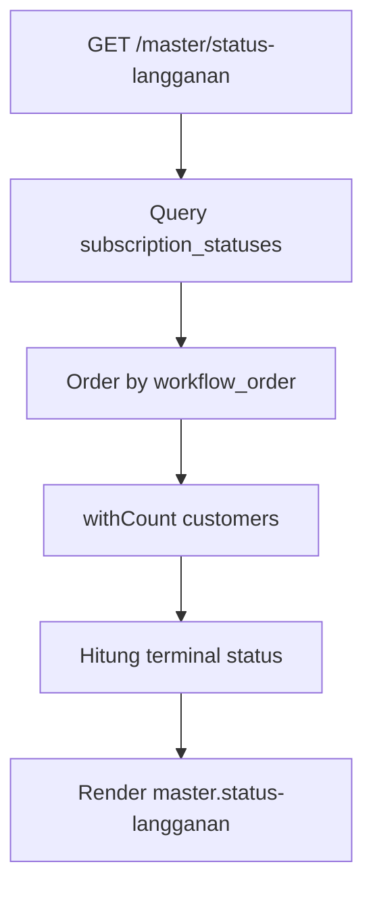

# Master Status Langganan

Master Status Langganan menyimpan daftar status workflow pelanggan dari registrasi sampai aktif, suspend, terminated, atau rejected.

## Route dan Controller

| Method | Route | Action |
| --- | --- | --- |
| GET | `/master/status-langganan` | `SubscriptionStatusController@index` |

## Flow

1. User membuka master status langganan.
2. Sistem mengambil semua status dengan urutan `workflow_order`.
3. Sistem menghitung jumlah pelanggan per status melalui `withCount('customers')`.
4. Sistem menghitung jumlah status terminal.
5. View `master.status-langganan` menampilkan workflow status.

## Status Default

| Order | Code | Nama | Badge | Terminal |
| --- | --- | --- | --- | --- |
| 1 | `registered` | Registered | slate | Tidak |
| 2 | `waiting_survey` | Waiting Survey | sky | Tidak |
| 3 | `surveyed` | Surveyed | blue | Tidak |
| 4 | `waiting_installation` | Waiting Installation | amber | Tidak |
| 5 | `installed` | Installed | blue | Tidak |
| 6 | `active` | Active | green | Tidak |
| 7 | `suspended` | Suspended | amber | Tidak |
| 8 | `terminated` | Terminated | red | Ya |
| 9 | `rejected` | Rejected | red | Ya |

## Flowchart

## Schema Terkait

| Tabel | Keterangan |
| --- | --- |
| `subscription_statuses` | Master status workflow pelanggan. |
| `customers.status` | Kode status pelanggan. |

