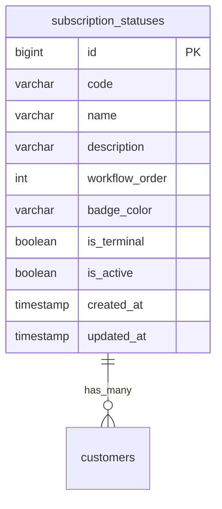

# Database Schema: Master Status Pelanggan

## Entitas Tabel

Tabel `subscription_statuses` berfungsi sebagai state referensi bagi kolom `status` pada tabel `customers`.

## Field Penting
- `code`: Slug / kode identifikasi status (misal: `survey_in_progress`). Ini digunakan langsung di sistem sebagai flag state machine.
- `workflow_order`: Menentukan urutan langkah status tersebut dalam workflow onboarding.
- `is_terminal`: Jika `true`, pelanggan tidak dapat diubah lagi statusnya secara otomatis ke flow selanjutnya tanpa logic manual.
