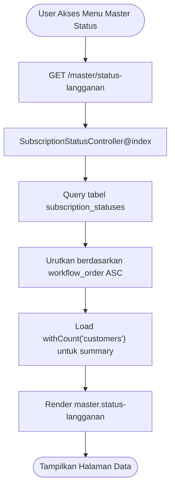

# Flowchart: Master Status Pelanggan

```mermaid
flowchart TD
    Start([User Akses Menu Master Status]) --> Request[GET /master/status-langganan]
    Request --> Controller["SubscriptionStatusController@index"]
    
    Controller --> DBQuery[Query tabel subscription_statuses]
    DBQuery --> Order[Urutkan berdasarkan workflow_order ASC]
    Order --> WithCount["Load withCount('customers') untuk summary"]
    
    WithCount --> View[Render master.status-langganan]
    View --> End([Tampilkan Halaman Data])
```
