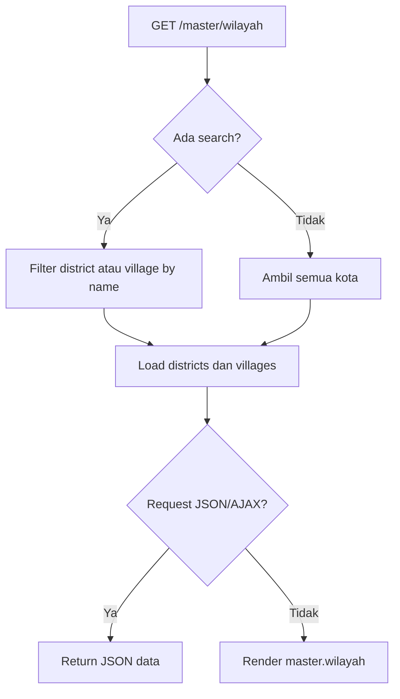

# Master Wilayah

Master Wilayah menyimpan struktur kota/kabupaten, kecamatan, dan desa/kelurahan. Data ini digunakan pada form pelanggan, filter daftar pelanggan, import pelanggan, dan API dependent dropdown.

## Route dan Controller

| Method | Route | Action |
| --- | --- | --- |
| GET | `/master/wilayah` | `RegionController@index` |
| GET | `/api/cities/{city}/districts` | Closure route |
| GET | `/api/districts/{district}/villages` | Closure route |

## Flow

1. User membuka halaman master wilayah.
2. Sistem menerima query `search` jika ada.
3. Sistem mengambil `City` beserta `districts` dan `villages`.
4. Jika search diisi, kecamatan/desa difilter berdasarkan nama.
5. Jika request JSON/AJAX, sistem mengembalikan JSON.
6. Jika request halaman biasa, sistem render view `master.wilayah`.

## Flowchart

## Schema Terkait

| Tabel | Relasi |
| --- | --- |
| `cities` | Memiliki banyak `districts`. |
| `districts` | Milik `cities`, memiliki banyak `villages`. |
| `villages` | Milik `districts`. |
| `customers` | Menyimpan `city_id`, `district_id`, dan `village_id`. |

