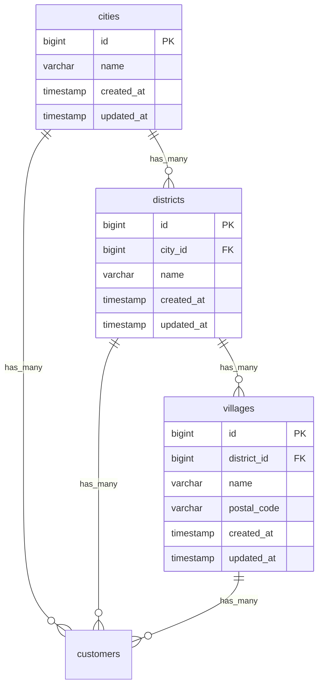

# Database Schema: Master Wilayah

## Entitas Tabel

Modul Wilayah terdiri atas 3 tabel yang saling berkaitan membentuk hierarki referensi lokasi.

## Field Penting
- `city_id` pada `districts`: Mengaitkan kecamatan dengan kota induknya.
- `district_id` pada `villages`: Mengaitkan kelurahan dengan kecamatan induknya.
- Tabel `customers` merujuk langsung ke *id* kota, kecamatan, dan kelurahan untuk mengunci lokasi tempat tinggal/pemasangan.
