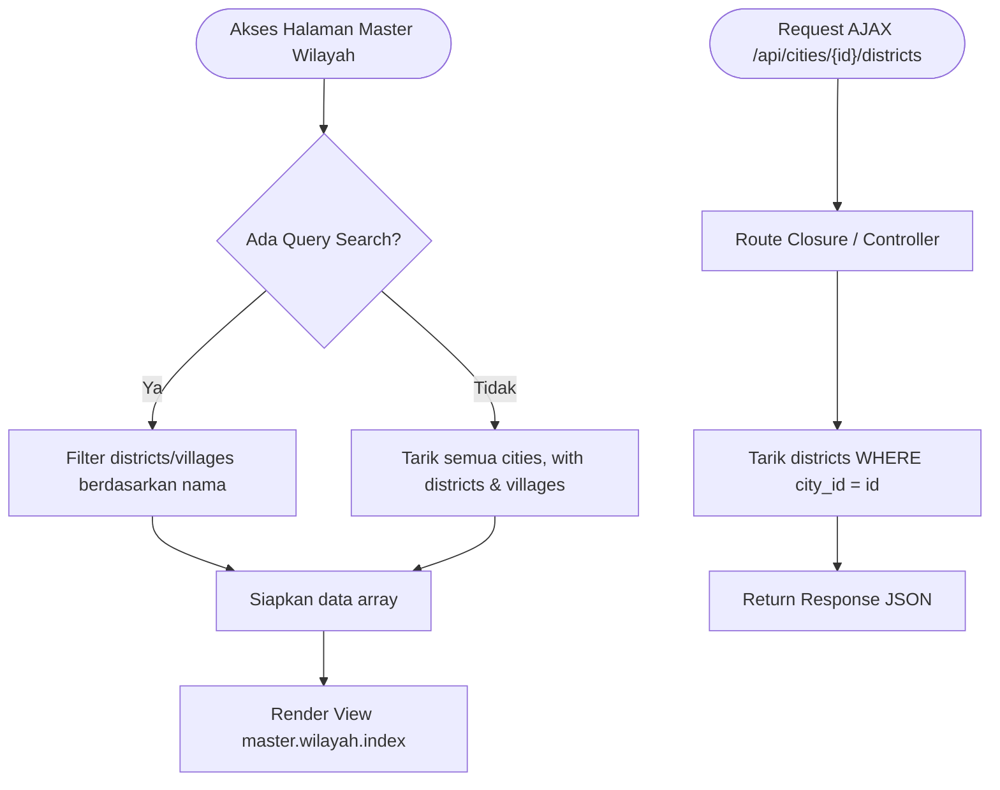

# Flowchart: Master Wilayah

Terdapat dua alur utama pada Master Wilayah: akses halaman master secara langsung dan akses data untuk Dropdown API.

```mermaid
flowchart TD
    %% Flow Halaman Master Wilayah
    Aksespencarian([Akses Halaman Master Wilayah]) --> CekSearch{Ada Query Search?}
    CekSearch -->|Ya| QueryFilter[Filter districts/villages berdasarkan nama]
    CekSearch -->|Tidak| QueryAll[Tarik semua cities, with districts & villages]
    
    QueryFilter --> PaginateData[Siapkan data array]
    QueryAll --> PaginateData
    
    PaginateData --> RenderView[Render View master.wilayah.index]

    %% Flow API Dropdown
    AksesAPI(["Request AJAX /api/cities/{id}/districts"]) --> ControllerAPI[Route Closure / Controller]
    ControllerAPI --> FetchAPI[Tarik districts WHERE city_id = id]
    FetchAPI --> JSONReturn[Return Response JSON]
```
