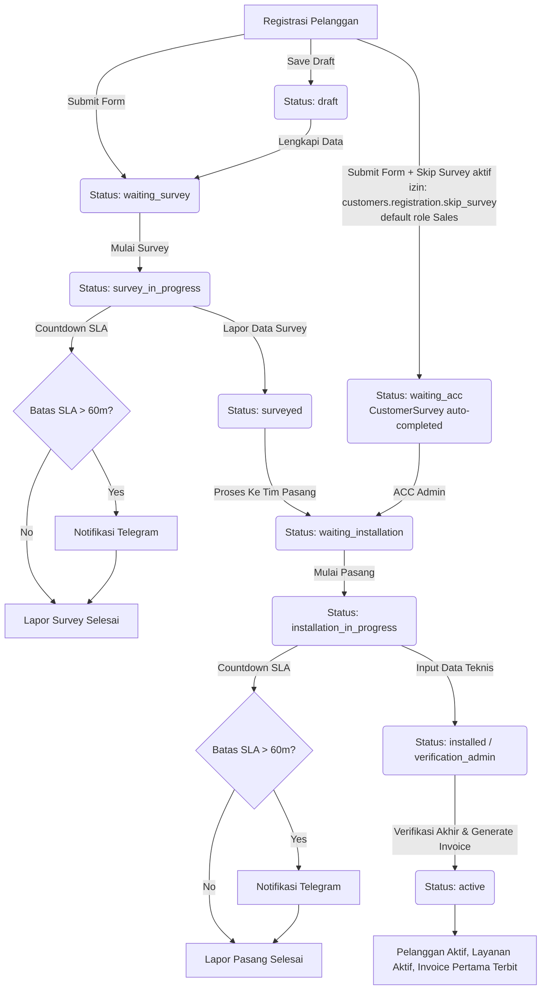

# Flowchart: Pendaftaran Pelanggan Workflow

Berikut adalah alur sistem (system flow) untuk proses Pendaftaran Pelanggan Baru dari registrasi hingga penagihan.

```mermaid
flowchart TD
    A[Registrasi Pelanggan] -->|Save Draft| B(Status: draft)
    A -->|Submit Form| C(Status: waiting_survey)
    A -->|Submit Form + Skip Survey aktif<br/>izin: customers.registration.skip_survey<br/>default role Sales| Q(Status: waiting_acc<br/>CustomerSurvey auto-completed)
    
    B -->|Lengkapi Data| C
    
    C -->|Mulai Survey| D(Status: survey_in_progress)
    D -->|Countdown SLA| E{Batas SLA > 60m?}
    E -->|Yes| F[Notifikasi Telegram]
    E -->|No| G[Lapor Survey Selesai]
    F --> G
    
    D -->|Lapor Data Survey| H(Status: surveyed)
    
    H -->|Proses Ke Tim Pasang| I(Status: waiting_installation)
    Q -->|ACC Admin| I
    
    I -->|Mulai Pasang| J(Status: installation_in_progress)
    J -->|Countdown SLA| K{Batas SLA > 60m?}
    K -->|Yes| L[Notifikasi Telegram]
    K -->|No| M[Lapor Pasang Selesai]
    L --> M
    
    J -->|Input Data Teknis| N(Status: installed / verification_admin)
    
    N -->|Verifikasi Akhir & Generate Invoice| O(Status: active)
    
    O --> P[Pelanggan Aktif, Layanan Aktif, Invoice Pertama Terbit]
```
