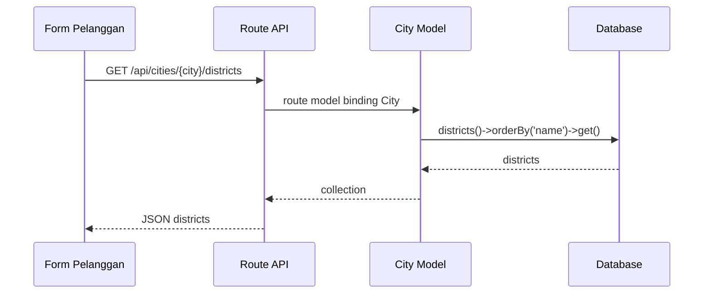
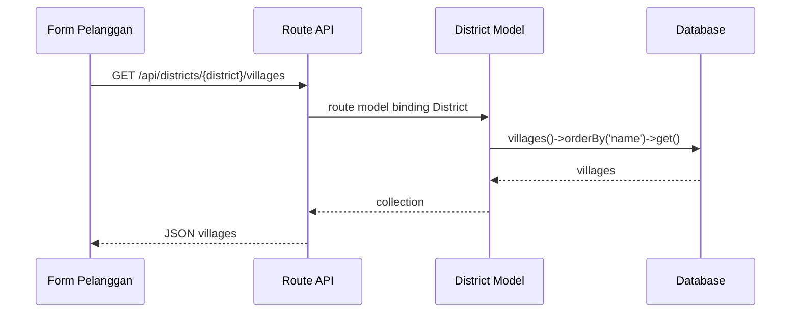

# Penunjang API Wilayah

API wilayah digunakan oleh form pelanggan untuk dependent dropdown kota, kecamatan, dan desa.

## Endpoint

| Method | Endpoint | Response |
| --- | --- | --- |
| GET | `/api/cities/{city}/districts` | Daftar kecamatan berdasarkan kota. |
| GET | `/api/districts/{district}/villages` | Daftar desa berdasarkan kecamatan. |

## Flow Kecamatan per Kota

## Flow Desa per Kecamatan

