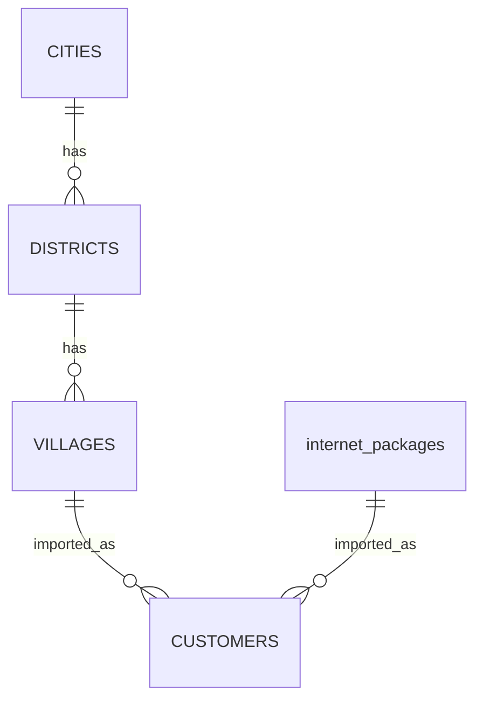

# Database Schema Penunjang

## Import Pelanggan

Import pelanggan membaca dan menyimpan data ke tabel berikut:

| Tabel | Pemakaian |
| --- | --- |
| `customers` | Cek duplikasi HP/NIK dan menyimpan pelanggan hasil import. |
| `villages` | Mencocokkan nama desa. |
| `districts` | Mengambil kecamatan dari desa. |
| `cities` | Mengambil kota dari kecamatan. |
| `internet_packages` | Mencocokkan kode atau nama paket. |

## API Wilayah

API dependent dropdown membaca tabel berikut:

| Endpoint | Tabel |
| --- | --- |
| `/api/cities/{city}/districts` | `cities`, `districts` |
| `/api/districts/{district}/villages` | `districts`, `villages` |

## ERD Penunjang

