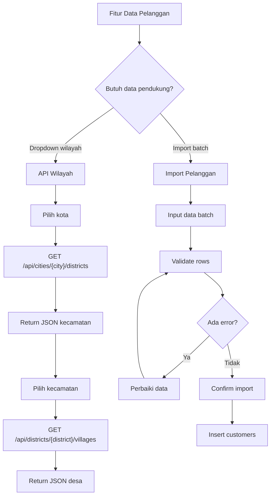

# Flowchart Penunjang

## Flow Penunjang Umum

```mermaid
flowchart TD
    A[Fitur Data Pelanggan] --> B{Butuh data pendukung?}
    B -->|Dropdown wilayah| C[API Wilayah]
    B -->|Import batch| D[Import Pelanggan]

    C --> C1[Pilih kota]
    C1 --> C2["GET /api/cities/{city}/districts"]
    C2 --> C3[Return JSON kecamatan]
    C3 --> C4[Pilih kecamatan]
    C4 --> C5["GET /api/districts/{district}/villages"]
    C5 --> C6[Return JSON desa]

    D --> D1[Input data batch]
    D1 --> D2[Validate rows]
    D2 --> D3{Ada error?}
    D3 -->|Ya| D4[Perbaiki data]
    D4 --> D2
    D3 -->|Tidak| D5[Confirm import]
    D5 --> D6[Insert customers]
```

