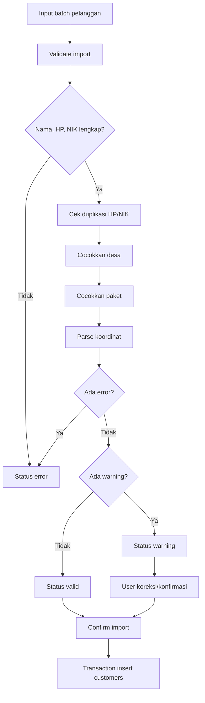

# Penunjang Import Pelanggan

Import pelanggan membantu admin memasukkan banyak data pelanggan dalam satu proses.

## Route

| Method | Route | Fungsi |
| --- | --- | --- |
| GET | `/customers/import` | Form import. |
| POST | `/customers/import/validate` | Validasi row import. |
| POST | `/customers/import/confirm` | Simpan hasil import. |

## Validasi Row

| Data | Aturan |
| --- | --- |
| Nama | Wajib. |
| HP | Wajib, dicek duplikasi ke `customers.phone`. |
| ID/NIK | Wajib, dicek duplikasi ke `customers.identity_number`. |
| Desa | Wajib, dicocokkan ke `villages.name`. |
| Paket | Wajib, dicocokkan ke `internet_packages.package_code` atau `internet_packages.name`. |
| Koordinat | Opsional, format `latitude, longitude`. |

## Status Row

| Status | Arti |
| --- | --- |
| `valid` | Row siap disimpan. |
| `warning` | Row bisa diperbaiki manual karena ada data yang tidak cocok atau duplikat. |
| `error` | Row tidak boleh disimpan sebelum data wajib diperbaiki. |

## Flowchart

