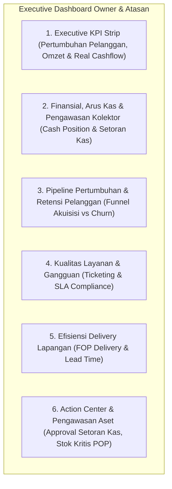

# Analisa & Blueprint Dashboard Owner — Executive Command Center (Multi-Modul)

Status: **Rancangan Lengkap & Termutakhir (Menyesuaikan Arsitektur Multi-Modul Aktif)**  
Target Halaman: `GET /` (`DashboardController@index`, `resources/views/dashboard.blade.php`)  
Akses & Hak: Role `owner` (Akses Penuh / Wildcard `*`), `atasan`, dan `admin` yang memiliki permission `dashboard.view`.

---

## 1. Konteks & Evolusi Sistem

Dokumen awal sebelumnya disusun pada fase awal pengembangan ketika aplikasi baru memiliki modul dasar (Pelanggan, Penagihan, Pembayaran sederhana). Seiring bertumbuhnya sistem, telah hadir modul-modul operasional strategis yang saling terintegrasi:

1. **Modul Kolektor 2.0 & Setoran Kas Admin** (`CashDeposit`, `CollectorWorklist`, `CollectorDeposit`, `CollectorVisit` — ADHOC-18 s/d ADHOC-45).
2. **Modul Fieldwork Lifecycle & Akuisisi** (Survey, PSB/Instalasi, Skip Survey, Verifikasi Admin, Pelanggan Gagal — ADHOC-11, ADHOC-28, ADHOC-41, ADHOC-43).
3. **Modul Manajemen Retensi & Churn** (`CustomerTerminationController`, `CustomerTerminatedController`, status isolir).
4. **Modul Ticketing & SLA Terpadu** (`TicketBucket`, `TicketHandler`, `TicketIssueCategory`, NOC Worksheet — ADHOC-03 s/d ADHOC-10).
5. **Modul Gudang & Inventori Aset** (`Warehouse`, `InventoryBalance`, `InventorySerial`, `TechnicianCustody`).
6. **Modul QR Pelanggan, Portal & Denda** (`CustomerQrToken`, `CustomerBalanceMutation`, `RevenueCategory`).

### Prinsip Utama Dashboard Owner vs Dashboard Operasional Divisi
Sistem Whusnet Operasional telah memiliki dashboard kerja mendalam untuk level operasional:
- `NocDashboardController` (`/noc/dashboard`): Alat ukur SLA per individu CS/NOC, aging tiket per menit, breakdown kategori gangguan.
- `FopDashboardController` (`/fop`): Dispatch harian live, antrean survey hari ini, beban kerja per teknisi.
- `CollectorWorksheetController` (`/collector-worksheet`): Rekonsiliasi setoran fisik kolektor, pencocokan QR kwitansi.

> **Prinsip:** **Dashboard Owner (`/`) BUKAN alat kerja operasional teknis mikro**, melainkan **Executive Command Center (360° Health & Business Overview)**. Dashboard ini memberikan visibilitas menyeluruh terhadap performa finansial, pertumbuhan pelanggan, efisiensi operasional, risiko piutang/churn, serta pengawasan kas perusahaan.

---

## 2. Kondisi Saat Ini vs Target Pengembangan

### Kondisi Eksisting (`DashboardController::index()`)
| Area | Data Eksisting | Evaluasi |
|---|---|---|
| **Pelanggan** | Total, Aktif, Data Belum Lengkap, Siap Billing, Distribusi per POP | Cukup baik, tapi belum menampilkan laju pertumbuhan (*Net Growth*), funnel registrasi baru, dan pelanggan putus (*Churn*). |
| **Penagihan** | Tagihan periode filter, Total tunggakan (`remaining_amount`), Top 10 jatuh tempo | Statis, belum ada breakdown efektivitas penagihan (*Collection Rate*), aging piutang, dan denda. |
| **Pembayaran** | Total pembayaran valid periode filter | Belum ada breakdown kanal penerimaan (Kasir Kantor vs Kolektor vs Transfer Bank). |
| **Posisi Kas** | **Tidak ada** | **Gap Kritis:** Owner tidak bisa melihat berapa kas fisik yang sedang dipegang Kasir POP, berapa di tangan Kolektor, dan berapa Setoran Kas yang menunggu persetujuan Owner. |
| **Ticketing** | **Tidak ada** | **Gap:** Owner butuh melihat ringkasan volume gangguan aktif dan tingkat kepatuhan SLA. |
| **Fieldwork (FOP)** | **Tidak ada** | **Gap:** Owner butuh memantau antrean pasang baru (PSB) dan rata-rata durasi penyelesaian instalasi. |
| **Inventori / Aset** | **Tidak ada** | **Gap:** Belum ada indikator peringatan stok kritis di POP. |

---

## 3. Blueprint 6 Pilar Metrik Dashboard Owner

Dashboard dirancang dalam **6 Pilar Strategis** yang menyajikan metrik penting dengan formula query yang aman, teroptimasi, dan konsisten terhadap RBAC Scope (`applyUserScope()`).



---

### PILAR 1: Executive KPI Strip (Ringkasan Tingkat Tinggi)
Terletak pada baris paling atas sebagai indikator kesehatan utama bisnis ISP pada periode terpilih:

| Indikator | Sumber Data & Formula | Keterangan |
|---|---|---|
| **Total Pelanggan Aktif** | `Customer::applyUserScope()->where('status', 'active')->count()` | Jumlah pelanggan yang sedang aktif berlangganan |
| **Net Customer Growth** | `(Pelanggan Aktif Baru Periode Ini) - (Pelanggan Terminated Periode Ini)` | Pertumbuhan riil pelanggan bersih |
| **Omzet Tagihan Periode** | `Invoice::applyUserScope()->whereBetween('billing_period', [$from, $to])->sum('total_amount')` | Total nilai invoice terbit pada periode filter |
| **Realisasi Kas Masuk** | `Payment::applyUserScope()->where('payment_status', 'valid')->whereBetween('payment_date', [$start, $end])->sum('amount')` | Kas riil diterima dan valid |
| **Collection Rate (%)** | `(Realisasi Kas / Omzet Tagihan) * 100` | Efektivitas penagihan periode berjalan |
| **Tiket Gangguan Aktif** | `Ticket::applyUserScope()->whereInBucket([TicketBucket::MASUK, TicketBucket::DIPROSES])->count()` | Gangguan yang sedang ditangani tim |

---

### PILAR 2: Finansial, Arus Kas & Pengawasan Kasir / Kolektor
Menjawab kebutuhan krusial Owner terhadap **keberadaan fisik uang kas perusahaan**:

```
[ Pelanggan Bayar ]
        │
   ┌────┴──────────────────────────┐
   ▼                               ▼
[ Kasir Kantor POP ]        [ Kolektor Lapangan ]
   │ (Saldo Kas POP)               │ (Cash in Transit)
   │                               │
   └───────────────┬───────────────┘
                   ▼
         [ Setoran Kas Admin ] ──(diajukan)──► [ APPROVAL OWNER / BANK ]
```

| Metrik | Formula Query / Model | Makna bagi Owner |
|---|---|---|
| **Kas Mengendap di Kasir POP** | Turunan pembayaran tunai kantor yang belum disetorkan via `CashDeposit` (`cash_deposit_id IS NULL`) | Uang fisik perusahaan di laci kasir kantor cabang |
| **Uang di Tangan Kolektor (*Cash in Transit*)** | Pembayaran via kolektor yang belum disetor ke admin (`collector_deposit_id IS NULL` atau status `menunggu_verifikasi`) | Uang yang sedang dibawa kolektor di lapangan |
| **Setoran Kas Menunggu Verifikasi Owner** | `CashDeposit::applyUserScope()->where('status', CashDepositStatus::MENUNGGU_VERIFIKASI)->get()` | **Action Wajib:** Uang yang sudah disetor admin ke rekening/owner dan butuh approval/konfirmasi |
| **Selisih Kas Menggantung** | `CashDeposit::applyUserScope()->whereIn('status', [CashDepositStatus::SELISIH_KURANG, CashDepositStatus::SELISIH_LEBIH])->count()` | Masalah selisih setoran kas yang belum ditutup/dihapus-buku |
| **Breakdown Kanal Pembayaran** | Grouping `Payment::applyUserScope()` berdasarkan `payment_method` (`cash`, `transfer`, `collector`) | Porsi pembayaran via bank transfer vs uang tunai |
| **Aging Tunggakan Piutang** | Invoices non-lunas dikelompokkan berdasarkan batas `due_date`: <br>• Lancar (Belum jatuh tempo)<br>• Menunggak 1–30 hari<br>• Menunggak 31–60 hari<br>• Macet (>60 hari) | Profil risiko piutang belum tertagih |

---

### PILAR 3: Pipeline Pertumbuhan & Retensi Pelanggan (Funnel Akuisisi vs Churn)

Memantau jalannya alur konversi dari calon pelanggan hingga aktif, serta mengawasi potensi kehilangan pelanggan (*churn*):

1. **Akuisisi / Pasang Baru (Funnel):**
   - `Calon Pelanggan / Menunggu Survey`: `Customer::whereIn('status', ['calon_pelanggan', 'waiting_survey', 'registered'])->count()`
   - `Menunggu ACC Admin`: `Customer::whereIn('status', ['waiting_acc', 'surveyed'])->count()`
   - `Menunggu Pemasangan (PSB)`: `Customer::where('status', 'waiting_installation')->count()`
   - `Menunggu Verifikasi Admin`: `Customer::where('status', 'verification_admin')->count()`
   - `Pelanggan Gagal / Batal`: `Customer::whereNotNull('rejected_at')->whereBetween('rejected_at', [$start, $end])->count()`

2. **Retensi & Risiko Churn:**
   - `Pelanggan Terisolir`: `Customer::where('status', 'suspended')->count()` (indikasi tunggakan kritis).
   - `Pelanggan Putus (Terminated)`: `Customer::where('status', 'terminated')->whereBetween('terminated_at', [$start, $end])->count()` (angka churn periode).
   - `Kelengkapan Data Pelanggan`: Rasio `siap_billing` vs `perlu_dilengkapi` / `draft`.

---

### PILAR 4: Kualitas Layanan & Gangguan (Ticketing & SLA)

Memberikan visibilitas kualitas jaringan dan kepuasan pelanggan tanpa menduplikasi detail teknis worksheet NOC:

| Metrik | Formula & Relasi | Output |
|---|---|---|
| **Distribusi Bucket Tiket** | `Ticket::applyUserScope()->scopeInBucket($bucket)->count()` untuk `MASUK`, `DIPROSES`, `SELESAI`, `DIBATALKAN` | Volume status penanganan tiket |
| **Tiket Breach SLA Handling** | Tiket `handler != 'fop'` yang durasi penanganannya melewati `handling_sla_hours` (dari `TicketIssueCategory` atau default) | Gangguan yang lambat direspon tim Helpdesk/NOC |
| **Tiket Breach SLA Pengerjaan Lapangan** | Task FOP tiket yang durasi pengerjaan lapangannya melewati `TaskType::slaMinutes()` | Gangguan yang lama selesai di lapangan |
| **Top 5 Kategori Gangguan** | Group by `ticket_issue_categories.name`, count `tickets` periode ini | Mengidentifikasi akar masalah gangguan dominan (misal: FO Cut, Dropcore Putus, Modem Rusak) |

---

### PILAR 5: Efisiensi Delivery Lapangan (FOP Delivery & Lead Time)

Memantau produktivitas instalasi dan survey tim lapangan:

| Metrik | Sumber Data | Keterangan |
|---|---|---|
| **Total Survey Selesai Periode Ini** | `Task::where('task_type', TaskType::SURVEY)->where('status', TaskStatus::SELESAI)->whereBetween('completed_at', [$start, $end])->count()` | Realisasi survey lapangan |
| **Total PSB Selesai Periode Ini** | `Task::where('task_type', TaskType::PEMASANGAN)->where('status', TaskStatus::SELESAI)->whereBetween('completed_at', [$start, $end])->count()` | Realisasi instalasi pelanggan baru |
| **Rata-rata Durasi PSB (Lead Time)** | Rata-rata selisih `completed_at` - `created_at` pada task pemasangan selesai | Mengukur kecepatan aktivasi pelanggan dari daftar hingga online |
| **Overdue Antrean Survey (>24 Jam)** | Calon pelanggan menunggu survey dengan `created_at < now()->subDay()` | Antrean survey yang melampaui SLA |
| **Overdue Antrean PSB (>3 Hari)** | Pelanggan menunggu pemasangan dengan survey selesai `> 3 hari lalu` | Pemasangan yang tertunda |

---

### PILAR 6: Action Center & Pengawasan Aset / Inventori Ringkas

Panel tindakan langsung (*Immediate Attention Required*) yang membutuhkan keputusan Owner/Atasan:

1. **Approval & Verifikasi Setoran Kas:**
   - Menampilkan list ringkas setoran kas dari Admin POP yang membutuhkan verifikasi Owner lengkap dengan bank tujuan, bukti transfer, dan catatan selisih (jika ada).
2. **Alert Stok Menipis di POP:**
   - Menampilkan daftar POP yang memiliki stok barang utama (Modem/ONT, Kabel Dropcore) di bawah batas minimum (*safety stock*).
3. **Peringatan Anomali & Audit Log:**
   - Ringkasan aktivitas sensitif periode ini (misal: pembatalan invoice manual, hapus buku selisih kas, perubahan paket non-standar).
   - **DISKIP PERMANEN (2026-09-10).** `audit_logs` bersifat polymorphic
     (`morphTo` ke Payment/Invoice/Customer/CashDeposit/dst) dan **tidak
     punya kolom `pop_id` sendiri** — POP scope cuma bisa ditegakkan dengan
     join balik ke tabel asal tiap `auditable_type` satu-satu (bukan satu
     query lurus). Widget ringkasan lintas-modul kayak ini gampang jadi
     "query data tanpa pembatasan POP scope" kalau dipaksakan asal jalan
     (lihat `CLAUDE.md` § Berhenti & Tanya Kalau, poin 7). Diputuskan CUKUP
     diaudit lewat halaman/DB langsung, bukan lewat Dashboard Owner. Jangan
     dihidupkan lagi tanpa solusi scoping yang jelas dulu.

---

## 4. Struktur Tata Letak (Layout Wireframe)

Dashboard disusun secara terstruktur, bersih, dan responsif menggunakan standar Design System Whusnet (Tailwind CSS, Dark/Light Mode support, Card & Table Components):

```
┌───────────────────────────────────────────────────────────────────────────┐
│ Filter Bar: [Pilih POP: Semua ▼] [Periode: 2026-08 s/d 2026-09 ▼] [Filter]│
├───────────────────────────────────────────────────────────────────────────┤
│ [Card 1: Pelanggan Aktif] [Card 2: Net Growth] [Card 3: Omzet Tagihan]   │
│ [Card 4: Kas Masuk]       [Card 5: Collection Rate] [Card 6: Open Tiket] │
├──────────────────────────────────────────────────────┬────────────────────┤
│ POSISI KEUANGAN & ARUS KAS                           │ ACTION CENTER:     │
│ ┌──────────────────────┬───────────────────────────┐ │ SETORAN KAS PENDING│
│ │ Kas di Kasir POP     │ Rp 12.500.000             │ │ ┌────────────────┐ │
│ │ Uang di Kolektor     │ Rp  8.200.000             │ │ │ POP Siman      │ │
│ │ Setoran Pending Verif│ Rp 25.000.000 (3 Setoran) │ │ │ Rp 5.000.000   │ │
│ └──────────────────────┴───────────────────────────┘ │ │ [Verifikasi]   │ │
│ Grafik: Kanal Penerimaan (Transfer vs Kasir vs Kol) │ └────────────────┘ │
├───────────────────────────────────┬──────────────────┴────────────────────┤
│ FUNNEL AKUISISI PELANGGAN BARU    │ RETENSI & STATUS PELANGGAN            │
│ [Survey: 8] ──► [PSB: 14] ──► [Verif: 3] │ • Aktif: 1.250  • Isolir: 45          │
│ Overdue Survey: 2  | Overdue PSB: 1     │ • Churn/Putus: 4  • Siap Tagih: 1.240 │
├───────────────────────────────────┴───────────────────────────────────────┤
│ KUALITAS LAYANAN (TICKETING) & SLA                                        │
│ • Tiket Masuk: 5  | Diproses: 12  | Overdue SLA: 2  | Compliance: 94.2%  │
│ Top Kategori Gangguan: [1. Dropcore Putus (8)] [2. Redaman Tinggi (5)]   │
├───────────────────────────────────┬───────────────────────────────────────┤
│ TAGIHAN JATUH TEMPO (TOP 10)      │ ALERT STOK KRITIS POP                 │
│ [Tabel Tagihan Jatuh Tempo...]    │ [Tabel Stok ONT/Kabel Menipis...]     │
└───────────────────────────────────┴───────────────────────────────────────┘
```

---

## 5. Pertimbangan Teknis & Performa

1. **Penegakan RBAC POP Scope:**
   - Semua query wajib melalui `applyUserScope()`.
   - Role Owner otomatis mendapatkan `all_pop`.
   - Role Atasan/Admin POP otomatis terisolasi pada POP yang ditugaskan (*defense-in-depth*).
2. **Strategi Caching 60 Detik:**
   - Hanya nilai skalar/agregasi (`count`, `sum`) yang disimpan di cache dengan key:  
     `dashboard:owner:stats:{userId}:{popId}:{periodFrom}:{periodTo}`.
   - Jangan menyimpan Eloquent Collection utuh ke dalam Cache untuk menghindari isu desrialisasi `__PHP_Incomplete_Class`.
3. **Optimasi Query & Index Database:**
   - Gunakan `whereBetween` pada timestamp dan date untuk menjaga pemanfaatan index kolom (`billing_period`, `payment_date`, `due_date`, `created_at`).
   - Hindari pemanggilan `whereDate()` mentah yang membungkus kolom dalam fungsi SQL `DATE()`.

---

## 6. Rencana Tahapan Eksekusi (Implementation Phasing)

| Fase | Cakupan Modul | Target Deliverable |
|---|---|---|
| **Fase 1: Finansial, Kas Lapangan & Growth KPI** | Tagihan, Pembayaran, Setoran Kas Admin, Saldo Kolektor, Net Growth Pelanggan | • Update `DashboardController` & KPI Cards.<br>• Integrasi Card Posisi Kas & Approval Setoran Kas.<br>• Test Finansial & Kas. |
| **Fase 2: Funnel Akuisisi & Ticketing SLA** | Pipeline Survey/PSB/Verifikasi, Churn/Isolir, Bucket Tiket & SLA Compliance | • Integrasi Funnel Pelanggan.<br>• Integrasi Ringkasan Tiket & SLA.<br>• Test Pipeline & Tiket. |
| **Fase 3: Warehouse Alert & Action Center UI** | Stok Kritis POP, Quick Action Center, Refinement Blade Dark/Light | • Tabel Stok Kritis.<br>• Polish visual & responsivitas.<br>• End-to-end Feature Test. |

---

## 7. Verifikasi Teknis Prasyarat (Wajib Dicek Sebelum Coding)

Rancangan di atas ditulis berdasarkan asumsi skema. Sebelum eksekusi Fase 1,
poin-poin berikut **wajib diverifikasi dulu ke kode/migration aktual** —
jangan asumsi dari dokumen ini:

| Asumsi di Rancangan | Yang Perlu Dicek | Risiko Kalau Salah |
|---|---|---|
| `Ticket::applyUserScope()->whereInBucket($bucket)` | Apakah scope `whereInBucket()` sudah ada di model `Ticket`, atau perlu ditambah | Query gagal / query manual tanpa scope POP → kebocoran data lintas cabang |
| `Payment.cash_deposit_id IS NULL` / `collector_deposit_id IS NULL` | Nama kolom FK aktual di tabel `payments` (bisa beda nama, atau relasinya justru dari sisi `CashDeposit`/`CollectorDeposit` yang nyimpen daftar `payment_id`) | Query "kas mengendap" salah hitung, angka kas fisik ke Owner meleset |
| `handling_sla_hours` di `TicketIssueCategory` | Kolom ini baru disebut modif di `git status` — pastikan migration & seeder sudah jalan sebelum dipakai di query SLA | Breach SLA dihitung dari fallback `TaskType::defaultHandlingSlaHours()` terus, gak sensitif ke kategori |
| Safety stock / batas minimum stok di `InventoryBalance` | Apakah ada kolom `minimum_stock`/`safety_stock` per POP, atau ambang batas ditentukan di tempat lain (`config/`, tabel master baru) | Alert stok kritis gak bisa dibangun tanpa ambang batas — jangan hardcode angka di kode |
| Audit log aktivitas sensitif (Pilar 6 poin 3) | Apakah infrastruktur audit log (`spatie/activitylog` atau audit table custom) sudah ada di repo | Kalau belum ada, ini bukan lagi "tampilkan data yang ada" tapi scope baru (bikin infra audit) — harus dipisah task sendiri, jangan digabung Fase 3 |
| `TaskType::PEMASANGAN` (value `PSB`) dipakai utk hitung PSB selesai | Nama case sudah benar (`PEMASANGAN` label "Pemasangan Baru", value `PSB`) — bukan bug, tapi tim penerus perlu tahu ini bukan `TaskType::PSB` | Salah tulis `TaskType::PSB` di kode akan error "undefined case" |

**Prinsip:** kalau satu baris di atas ternyata belum ada di skema, **jangan bikin
kolom/infra baru diam-diam** — laporkan sebagai gap, tanya dulu ke user
sebelum menambah migration baru (sesuai aturan "Berhenti & Tanya Kalau" di
`CLAUDE.md`, terutama soal perubahan skema data).

---

## 8. Pemetaan Komponen UI per Metrik (Card / KPI Strip / Chart / Table / List / Action)

Supaya tim frontend gak asal pilih komponen, setiap metrik di 6 Pilar dipetakan
ke jenis komponen visual yang sesuai karakter datanya:

**Aturan pemilihan:**
- **KPI Strip (angka besar, 1 baris di atas)** → metrik ringkasan tunggal, tren naik/turun jadi konteks utama, dilihat pertama kali. Semua di Pilar 1.
- **Card (angka + label + optional sub-label)** → metrik agregat berdiri sendiri, tapi bukan headline utama (biasanya berpasangan 2–3 card dalam satu blok Pilar).
- **Chart (bar/donut/line)** → data yang maknanya baru kelihatan lewat *distribusi* atau *perbandingan kategori/waktu*, bukan angka tunggal.
- **Table (list terbatas, ada aksi lihat/klik baris)** → data granular per-entitas (per invoice, per POP, per setoran) yang Owner mungkin perlu telusuri satu-satu.
- **List/Badge ringkas** → funnel/status bertahap, ditampilkan sebagai urutan tahap dengan angka, bukan tabel penuh.
- **Action Card / Button inline** → item yang butuh keputusan Owner saat itu juga (approve/verifikasi), bukan sekadar informasi pasif.

| Pilar | Metrik | Komponen | Alasan |
|---|---|---|---|
| **1. KPI Strip** | Total Pelanggan Aktif, Net Growth, Omzet Tagihan, Realisasi Kas, Collection Rate %, Tiket Aktif | **KPI Strip** (6 kotak sejajar, baris paling atas) | Angka tunggal per metrik, jadi "vital sign" bisnis — harus kebaca sekali pandang tanpa scroll |
| **2. Kas & Kolektor** | Kas di Kasir POP, Uang di Kolektor, Setoran Pending Verif (nominal + jumlah) | **Card** (3 card dalam satu blok "Posisi Keuangan") | Tiga angka posisi kas berdampingan, saling melengkapi jadi satu cerita arus kas — bukan tren, jadi bukan chart |
| | Selisih Kas Menggantung | **Card kecil / badge warning** di sisi blok kas | Angka peringatan, bukan bagian dari posisi kas utama — perlu beda visual (warna alert) supaya gak tercampur angka normal |
| | Breakdown Kanal Pembayaran (cash/transfer/kolektor) | **Chart (donut/pie)** | Proporsi antar kanal — bentuk paling natural utk "porsi dari keseluruhan" |
| | Aging Tunggakan Piutang (Lancar/1-30/31-60/>60 hari) | **Chart (bar horizontal bertingkat)** | Perbandingan besaran antar rentang umur piutang, sekaligus kelihatan mana yang paling parah dari panjang bar |
| **3. Funnel & Retensi** | Funnel Akuisisi (Survey→PSB→Verif→Aktif) | **List/Stepper bertahap** (bukan tabel, bukan chart) | Urutan proses berjenjang — representasi funnel visual (Survey ► PSB ► Verif) lebih jelas dari sekadar angka acak |
| | Overdue Survey/PSB | **Badge angka merah** menempel di tahap funnel terkait | Alert yang nempel ke konteks tahapnya, bukan berdiri sendiri |
| | Retensi (Aktif/Isolir/Churn/Siap Tagih) | **Card** (4 card kecil sejajar) | Angka status berdampingan, dibandingkan langsung, gak perlu bentuk chart |
| **4. Ticketing & SLA** | Distribusi Bucket Tiket (Masuk/Diproses/Selesai/Dibatalkan) | **Card** (4 card) atau **Chart bar tipis** kalau mau tampilkan tren harian juga | Kalau hanya snapshot saat ini → card cukup; kalau ada tren waktu → baru layak jadi chart |
| | Breach SLA Handling & SLA Pengerjaan | **Card angka + badge merah** kalau > 0 | Angka tunggal tapi statusnya kritikal — perlu penekanan visual beda dari card netral |
| | Top 5 Kategori Gangguan | **Chart (horizontal bar) atau Table ranking** | Perbandingan frekuensi antar kategori — bar chart lebih cepat dibaca daripada tabel angka |
| **5. FOP Delivery** | Survey/PSB Selesai Periode Ini | **Card** | Angka realisasi periode, dibandingkan sekilas dengan target/periode lalu |
| | Rata-rata Durasi PSB (Lead Time) | **Card** dengan satuan jelas ("X hari") — chart line kalau mau bandingkan tren antar bulan | Default: angka tunggal cukup di Fase 1; chart tren jadi *nice to have* fase lanjutan |
| | Overdue Antrean Survey/PSB | **Table** (list nama pelanggan + POP + umur antrean) | Owner butuh tahu **siapa** yang overdue, bukan cuma jumlahnya — wajib bisa drilldown per baris |
| **6. Action Center** | Setoran Kas Menunggu Verifikasi | **Table + Action button** ("Verifikasi" per baris) | Ini daftar kerja (worklist), bukan info pasif — tiap baris punya aksi konkret |
| | Alert Stok Kritis POP | **Table** (POP, item, sisa stok, ambang minimum) | Granular per POP+item, perlu ditelusuri, bukan diringkas jadi satu angka |
| | Anomali/Audit Log | **List ringkas** (bukan tabel penuh) — tiap baris link ke detail | Ringkasan aktivitas, bukan angka statistik; poin bukan "berapa" tapi "apa yang terjadi" |

**Catatan konsistensi:** komponen `Card`, `Chart`, `Table` dipetakan ke
component Blade/Alpine yang **sudah ada** di codebase (cek dulu
`resources/views/components/` sebelum bikin partial baru) — sesuai prinsip
"Check for existing components to reuse before writing a new one" di
guideline Boost.

---

## 9. Drilldown & Realtime (Prinsip "Jangan Duplikasi Dashboard Operasional")

Supaya dashboard ini gak berubah jadi kloningan `NocDashboardController` /
`FopDashboardController` / `CollectorWorksheetController` (lihat §1
"Prinsip Utama"), setiap Card/Table di sini yang datanya juga tersedia di
dashboard operasional **wajib linking**, bukan menduplikasi detailnya:

| Sumber Ringkas di Dashboard Owner | Link Drilldown ke |
|---|---|
| Distribusi Bucket Tiket, Breach SLA | `route('noc.dashboard')` |
| Antrean Survey/PSB, Overdue FOP | `route('fop.dashboard')` |
| Setoran Kas, Uang di Kolektor | `route('collector-worksheet.index')` |
| Alert Stok Kritis | halaman detail modul Gudang (`warehouse.*`) |

**Realtime (opsional, bukan syarat Fase 1):** app sudah pakai Reverb +
laravel-echo di dashboard FOP/NOC. Kalau nanti ada kebutuhan angka Owner
update tanpa refresh manual, broadcast event yang sudah ada (mis. event
setoran kas baru, tiket breach SLA) bisa dipakai ulang — jangan bikin channel
broadcast baru khusus dashboard Owner sebelum event sumbernya dipastikan
sudah broadcast keluar.

---

## 10. Status Implementasi (per 2026-09-10)

| Fase | Pilar | Status | Keterangan |
|---|---|---|---|
| Fase 1 | 1 (KPI Strip), 2 (Kas & Kolektor) | ✅ Selesai | Net Growth pakai `customer_status_logs` (bukan kolom baru), Collection Rate, posisi kas kasir/kolektor/setoran pending |
| Fase 2 | 3 (Funnel & Retensi), 4 (Ticketing SLA) | ✅ Selesai | Funnel 4 tahap dari `WorkflowTransition`, distribusi bucket tiket, breach SLA, Top 5 kategori gangguan |
| Fase 3 | 6 poin 2 (Alert Stok Kritis) | ✅ Selesai | Pakai `InventoryBalance::scopeLowStock()` yang sudah ada, gak perlu migration |
| Fase 4 | 5 (Efisiensi Delivery Lapangan) | ✅ Selesai | Survey/PSB selesai, lead time PSB, overdue antrean — sumber `Task`, bukan `Customer` |
| Fase 5 | 2 (perluasan — risiko Kolektor) | ✅ Selesai | Kurang Setor Kolektor (`DepositStatus::SELISIH`, `outstandingShortfall()`) — gap yang gak eksplisit di 6 Pilar awal tapi ditemukan pas audit cakupan modul |
| — | 6 poin 1 (Approval Setoran Kas) | ✅ Selesai | Bagian dari Fase 1 |
| — | 6 poin 3 (Anomali & Audit Log) | ❌ **Diskip permanen** | `audit_logs` gak punya `pop_id` (polymorphic) — lihat catatan di Pilar 6 poin 3 |

Semua gerbang permission & test regresi ada di `app/Http/Controllers/DashboardController.php` dan `tests/Feature/Dashboard*Test.php`.

---

## 11. Kesimpulan
Dengan arsitektur termutakhir ini, Dashboard Owner tidak hanya menampilkan data statis pelanggan dan tagihan lama, melainkan bertransformasi menjadi **Executive Command Center** yang memonitor seluruh denyut operasional ISP Whusnet secara akurat, real-time, dan terintegrasi penuh.
