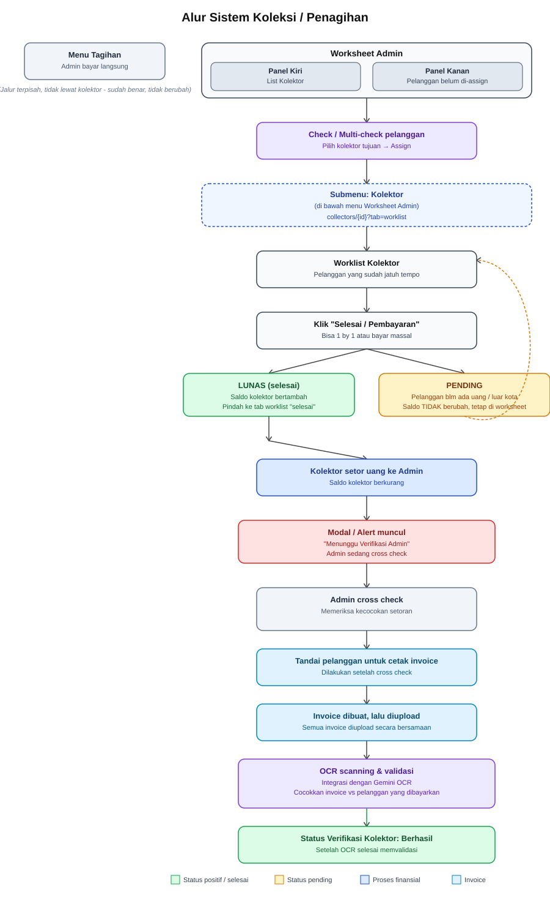

# RANCANGAN — Fase 1–3 SUDAH DIKERJAKAN

> **Dokumentasi modul (acuan sehari-hari) sudah pindah ke [`docs/kolektor/`](../../kolektor/README.md)** —
> README, business-logic, user-flow, flowchart, database-schema. Dokumen ini dipertahankan sebagai
> **rancangan & jejak alasan**: kenapa tiap keputusan diambil, opsi apa yang ditolak, dan konsekuensi
> yang disadari saat memutuskan. Untuk "bagaimana sistem bekerja sekarang", baca `docs/kolektor/`.
>
> Status: Fase 1, 2, 3 selesai 2026-08-08 (+ perbaikan hasil review, lihat
> [`review-fase-1-3.md`](review-fase-1-3.md)). Fase 4 belum dikerjakan.

> **Status:** seluruh pertanyaan terbuka sudah dijawab user (2026-08-08). Bagian 1–7 = alur bisnis
> hasil diskusi awal. Bagian 8–15 = hasil review engineering + keputusan final + peta implementasi.
>
> **Dokumen ini MEREVISI dua keputusan yang sebelumnya dikunci di
> `docs/plan/analisa-billing-tagihan-pembayaran-kolektor.md`** — lihat §8. Jangan baca dokumen lama
> tanpa membaca §8 dulu.

# Analisa Alur Sistem Koleksi / Penagihan

## Diagram Alur



---

## 1. Aktor dalam Sistem

- **Admin** — mengelola Worksheet, meng-assign pelanggan ke kolektor, melakukan cross check & verifikasi setoran, serta bisa membayar tagihan pelanggan secara langsung.
- **Kolektor** — menagih pelanggan sesuai Worklist miliknya, memegang saldo (uang cash hasil tagihan) sampai disetorkan ke Admin.

---

## 2. Pembayaran Langsung oleh Admin

Admin bisa membayar sendiri pada menu **Tagihan** — bagian ini **sudah benar** dan tidak ada perubahan. Ini adalah jalur terpisah, tidak melalui kolektor sama sekali. Pembayaran jalur ini `collected_by = null`, jadi **tidak** menyentuh saldo kolektor mana pun.

---

## 3. Struktur Menu: Kolektor sebagai Submenu Worksheet Admin

**Kolektor adalah submenu** di bawah menu **Worksheet Admin** (bukan relasi data "kolektor = worksheet admin", melainkan struktur navigasi/menu). Strukturnya kurang lebih:

```
Worksheet Admin
 ├─ (Panel utama: List Kolektor + List Pelanggan belum di-assign)
 └─ Kolektor  ← submenu
      └─ Detail per kolektor (collector-worksheet/{collector})
```

### Layout Worksheet Admin — 2 Panel

| Panel | Isi | Aksi |
|---|---|---|
| Kiri | Daftar Kolektor | — |
| Kanan | Daftar pelanggan yang **belum di-assign** ke kolektor mana pun | Checkbox (single/multi-select) → pilih kolektor tujuan → **Assign** |

Query panel kanan **wajib** `applyUserScope()` — ini query pelanggan baru, aturan repo: tiap query pelanggan lewat POP scope.

---

## 4. Worklist Kolektor

Menampilkan pelanggan yang **sudah waktunya ditagih**. Kolektor bisa membayarkan tagihan secara:

- **1 by 1** (per pelanggan), atau
- **Massal / bulk**, sama seperti mekanisme di halaman Tagihan.

Definisi "sudah waktunya ditagih" dikunci di §10.

---

## 5. Mekanisme Saldo Kolektor

Saldo di sini merepresentasikan **uang cash** yang sedang dipegang kolektor, sehingga ada 2 pemicu perubahan:

### a) Saldo Bertambah — Saat Menagih Pelanggan

Trigger: kolektor klik tombol **Selesai/Pembayaran**. Ada 2 kemungkinan hasil:

- **Lunas / Sebagian** → saldo kolektor bertambah **sejumlah uang yang benar-benar diterima** (bukan sejumlah nilai tagihan). Kalau pelanggan mencicil, saldo bertambah sebesar cicilannya dan invoice jadi `sebagian` — pelanggan tetap muncul untuk sisa tagihannya.
- **Pending** (pelanggan belum ada uang, sedang di luar kota, dll) → saldo **tidak** berubah; pelanggan tetap berada di worklist aktif kolektor. **Alasan pending WAJIB tercatat** — lihat §12 (Visit Log).

### b) Saldo Berkurang — Saat Setor ke Admin

Trigger: kolektor menyetorkan hasil tagihan ke Admin.

- Saldo kolektor berkurang sejumlah uang yang disetorkan.
- Sistem menampilkan **Alert/Modal**: "Menunggu Verifikasi Admin" — karena setoran masih harus di-*cross check*.
- Admin melakukan cross check, lalu melakukan **Verifikasi** untuk menyelesaikan proses setoran.

### c) Kwitansi & QR — dokumen bukti bayar

Setelah pembayaran tercatat, Admin mencetak kwitansi, meng-upload-nya (bulk), lalu sistem menempelkan tiap kwitansi ke pembayaran pelanggan yang benar. Pencocokan lewat **QR berisi `payment_number`**, dengan **OCR (Gemini) sebagai fallback** saat QR tak terbaca.

> ⚠️ **Direvisi dari draft awal.** Draft awal menggantung "Status Verifikasi Kolektor: Berhasil" pada
> selesainya OCR. Itu salah urut — lihat §13. Verifikasi setoran = urusan **uang**, selesai di meja
> admin hari itu juga. Kelengkapan kwitansi = urusan **dokumen**, punya status sendiri, tidak
> menyandera status uang.

---

## 6. Ringkasan Alur End-to-End

1. Admin buka **Worksheet Admin** → 2 panel (List Kolektor kiri, pelanggan belum di-assign kanan).
2. Admin check/multi-check pelanggan → assign ke kolektor tertentu.
3. Kolektor login → **Worklist**-nya sendiri: pelanggan yang sudah waktunya ditagih.
4. Kolektor menagih (1 by 1 / massal) → klik Selesai/Pembayaran.
   - **Lunas** → saldo bertambah, invoice keluar dari daftar aktif, masuk tab **Selesai**.
   - **Sebagian** → saldo bertambah sebesar cicilan, sisa tagihan tetap di daftar aktif.
   - **Pending** → saldo tetap, pelanggan tetap di daftar, **alasan tercatat di Visit Log**.
5. Kolektor setor **seluruh** saldo ke Admin → status setoran `menunggu_verifikasi`, saldo kolektor jadi 0.
6. Modal "Menunggu Verifikasi Admin" muncul.
7. Admin cross check: hitung uang fisik vs total sistem → **Verifikasi** atau **tandai Selisih**.
8. Admin cetak kwitansi untuk pembayaran yang sudah terverifikasi.
9. Admin upload kwitansi bulk → sistem scan QR (fallback OCR) → kwitansi nempel ke pembayaran pelanggan.
10. *(Terpisah)* Admin bisa langsung bayar tagihan pelanggan via menu Tagihan, tanpa alur di atas.

---

## 7. Status Konfirmasi (diskusi awal)

| No | Poin | Status |
|---|---|---|
| 1 | "Kolektor = Worksheet Admin" dimaksudkan sebagai **submenu**, bukan relasi data | ✅ Dikonfirmasi |
| 2 | Saat status **Pending**, saldo **tidak bertambah sama sekali** | ✅ Dikonfirmasi |
| 3 | "Saldo berkurang" adalah proses **setoran/deposit** kolektor ke Admin | ✅ Dikonfirmasi |
| 4 | Setelah cross check ada tahap kwitansi → upload → validasi → status | ✅ Ditambahkan, **diurut ulang di §13** |

---

# BAGIAN REVIEW & RANCANGAN FINAL (2026-08-08)

## 8. Dua keputusan lama yang DIREVISI dokumen ini

Wajib dibaca sebelum menyentuh kode — komentar migration dan seeder masih merujuk ke keputusan lama.

| Keputusan lama | Lokasi | Status sekarang |
|---|---|---|
| **Kolektor TIDAK boleh input pembayaran** | `analisa-billing-tagihan-pembayaran-kolektor.md` §B-1, §B-8 no. 4; `RolePermissionSeeder` (kolektor cuma `kolektor.view`); `tests/Feature/CollectorRoleCannotCreatePaymentsTest.php`; komentar kelas `CollectorWorklistController` ("nol tombol, nol aksi") | **DIREVISI.** Kolektor mencatat pembayaran sendiri dari Worklist-nya. Alasan lapangan: kolektor yang tahu persis siapa bayar berapa saat itu juga; menunda input ke admin bikin antrean & selisih ingatan. |
| **Rekonsiliasi kas kolektor DILUAR SCOPE** (2026-08-01) | dokumen sama §B-11 ⛔; komentar migration `create_payment_batches` | **DIREVISI.** Setoran + saldo + cross check dihidupkan, dengan bentuk **lebih ringan** dari §B-11 (lihat §11). Sesuai catatan §B-11 sendiri: tabel `payment_batches` yang diperluas, **bukan** tabel baru berlapis. |

Yang **tidak** direvisi dan tetap berlaku:

- Halaman Tagihan tetap master universal; assign kolektor tidak memindahkan pelanggan dari sana (§B-2, §B-8 no. 2).
- Kelebihan bayar dikembalikan fisik, tak jadi kredit/saldo pelanggan (§B-8 no. 6).
- `payment_date` = tanggal posting kantor, `collected_date` = tanggal tagih lapangan (§B-8 no. 8).
- Role global, dibatasi scope; dilarang bikin role per cabang.

---

## 9. Pemisahan Halaman — dua audiens, dua halaman

Inti perbaikan arsitektur. Halaman dipisah menurut **siapa penggunanya**, bukan menurut data.

| Halaman | Pemakai | Isi |
|---|---|---|
| **Worksheet Admin** `/collector-worksheet` | Admin | daftar kolektor, panel assign, cross check & verifikasi setoran, upload + validasi kwitansi, riwayat pembayaran per kolektor |
| **Worklist Kolektor** `/collector-worklist` | Kolektor | pelanggan yang harus ditagih, aksi bayar, aksi setor, saldo berjalan |

Efeknya: kolektor **tidak pernah** membuka halaman admin, jadi `payments.create` tetap **tidak** diberikan ke role `kolektor`. Ini menutup blocker terbesar rancangan awal (rute `/collectors` sekarang digerbang `payments.create` di `routes/web.php:206`, yang tak dimiliki kolektor).

### Peta rename route / controller / view

Prinsip penamaan repo: **identifier kode Inggris** (`collectors`, `fop-tasks`, `payment_batches`), **komentar/commit/dokumen Indonesia**, **kode role & permission Indonesia** karena istilah domain (`kolektor`, `kolektor.view`). Jangan campur dalam satu identifier.

**Sisi Admin**

| Baru | Lama | Controller |
|---|---|---|
| `GET /collector-worksheet` | `GET /collectors` | `CollectorWorksheetController@index` |
| `GET /collector-worksheet/{collector}` | `GET /collectors/{collector}` | `CollectorWorksheetController@show` |
| `POST /collector-worksheet/{collector}/assign` | `POST /collectors/{collector}/assign` | `@assign` |
| `POST /collector-worksheet/{collector}/customers/{customer}/release` | idem lama | `@release` |
| `POST /payment-batches/{collector}` | `POST /collector-batch/{collector}` | `PaymentBatchController@store` |
| `POST /collector-deposits/{deposit}/verify` | — (baru) | `CollectorDepositController@verify` |
| `POST /payment-receipts` | — (baru) | `PaymentReceiptController@store` |

**Sisi Kolektor**

| Route | Controller | Catatan |
|---|---|---|
| `GET /collector-worklist` | `CollectorWorklistController@index` | sudah ada, nama sudah tepat, isinya berubah jadi actionable |
| `POST /collector-worklist/pay` | `CollectorPaymentController@store` | **TANPA parameter `{collector}`** |
| `POST /collector-worklist/deposit` | `CollectorDepositController@store` | setor seluruh saldo |

> ### 🔒 Kenapa rute kolektor TANPA parameter `{collector}`
>
> Endpoint sekarang `POST /collector-batch/{collector}` mengambil kolektor dari URL. Aman selama
> hanya admin yang boleh. Begitu kolektor ikut submit, **kolektor A bisa POST ke `{id-B}` dan
> mencatat pembayaran atas nama B**. Di rute kolektor, `collector_id` **dipaksa `auth()->id()` di
> server**, bukan diterima dari request. Logika inti tetap satu method bersama — yang beda cuma
> sumber `$collector`. Jangan duplikasi validasi baris.

Biaya rename yang harus ikut dikerjakan: `resources/views/collectors/{index,show}.blade.php`,
`tests/Feature/CollectorHubTest.php`, `tests/Feature/CollectorAssignmentGuardsTest.php`,
`tests/Feature/CollectorBatchPaymentTest.php`, `tests/Feature/CollectorBatchNotificationTest.php`,
`tests/Feature/KolektorLoginRedirectsToWorklistTest.php`, dan `route('collectors.show')` yang dipakai
di notifikasi `CollectorBatchController` (baris ~163). Sekali kerja, mumpung belum tumbuh.

### Tab di halaman Worksheet Admin

Draft awal menyebut tab "Selesai" **dan** daftar aktif dengan URL yang sama (`?tab=worklist`) — itu
kontradiksi. Tiga tab terpisah:

- `?tab=pembayaran` — cross check: pembayaran & setoran kolektor ini
- `?tab=assign` — assign / release pelanggan (sudah ada)
- `?tab=kwitansi` — upload & status pencocokan dokumen

---

## 10. Definisi "sudah waktunya ditagih"

**Keputusan: jendela 7 hari sebelum jatuh tempo.**

```php
// config/billing.php
'collector_due_window_days' => 7,
```

Angka disimpan di config, bukan literal di query — tiap POP bisa beda ritme keliling dan penyetelan
tak boleh butuh deploy.

Aturan:

1. Invoice masuk daftar kalau `due_date <= today + collector_due_window_days` dan status
   `belum_dibayar` / `sebagian`.
2. **Seleksi per PELANGGAN, tampilan per INVOICE.** Pelanggan muncul kalau **ada minimal satu**
   invoice yang memenuhi (1); begitu dibuka, tampilkan **seluruh** invoice belum lunasnya —
   termasuk yang belum masuk jendela. Kalau tidak, tunggakan lama dan tagihan berjalan terpisah di
   dua kunjungan berbeda. Kolektor keliling sebulan sekali; dia harus bisa menyapu semuanya sekali datang.
3. Invoice `sebagian` tetap muncul walau jatuh temponya sudah lewat jauh — itu sisa cicilan, bukan tagih ulang.

> **Catatan koreksi:** filter jatuh tempo **bukan** mekanisme pencegah "nagih 2× ke pelanggan sama".
> Dobel tagih sudah tertutup secara struktural: bayar → `remaining_amount` turun → lunas → invoice
> keluar dari daftar; dan `CollectorBatchController::validateRows()` menolak invoice `lunas`/`batal`
> serta nominal melebihi sisa. Yang dicegah filter ini adalah **nagih terlalu awal**.

---

## 11. Saldo, Setoran, dan Selisih

### 11.1 Saldo = angka TURUNAN, bukan kolom yang di-increment

```
saldo(kolektor X) = Σ payment (collected_by = X, status VALID, belum masuk setoran terverifikasi)
                  − Σ setoran terverifikasi milik X
```

**Dilarang** membuat kolom `users.saldo` yang di-`+=` saat bayar dan `-=` saat setor. Begitu ada satu
payment di-reject / void / dikoreksi, kolom itu tidak ikut berubah dan mulai bohong. Angka uang yang
bohong tidak punya alarm — ketahuan berbulan-bulan kemudian dan tak bisa direkonstruksi.

Pola yang benar sudah ada di repo: `Invoice::recalculateFromPayments()` — nilai boleh disimpan, tapi
**hanya satu fungsi yang boleh menulisnya** dan selalu hitung ulang dari payment. Mulai dari murni
dihitung live (volume per kolektor kecil); tambahkan kolom cache hanya kalau terbukti lambat, dengan
satu penulis.

### 11.2 "Tidak boleh ada saldo mengendap" — dua angka, jangan pernah dijumlahkan

Keputusan user: setoran = **setor seluruh saldo**, bukan sebagian. Setelah setor, saldo kembali 0.
Tak ada logika alokasi setoran parsial — penyederhanaan besar, diterima.

**Tapi jangan ditegakkan mutlak.** Kalau kolektor kurang setor (sistem catat 350rb, fisik 320rb),
memaksa saldo jadi 0 membuat **kekurangan 30rb menguap** — padahal justru itu angka terpenting.
Karena itu selalu **dua angka terpisah**:

| Angka | Perilaku |
|---|---|
| **Saldo Belum Disetor** | wajib kembali 0 tiap setoran — ini "tidak mengendap" yang dimaksud |
| **Kurang Setor (kewajiban kolektor)** | **tidak** ikut nol; tetap terlihat sampai dilunasi atau dihapus buku |

Kalau digabung, "saldo 0" jadi ambigu: beres, atau nombok 30rb yang tak tercatat.

### 11.3 Cicilan — tidak ada perubahan kode

Tagihan 150rb, pelanggan bayar 100rb → `Payment.amount = 100.000`, invoice `sebagian` sisa 50rb,
saldo kolektor +100rb. `CollectorBatchController` sudah persis begitu (nominal bebas ≤ sisa, lalu
`recalculateFromPayments()`). Saldo mencatat **uang yang diterima**, bukan nilai tagihan.

### 11.4 Cross check — harus punya hasil akhir yang tersimpan

Tabel `collector_deposits`:

| Field | Isi |
|---|---|
| `id`, `deposit_number` | identitas setoran |
| `collector_id` | penyetor |
| `pop_id` | POP setoran (untuk scope verifikasi) |
| `declared_amount` | uang fisik yang dihitung Admin di meja |
| `settles_deposit_id` (nullable) | menunjuk setoran bermasalah yang dilunasi setoran ini |
| `settlement_amount` | nominal pelunasan selisih yang ikut di setoran ini |
| `status` | `menunggu_verifikasi` → `terverifikasi` / `selisih` → `selisih_lunas` / `dihapus_buku` |
| `verified_by`, `verified_at`, `note` | siapa, kapan, kenapa |
| `written_off_by`, `written_off_at` | hapus buku (Owner) |
| `submitted_at`, `idempotency_key` | anti submit dobel, sama pola `payment_batches` |

Payment ditautkan lewat `payments.collector_deposit_id` (nullable).

**`computed_amount` DIHITUNG, tidak disimpan** = Σ payment yang tertaut setoran ini. Alasan sama
dengan §11.1.

Aturan:

1. Setoran menyimpan **daftar payment (snapshot relasi)**, bukan angka beku. Kolektor bisa terus
   nagih selagi setoran menunggu verifikasi — kalau yang disimpan angka, terjadi race.
2. `difference = declared_amount − (computed_amount + settlement_amount)`.
3. `difference ≠ 0` → **tidak boleh** `terverifikasi` tanpa `note` wajib. Statusnya `selisih`.
4. **`selisih` bukan status terminal.** Jalan pulangnya: dilunasi di setoran berikutnya
   (`settles_deposit_id`) → `selisih_lunas`; atau **dihapus buku oleh Owner** + alasan → `dihapus_buku`.
5. Semua perubahan status masuk audit log.

**Pencocokan invoice bersifat otomatis, bukan pekerjaan manual Admin.** Tiap payment sudah terikat
`invoice_id` dan tiap invoice sudah dihitung ulang dari payment-nya. Yang dicocokkan manusia hanya
**uang fisik vs total sistem**. Jangan suruh Admin mencocokkan invoice satu per satu — 1000 baris/hari,
itu kembali ke masalah awal yang mau dipecahkan fitur ini.

### 11.5 Form setoran — pelunasan selisih WAJIB field terpisah

Kalau kolektor kurang 30rb lalu besok menyetor 30rb ekstra dan ekstra itu cuma masuk
`declared_amount`, hasilnya `difference = +30.000` alias **lebih setor** — selisih baru yang
menggantung. Dua selisih berlawanan mengambang, laporan tak pernah nol.

```
Total pembayaran hari ini (dihitung sistem)  : 280.000
Pelunasan selisih Setoran #12                :  30.000
─────────────────────────────────────────────────────
Diharapkan                                   : 310.000
Uang fisik (declared)                        : 310.000
Selisih                                      :       0
```

Setoran #12 pindah ke `selisih_lunas`.

### 11.6 Reject / koreksi payment — batasnya titik verifikasi

| Kondisi payment | Reject boleh? | Efek |
|---|---|---|
| Belum masuk setoran | Ya | Saldo turun sendiri (derived) |
| Setoran `menunggu_verifikasi` | Ya | Total setoran ikut berubah — makanya snapshot relasi, bukan angka |
| Setoran **sudah terverifikasi** | **Tidak** | Ditolak di `PaymentController::reject()` |

Koreksi setelah terverifikasi lewat **payment pembalik** (bertanda, alasan wajib, audit log) yang
otomatis menerbitkan Kurang/Lebih Setor atas nama kolektor. **Setoran lama tidak pernah disentuh.**

Alasannya bukan teknis: setoran terverifikasi adalah dokumen serah-terima uang yang sudah disetujui
dua pihak. Mengubahnya belakangan berarti jejak uang bisa dihapus diam-diam — persis lubang yang mau
ditutup fitur ini.

### 11.7 Guard nonaktifkan kolektor — diperluas

`UserController::update()` sekarang melarang menonaktifkan kolektor yang masih memegang pelanggan.
**Tambah: dilarang juga selama masih punya kurang setor terbuka** (`selisih` belum `selisih_lunas`
atau `dihapus_buku`). Tanpa ini, kolektor bertunggakan tinggal dinonaktifkan dan angkanya hilang dari
semua daftar. Satu-satunya jalan keluar tetap hapus buku oleh Owner.

---

## 12. Pending → Visit Log

Draft awal: pending ⇒ saldo tak berubah, pelanggan tetap di daftar. Itu **identik dengan tidak
melakukan apa-apa** — nol baris tersimpan.

Padahal ini satu-satunya kesempatan menutup lubang yang sudah diidentifikasi §B-11 lama:
*"laporan tidak jujur lolos 100%"* — pelanggan bayar tunai, kolektor tak melapor, sistem diam,
invoice tetap `belum_dibayar`, pelanggan merasa sudah bayar.

Tabel `collector_visits`:

| Field | Isi |
|---|---|
| `collector_id`, `customer_id`, `pop_id` | siapa mendatangi siapa |
| `visited_at` | tanggal kunjungan |
| `result` | `bayar` / `tidak_ada_orang` / `menolak` / `janji_bayar` |
| `promised_date` (nullable) | kalau `janji_bayar` |
| `note` | alasan bebas |
| `payment_id` (nullable) | terisi kalau `result = bayar` |

Nilainya: muncul **aging per kolektor** — "pelanggan ini 5× `tidak_ada_orang` tapi tunggakannya
menua" = pola yang layak diaudit. Tanpa ini, "tidak ada baris" ambigu: belum didatangi, atau
didatangi lalu uangnya raib.

Biaya: satu tabel kecil. **Ini satu-satunya kontrol anti-fraud di rancangan ini** — kwitansi bukan
(lihat §13).

---

## 13. Kwitansi & QR — arsip bukti, BUKAN kontrol fraud

Alur yang disepakati: cetak → upload bulk → cocokkan ke pembayaran → tersimpan sebagai dokumen
pembayaran pelanggan.

Gunanya nyata: pelanggan sengketa "saya sudah bayar" → ada bukti; CS tak perlu bertanya ke kolektor.

**Tapi jangan dianggap kontrol.** Kwitansi yang dicetak dari data sistem **setelah** pembayaran
diinput tidak mendeteksi kolektor yang tak melapor: kalau uang diterima dan tak dicatat, tak ada
kwitansi yang dicetak, tak ada yang hilang, tak ada alarm. Yang menangkap kasus itu tetap **Visit Log**
(§12) dan pelanggan yang komplain. Kwitansi = bukti bagi pelanggan; Visit Log = jaring bagi kolektor.
Dua fungsi berbeda, dua-duanya dibangun.

### 13.1 QR utama, OCR fallback

Karena kwitansi dicetak sistem sendiri, mencocokkannya **bukan pekerjaan AI**:

1. **Cetak QR berisi `payment_number`** di kwitansi. Upload → scan QR → file otomatis nempel ke
   payment yang benar. Deterministik, gratis, akurat, tanpa antrean panjang.
2. **Cetak `payment_number` juga sebagai teks biasa** — itu yang dibaca OCR saat QR sobek/buram/hasil
   fotokopi, dan yang dibaca manusia saat OCR juga gagal.
3. **Gemini OCR = fallback**, bukan jalur utama. Jalan di **queue job** (Horizon sudah ada), bukan
   request sinkron.
4. **Manual override wajib.** Status dokumen tidak boleh disandera model probabilistik.
5. Status per file: `pending` / `processing` / `matched` / `mismatch` / `failed`, retry terbatas.

Sinergi: rancangan QR pelanggan sudah ada di `docs/plan/qr-code/rancangan-qr-pelanggan.md`.

### 13.2 Urutan diperbaiki — kas dan dokumen dua sumbu terpisah

Draft awal menggantung status verifikasi kolektor pada selesainya OCR. Salah: verifikasi setoran
(uang, hari ini, di meja) tidak boleh menunggu upload dokumen (belakangan, bisa gagal baca).

```
Sumbu KAS      : bayar → setor → cross check → terverifikasi / selisih   ← selesai hari itu
Sumbu DOKUMEN  : cetak kwitansi → upload → QR/OCR → matched              ← status sendiri
```

Setoran terverifikasi walau kwitansinya belum diupload. Kelengkapan dokumen dilaporkan terpisah.

### 13.3 Penyimpanan

File kwitansi memuat data pelanggan → disk **`local` (privat)**, sama seperti lampiran tiket. Akses
hanya lewat controller yang mengecek permission + POP scope. **Dilarang** ke disk `public` atau URL
yang bisa ditebak.

### 13.4 Catatan yang belum tertutup

Karena `payment_number` baru ada **setelah** pembayaran tersimpan, kwitansi dicetak sesudah kolektor
submit — **pelanggan tidak menerima apa pun di tempat**. Kwitansi jadi arsip internal untuk sengketa,
bukan bukti yang dipegang pelanggan saat itu. Kalau kelak pelanggan harus pegang bukti seketika,
butuh langkah tambahan (kwitansi dibawa kolektor kunjungan berikutnya, atau notifikasi WA saat
payment tercatat). Bukan blocker sekarang — dicatat supaya tidak dikira sudah tertutup.

---

## 14. RBAC & POP Scope

### 14.1 Permission

Permission di-generate dari `features × actions` (`PermissionGeneratorService`), **bukan hardcode**.

| Feature | Action | Permission | Pemegang |
|---|---|---|---|
| `kolektor` | `view` | `kolektor.view` (sudah ada) | kolektor |
| `kolektor` | `pay` | `kolektor.pay` (baru) | kolektor |
| `kolektor` | `deposit` | `kolektor.deposit` (baru) | kolektor |
| `collector_worksheet` | `view` | `collector_worksheet.view` (baru) | admin, owner |
| `collector_worksheet` | `assign` | `collector_worksheet.assign` (baru) | admin, owner |
| `collector_worksheet` | `validate` | `collector_worksheet.validate` (baru) | admin, owner |

- **`payments.create` TETAP tidak diberikan ke role `kolektor`.** Kolektor hanya boleh membayar
  invoice pelanggan yang ter-assign ke dirinya, lewat rute kolektor.
- **Hapus buku selisih = Owner** (punya `*`).
- **Status action code (sudah dicek di `app/Enums/ActionCode.php`):**
  - `view`, `assign`, `validate` — **sudah ada**. Verifikasi setoran memakai `validate`, konsisten
    dengan `payments.validate` yang sudah dipakai repo. Jangan bikin action `verify` yang artinya sama.
  - `pay`, `deposit` — **belum ada**, wajib ditambah ke enum `ActionCode` + `ActionSeeder` dulu.
    Jangan pakai `create` (`kolektor.create` ambigu: bikin kolektor atau bikin pembayaran?), dan
    jangan hardcode string permission.
- Setelah ubah role/permission/scope: panggil `EffectiveAccessService::clearCache($user)`.

### 14.2 Guard yang wajib ada

1. **Verifikator ≠ penyetor.** §B-8.4 mengizinkan `pop_admin` merangkap role `kolektor`. Tanpa guard
   ini, orang yang sama bisa menagih, mencatat, menyetor, dan memverifikasi setorannya sendiri —
   menghapus seluruh guna cross check. Berlaku untuk semua, termasuk Owner.
2. **Admin POP A tak boleh memverifikasi setoran kolektor POP B.** Verifikasi lewat
   `EffectiveAccessService` / `applyUserScope()`, server-side, bukan sekadar UI.
3. **`collector_id` wajib ber-role `kolektor`** + POP pelanggan ⊆ scope kolektor — sudah ada di
   `CollectorController::assign()`, dipertahankan.
4. **Kolektor hanya menagih POP-nya sendiri.** Sudah dijaga dua lapis (`customers.collector_id` +
   guard assign). Celah tersisa: `CollectorWorklistController` memfilter **hanya**
   `collector_id = auth()->id()` tanpa `applyUserScope()`. Kalau scope POP kolektor **dipersempit**
   belakangan (dipindah cabang), pelanggan yang terlanjur ter-assign tetap muncul di worklist-nya —
   di luar scope barunya. **Tambahkan `applyUserScope()`** di sana.
5. Rute kolektor tanpa parameter `{collector}` (§9).

---

## 15. Urutan Fase & Dampak ke Test/Dokumen

### Fase 1 — Pemisahan halaman & kolektor bisa bayar ✅ SELESAI 2026-08-08

Ringkasan hasil (detail di `docs/TASKS.md` ADHOC-18):

| Yang dibangun | Berkas |
|---|---|
| Worksheet Admin (2 panel + 2 tab) | `CollectorWorksheetController`, `resources/views/collector-worksheet/` |
| Worklist Kolektor actionable + POP scope lapis kedua | `CollectorWorklistController`, `resources/views/collector-worklist/index.blade.php` |
| Rute kolektor tanpa `{collector}` | `CollectorPaymentController`, `POST /collector-worklist/pay` |
| Rute admin ber-parameter | `PaymentBatchController`, `POST /payment-batches/{collector}` |
| Logika bersama | `CollectorPaymentService`, `CollectorWorklistService`, `App\Traits\RecordsCollectorBatch` |
| Jendela tagih 7 hari | `config/billing.php` |
| Permission `kolektor.pay`, feature `collector_worksheet` | `ActionCode::PAY`, `ActionSeeder`, `config/rbac.php`, `FeatureSeeder`, `RolePermissionSeeder` |

Temuan saat implementasi (sudah diperbaiki): urutan cek idempotency sempat jatuh
**sesudah** validasi baris, sehingga submit ulang dijawab 422 "invoice sudah lunas"
padahal pembayaran pertama berhasil. Idempotensi wajib mendahului validasi — jaminan
ini dikunci test `CollectorSelfPaymentTest::test_duplicate_idempotency_key_is_not_processed_twice`.

Catatan deploy: setelah seeder RBAC jalan, panggil `EffectiveAccessService::clearCache()`
— permission & scope di-cache, permission baru tak kelihatan sampai cache kedaluwarsa.

Rencana awal fase ini:
- Rename route/controller/view sesuai §9; tab dipisah tiga.
- Permission `kolektor.pay`, feature `collector_worksheet`.
- `CollectorWorklistController` jadi actionable + `applyUserScope()`.
- `CollectorPaymentController@store` — `collector = auth()->id()`, pakai ulang logika batch yang ada
  (satu transaksi, all-or-nothing, `idempotency_key`), **jangan bikin jalur kedua**.
- Filter jendela 7 hari (§10).

### Fase 2 — Saldo & Setoran ✅ SELESAI 2026-08-08

| Yang dibangun | Berkas |
|---|---|
| Tabel setoran + tautan payment | `collector_deposits`, `payments.collector_deposit_id` |
| Status siklus hidup | `App\Enums\DepositStatus` |
| Saldo & kewajiban (dua angka terpisah, keduanya turunan) | `CollectorBalanceService` |
| Setor / verifikasi / hapus buku + seluruh invariant | `CollectorDepositService` |
| Tiga aksi, tiga kewenangan | `CollectorDepositController` |
| UI kolektor (saldo, tombol setor, status) & admin (tab Setoran + form cross check) | `collector-worklist/index.blade.php`, `collector-worksheet/show.blade.php` |
| Permission | `kolektor.deposit`, `collector_worksheet.validate`, `collector_worksheet.approve` |
| Guard koreksi | `PaymentController::reject()` menolak payment di setoran terverifikasi |
| Guard nonaktif | `UserController::update()` menolak kolektor bersaldo / berkurang setor |

Keputusan implementasi yang perlu diketahui:

1. **Otorisasi POP verifikasi tidak bersandar pada `collector_deposits.pop_id`.**
   Kolom itu cuma representatif untuk listing. Yang menentukan: admin wajib bisa
   melihat **seluruh** payment di setoran lewat POP scope-nya. Kolektor ber-scope
   `pop_tree` bisa punya setoran lintas POP; mengecek satu kolom saja bikin admin
   cabang lain bisa menutup setoran yang isinya sebagian di luar wilayahnya.
2. **`collector_worksheet.approve` (hapus buku) TIDAK diberikan ke `admin`** —
   makanya matrix admin memakai daftar eksplisit, bukan wildcard
   `collector_worksheet.*`. Admin yang menemukan selisih tak boleh sekaligus
   menutup kerugian temuannya sendiri. Owner lolos lewat `*`.
3. **`difference` disimpan, `computedAmount()` dihitung.** Menyimpan hasil
   verifikasi aman karena payment tak bisa keluar dari setoran terverifikasi
   (guard di `reject()`); menyimpan saldo tidak aman karena payment bisa
   di-reject kapan saja sebelum verifikasi.
4. **Lebih setor tidak jadi piutang balik kolektor.** Uang lebih dikembalikan
   fisik saat itu juga, konsisten dengan aturan kembalian pelanggan (§B-8 no. 6
   yang masih berlaku). Yang dilacak sebagai kewajiban hanya `difference` negatif.
5. **Pelunasan selisih mendukung cicilan** lewat `settled_amount`: sisa kewajiban
   = kurang setor − yang sudah dilunasi. Setoran baru pindah ke `selisih_lunas`
   setelah sisanya habis, bukan setelah pelunasan pertama.

Rencana awal fase ini:
- `collector_deposits` + `payments.collector_deposit_id`.
- Saldo derived (§11.1), setor seluruh saldo (§11.2), form pelunasan selisih (§11.5).
- Verifikasi Admin + guard verifikator ≠ penyetor + POP scope.
- Guard reject pasca-verifikasi (§11.6), guard nonaktifkan kolektor diperluas (§11.7).
- Audit log semua transisi status.

### Fase 3 — Visit Log ✅ SELESAI 2026-08-08

| Yang dibangun | Berkas |
|---|---|
| Tabel kunjungan + kunci satu-pintu-satu-hari | `collector_visits` |
| Hasil kunjungan | `App\Enums\VisitResult` |
| Pencatatan + laporan aging | `CollectorVisitService` |
| Input kolektor (hasil tanpa uang) | `CollectorVisitController`, `POST /collector-worklist/visits` |
| `bayar` otomatis dari payment | hook di `CollectorPaymentService::record()` |
| UI kolektor & tab Kunjungan admin | `collector-worklist/index.blade.php`, `collector-worksheet/show.blade.php` |
| Permission | `kolektor.visit` (`ActionCode::VISIT`) |

Keputusan implementasi:

1. **`bayar` tidak bisa diinput manual.** Ia hanya lahir sebagai turunan payment
   yang benar-benar tersimpan, ditulis **di dalam transaksi pembayaran yang sama**
   supaya mustahil ada payment tanpa jejak kunjungan. Kalau hasil itu boleh
   diketik, kolektor yang mengantongi uang tinggal mencatat "bayar" tanpa payment
   — tabel ini berubah dari alat pengungkap jadi alat penutup.
2. **Satu kunjungan = satu baris per pintu per hari** (unique
   `collector_id + customer_id + visited_at`). Pelanggan yang melunasi 3 tagihan
   sekaligus tetap satu kunjungan; kalau tidak, "total kunjungan" membengkak dan
   pola aslinya tertutup. Bayar di sore hari menimpa "tidak ada orang" pagi hari —
   yang berlaku hasil akhir hari itu.
3. **Pilihan pelanggan dibatasi ke worklist hari itu**, jadi kolektor tak bisa
   mencatat kunjungan ke pelanggan yang bahkan tidak dia datangi.
4. **`promised_date` dibuang untuk hasil selain `janji_bayar`** — kalau ikut
   disimpan, laporan "janji jatuh tempo" memungut baris yang bukan janji.
5. **Tanggal kunjungan boleh mundur, tak boleh maju.** Mencatat menyusul itu
   normal (sinyal mati di lapangan); mencatat untuk besok bukan laporan, itu
   rencana.
6. **Aging diurutkan dari yang paling sering gagal**, baris ≥3 kunjungan gagal
   ditandai. Satu baris belum tentu berarti apa-apa — pengulangannya yang layak
   diaudit.

Bug yang ketahuan saat implementasi: `updateOrCreate` dengan `visited_at` di kunci
pencarian tak pernah menemukan baris yang ada — kolomnya `DATE` tapi atributnya
di-cast `date`, jadi Eloquent membandingkan sebagai datetime penuh. Akibatnya
insert kedua menabrak unique index dan **seluruh transaksi pembayaran rollback**:
bayar 3 tagihan sekaligus gagal total. Diganti `whereDate` + `fill/save`.

Rencana awal fase ini:
- `collector_visits`, aksi Pending menyimpan alasan, laporan aging per kolektor.

### Fase 4 — Kwitansi & QR
- QR `payment_number` di cetakan, upload bulk, pencocokan deterministik.
- OCR Gemini sebagai fallback di queue + manual override.
- Disk `local` privat + controller bercek permission & POP scope.

### Test yang wajib ikut berubah

| File | Perubahan |
|---|---|
| `CollectorRoleCannotCreatePaymentsTest` | **Bukan dihapus — diganti makna.** Kolektor tetap tidak punya `payments.create` generik, tetap tidak boleh membayar invoice di luar worklist-nya, dan tetap tidak boleh membayar atas nama kolektor lain. |
| `CollectorHubTest`, `CollectorAssignmentGuardsTest` | ikut rename route |
| `CollectorBatchPaymentTest`, `CollectorBatchNotificationTest` | ikut rename route + jalur kolektor baru |
| `KolektorLoginRedirectsToWorklistTest` | worklist sekarang actionable |
| *(baru)* | setoran: selisih, pelunasan lintas setoran, reject pasca-verifikasi ditolak, verifikator ≠ penyetor, POP scope verifikasi, guard nonaktifkan kolektor bertunggakan |

Penamaan test regresi mengikuti gejalanya, bukan nama kelas (konvensi repo).

### Dokumen yang jadi bohong kalau tidak ikut diperbarui

- `docs/plan/analisa-billing-tagihan-pembayaran-kolektor.md` §B-8 no. 4 dan §B-11 ⛔ → tandai
  **DIREVISI oleh `analisa-alur-kolektor-2.0`** beserta alasan lapangannya.
- Komentar kelas `CollectorWorklistController` ("nol tombol, nol aksi").
- Komentar migration `create_payment_batches` ("Setoran di-drop dari scope").
- Komentar kelas `CollectorController` (halaman berubah jadi Worksheet Admin).
- `docs/billing-pembayaran/README.md` — "PaymentBatch BUKAN rekonsiliasi kas".
- `docs/TASKS.md` — daftarkan sprint & fase di atas.

---

## 16. Ringkasan Keputusan Final

| No | Keputusan | Sumber |
|---|---|---|
| 1 | Kolektor **boleh** mencatat pembayaran dari Worklist-nya (revisi §B-8.4) | user, 2026-08-08 |
| 2 | Halaman dipisah: Worksheet Admin vs Worklist Kolektor; rute kolektor tanpa `{collector}` | §9 |
| 3 | Jendela tagih **7 hari** sebelum jatuh tempo, config | user |
| 4 | Saldo = angka **turunan**, bukan kolom increment | §11.1 |
| 5 | Setor = **seluruh saldo**; saldo kembali 0; kurang setor angka **terpisah** | user + §11.2 |
| 6 | Cross check wajib punya hasil tersimpan: declared vs computed, selisih, note wajib | user + §11.4 |
| 7 | Kurang setor ditutup di **setoran berikutnya**; hapus buku = **Owner** | user |
| 8 | Verifikasi setoran = **Admin**, dengan guard verifikator ≠ penyetor & POP scope | user + §14.2 |
| 9 | Pending **wajib tercatat** di Visit Log — satu-satunya kontrol anti-fraud | user + §12 |
| 10 | Kwitansi: **QR utama, OCR fallback**; arsip bukti, bukan kontrol | user + §13 |
| 11 | Verifikasi kas **tidak** menunggu dokumen — dua sumbu terpisah | user + §13.2 |
| 12 | Kolektor hanya menagih pelanggan di POP-nya sendiri | user + §14.2 |
| 13 | Jalur Admin bayar langsung via Tagihan **tidak berubah** | §2 |
