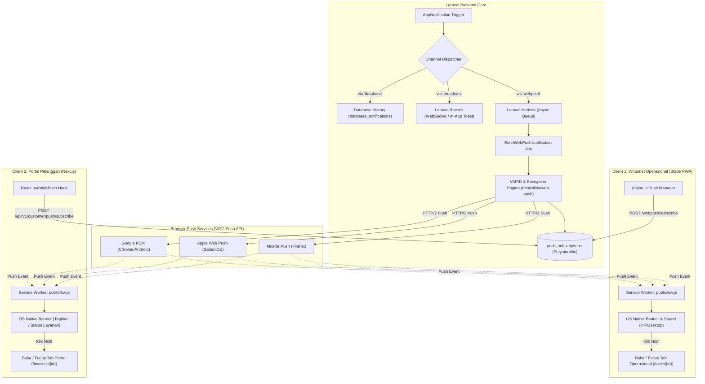

# Rancangan Arsitektur Web Push Notification Terpadu
**Whusnet ISP: PWA Operasional (Blade/Alpine) & Portal Pelanggan (Next.js)**

---

## 1. Latar Belakang & Visi Arsitektur

Sistem Whusnet sedang berkembang menuju ekosistem multi-platform yang mencakup:
1. **Whusnet Operasional (Internal):** Web Dashboard berbasis Blade + Alpine.js yang siap diubah menjadi **PWA (Progressive Web App)** untuk staf kantor dan teknisi lapangan.
2. **Whusnet Customer Portal (Eksternal):** Web App modern berbasis **Next.js** untuk pelanggan (cek tagihan, pembayaran, riwayat tiket, info gangguan).

Untuk menyediakan notifikasi yang andal saat aplikasi **tidak sedang dibuka** (background / screen off), sistem membutuhkan kanal **Web Push Notification standar W3C/IETF (VAPID & Service Worker)** yang terpusat di Laravel Backend.



---

## 2. Standar Protokol & Kriptografi (VAPID)

Web Push Notification menggunakan standar IETF terbuka tanpa biaya berlangganan pihak ketiga (gratis & mandiri):
- **RFC 8030:** Web Push Protocol.
- **RFC 8291:** Message Encryption for Web Push (`aes128gcm`).
- **RFC 8292:** Voluntary Application Server Identification (VAPID).

### Konfigurasi `.env` Laravel Backend:
```env
# VAPID Keys untuk Web Push
VAPID_PUBLIC_KEY=BG... (Disematkan di Blade PWA & Next.js client)
VAPID_PRIVATE_KEY=... (RAHASIA: Hanya tersimpan di Laravel Backend)
VAPID_SUBJECT=mailto:admin@whusnet.com
```

---

## 3. Desain Database Polymorphic (`push_subscriptions`)

Satu tabel database menangani langganan push dari **User Internal** (teknisi/admin) maupun **Customer** (pelanggan).

### Struktur Migrasi:
```php
Schema::create('push_subscriptions', function (Blueprint $table) {
    $table->id();
    
    // Polymorphic Relation: User (Internal) atau Customer (Portal)
    $table->morphs('subscribable'); // subscribable_type & subscribable_id
    
    // Endpoint unik dari Push Service (FCM/Apple/Mozilla)
    $table->string('endpoint', 500)->unique();
    
    // Public Key (p256dh) & Auth Token perangkat untuk enkripsi
    $table->string('public_key');
    $table->string('auth_token');
    $table->string('content_encoding')->default('aes128gcm');
    
    // Metadata Perangkat & Browser (Memudahkan debug & audit)
    $table->string('device_name')->nullable(); // e.g. "Samsung Galaxy A54", "Chrome on Windows"
    $table->string('user_agent', 500)->nullable();
    
    $table->timestamp('last_active_at')->nullable();
    $table->timestamps();
    
    $table->index(['subscribable_type', 'subscribable_id']);
});
```

---

## 4. Format Payload Notifikasi Terstandarisasi

Backend mengirimkan payload terstruktur ke Service Worker dalam format JSON:

```json
{
  "title": "Task Pemasangan Baru #1042",
  "body": "Anda ditugaskan untuk PSB pelanggan Bpk. Ahmad di Siman.",
  "icon": "/icons/icon-192x192.png",
  "badge": "/icons/badge-72x72.png",
  "image": null,
  "tag": "task-assignment-1042",
  "renotify": true,
  "requireInteraction": false,
  "data": {
    "url": "/tasks/1042",
    "type": "task_assigned",
    "id": 1042,
    "timestamp": 1790580000000
  },
  "actions": [
    {
      "action": "open",
      "title": "Buka Rincian",
      "icon": "/icons/action-open.png"
    },
    {
      "action": "close",
      "title": "Tutup",
      "icon": "/icons/action-close.png"
    }
  ]
}
```

---

## 5. Spesifikasi API & Endpoint

### A. Endpoint Internal Operasional (Session / Blade Web)

| Method | URI | Middleware | Fungsi |
|---|---|---|---|
| `GET` | `/webpush/vapid-public-key` | `auth` | Mengambil Public Key untuk registrasi browser |
| `POST` | `/webpush/subscribe` | `auth` | Mendaftarkan subscription token user login |
| `POST` | `/webpush/unsubscribe` | `auth` | Menghapus subscription perangkat saat ini |
| `GET` | `/webpush/subscriptions` | `auth` | Melihat daftar perangkat aktif milik user |

### B. Endpoint Portal Pelanggan (Next.js via Sanctum Token)

| Method | URI | Middleware | Fungsi |
|---|---|---|---|
| `GET` | `/api/v1/customer/push/vapid-key` | `auth:sanctum` | Mengambil Public Key untuk Next.js client |
| `POST` | `/api/v1/customer/push/subscribe` | `auth:sanctum` | Mendaftarkan subscription token pelanggan |
| `POST` | `/api/v1/customer/push/unsubscribe` | `auth:sanctum` | Menghapus subscription token saat logout |

---

## 6. Implementasi Service Worker (`public/sw.js`)

File Service Worker ditempatkan di root public web server agar memiliki *scope* kontrol penuh terhadap seluruh halaman aplikasi.

```javascript
// public/sw.js - Whusnet Service Worker
self.addEventListener('push', function (event) {
    if (!event.data) return;

    let payload;
    try {
        payload = event.data.json();
    } catch (e) {
        payload = {
            title: 'Whusnet Operasional',
            body: event.data.text(),
            data: { url: '/' }
        };
    }

    const options = {
        body: payload.body,
        icon: payload.icon || '/img/logo-192.png',
        badge: payload.badge || '/img/badge-72.png',
        image: payload.image || null,
        tag: payload.tag || 'default-tag',
        renotify: payload.renotify || false,
        requireInteraction: payload.requireInteraction || false,
        data: payload.data || { url: '/' },
        actions: payload.actions || []
    };

    event.waitUntil(
        self.registration.showNotification(payload.title, options)
    );
});

self.addEventListener('notificationclick', function (event) {
    event.notification.close();

    const targetUrl = (event.notification.data && event.notification.data.url) 
        ? event.notification.data.url 
        : '/';

    event.waitUntil(
        clients.matchAll({ type: 'window', includeUncontrolled: true }).then(function (clientList) {
            // Jika ada tab yang sudah membuka URL yang sama, fokuskan tab tersebut
            for (let i = 0; i < clientList.length; i++) {
                const client = clientList[i];
                if (client.url === targetUrl && 'focus' in client) {
                    return client.focus();
                }
            }
            // Jika belum ada, buka window/tab baru
            if (clients.openWindow) {
                return clients.openWindow(targetUrl);
            }
        })
    );
});
```

---

## 7. Penanganan Lifecycle & Auto-Pruning Token Usang (410 Gone)

Ketika user menghapus cookie browser, uninstall browser, atau mencabut izin notifikasi dari OS, Push Server (Google FCM / Apple / Mozilla) akan mengembalikan status HTTP:
- `410 Gone` (Subscription sudah tidak valid)
- `404 Not Found` (Endpoint tidak ditemukan)

### Mekanisme Pembersihan Otomatis (Auto-Cleanup):
Job pengiriman push di Laravel menangkap exception `WebPushException`:
```php
try {
    $report = $webPush->sendOneNotification($subscription, $payload);
    if (! $report->isSuccess()) {
        if ($report->isSubscriptionExpired()) {
            // Hapus otomatis token yang sudah usang dari DB
            PushSubscription::where('endpoint', $subscription->getEndpoint())->delete();
        }
    }
} catch (\Throwable $e) {
    Log::warning("Gagal mengirim web push: " . $e->getMessage());
}
```

---

## 8. Rencana Tahapan Implementasi (Roadmap)

```
[Fase 1: Backend Core] ──► [Fase 2: Blade PWA Operasional] ──► [Fase 3: Next.js Portal]
  • Package & VAPID Keys      • sw.js & PWA Manifest              • React useWebPush Hook
  • Migrasi push_subscriptions • Alpine.js Toggle & Permission    • Auth Sanctum API Sub
  • Queue Job via Horizon     • Test Push Offline Teknisi         • Test Push Tagihan/Invoice
```

### Checklist Rinci:
- [ ] **Fase 1: Backend Foundation**
  - [ ] Install library WebPush (`minishlink/web-push` atau `laravel-notification-channels/webpush`).
  - [ ] Generate VAPID Keys & daftarkan di `.env`.
  - [ ] Migrasi tabel `push_subscriptions`.
  - [ ] Buat Trait `HasPushSubscriptions` untuk model `User` dan `Customer`.
  - [ ] Buat Channel `WebPushChannel` yang dijalankan via queue Horizon (`ShouldQueue`).
  - [ ] Tambahkan API controller `PushSubscriptionController` & route endpoints.

- [ ] **Fase 2: Whusnet Operasional (Blade + PWA)**
  - [ ] Tambahkan `public/sw.js` & `public/manifest.json`.
  - [ ] Tambahkan tombol toggle "Aktifkan Notifikasi Perangkat" di dropdown profil/lonceng.
  - [ ] Implementasikan helper JavaScript (`resources/js/webpush.js`) untuk request permission & subscribe browser.
  - [ ] Uji pengiriman notifikasi saat tab ditutup pada skenario: Task Teknisi, Tiket Gangguan, dan SLA Breach.

- [ ] **Fase 3: Whusnet Customer Portal (Next.js)**
  - [ ] Buat endpoint API publik/sanctum untuk Customer Token registration.
  - [ ] Sediakan template hook `useWebPush.ts` untuk repository Next.js.
  - [ ] Integrasikan trigger notifikasi pelanggan: Invoice Terbit, Pembayaran Berhasil, Maintenance Jaringan.

---

## 9. Kesimpulan & Nilai Tambah

Dengan menerapkan arsitektur ini:
1. **Satu Backend, Dua Ekosistem:** Laravel menjadi pusat distribusi notifikasi tunggal yang melayani PWA teknisi dan Web Portal pelanggan secara seragam.
2. **Bebas Biaya Provider:** Menggunakan protokol Web Push resmi W3C/IETF tanpa ketergantungan biaya SMS Gateway / vendor push berbayar.
3. **Respon Cepat di Lapangan:** Teknisi dan staf tetap menerima sinyal penugasan dan SLA alert langsung di layar HP/Desktop meskipun aplikasi sedang ditutup.
