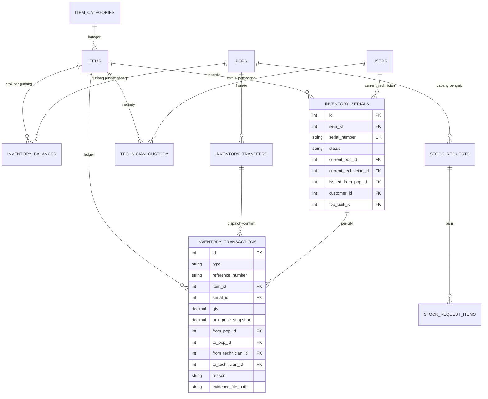

# Database Schema — Modul Gudang

Semua tabel dibuat di migration `2026_09_02_1000*` s.d. `2026_09_07_*`. Gudang **tidak punya tabel sendiri** — direpresentasikan lewat `pops` (`type` = `pusat`/`cabang`).

## ERD Ringkas

## `items` (kolom tambahan — `2026_09_02_100001`)

| Kolom | Tipe | Default | Keterangan |
|---|---|---|---|
| `tracking_type` | `string(20)` | `quantity` | `TrackingType` — `serialized`/`quantity`/`roll` (`batch` sudah dihapus, ADHOC-75) |
| `ownership_mode` | `string(20)` | `installable` | `OwnershipMode` |
| `equipment_class_override` | `string(10)` nullable | `null` | Override per-item dari `item_categories.equipment_class` |
| `auto_generate_serial` | `boolean` (`2026_09_17_100001`) | `false` | Cuma relevan `tracking_type=serialized`. `true` = barang gak punya SN vendor (ODP, Splitter) — SN digenerate sistem di `InventoryReceiveService::generateSerialCode()`, bukan diketik staf. Lihat `docs/plan/warehouse/analisa-generate-id-barang-non-serial.md` |
| `meter_per_roll` / `minimum_length` | `decimal(10,2)` nullable | `null` | Cuma relevan `tracking_type=roll` — konversi roll→meter + ambang "sisa kecil" |

Index: `tracking_type`.

## `item_categories` (kolom tambahan — `2026_09_02_100002`)

| Kolom | Tipe | Default |
|---|---|---|
| `equipment_class` | `string(10)` | `pasif` (backfill `aktif` untuk kategori `media_converter`, `antena_radio`) |

## `inventory_balances` (`2026_09_02_100003`)

Proyeksi stok saat ini — **diturunkan** dari ledger, bukan sumber kebenaran sendiri.

| Kolom | Tipe | Keterangan |
|---|---|---|
| `pop_id` | FK `pops`, restrict | Gudang (tipe pusat/cabang saja — ditegakkan di Service, bukan DB) |
| `item_id` | FK `items`, restrict | |
| `lot_no` | `string(50)` default `''` | **Tidak nullable** — sentinel `''` dipakai sebagai lot pertama/default (NULL dianggap "beda" oleh sebagian besar DB engine). Barang QUANTITY yang harga belinya berubah otomatis pecah jadi lot ke-2 (`lot_no` digenerate sistem, maksimal 2 lot aktif — ADHOC-75) |
| `qty` | `decimal(12,2)` default 0 | |
| `minimum_stock` / `maximum_stock` | `decimal(12,2)` nullable | Per-gudang, bukan per-produk global |

**Unique**: `(pop_id, item_id, lot_no)`. Index: `item_id`.

## `inventory_serials` (`2026_09_02_100004`, `+issued_from_pop_id` di `2026_09_02_100011`, `+condition*` di `2026_09_17_090739`)

Satu baris per unit fisik barang SERIALIZED.

| Kolom | Tipe | Keterangan |
|---|---|---|
| `item_id` | FK `items`, restrict | |
| `serial_number` | `string(100)` **unique global** | Satu SN tidak mungkin muncul dua kali di seluruh sistem |
| `mac_address` | `string(50)` nullable | |
| `status` | `string(20)` default `received` | `SerialStatus` — satu-satunya acuan status **lifecycle** entitas ini |
| `condition` | `string(20)` default `new` | `App\Enums\ItemCondition` (`new`/`used_good`/`used_damaged`) — kondisi **fisik**, axis independen dari `status` (ADHOC-80). `receiveSerialized()` set `new`; `returnInstalledSerialFromCustomer()` set `used_good` |
| `condition_checked_at` | `timestamp` nullable | NULL = belum dicek fisik sejak balik dari pemakaian — men-trigger gate Issue (`InventorySerial::isClearedForIssue()`) |
| `condition_checked_by` | FK `users` nullable, null-on-delete | Diisi lewat aksi "Sudah Dicek" (`InventoryReassignService::markSerialConditionChecked()`) |
| `current_pop_id` | FK `pops` nullable, restrict | Diisi kalau lagi di gudang |
| `current_technician_id` | FK `users` nullable, null-on-delete | Diisi kalau lagi di custody teknisi |
| `issued_from_pop_id` | FK `pops` nullable, null-on-delete | Gudang cabang asal ISSUE terakhir — diisi sekali saat ISSUE, tidak pernah berubah lagi (dipakai fallback POP-scope & tujuan retrieve dari pelanggan) |
| `customer_id` | FK `customers` nullable, null-on-delete | Diisi kalau `status=INSTALLED` |
| `fop_task_id` | FK `fop_tasks` nullable, null-on-delete | |
| `installed_at` | `timestamp` nullable | |

Konsistensi "cuma satu lokasi yang keisi sesuai status" ditegakkan Service/Observer, **bukan** DB constraint (kombinasi status×lokasi terlalu banyak untuk CHECK constraint portable SQLite/MySQL).

Index: `status`, `current_pop_id`, `current_technician_id`, `customer_id`.

## `inventory_transfers` (`2026_09_02_100005`)

Header **mutable** Transfer Pusat→Cabang — berbeda dari ledger append-only, mengikuti pola `Ticket` (mutable) berdampingan `ticket_histories` (append-only).

| Kolom | Tipe | Keterangan |
|---|---|---|
| `reference_number` | `string(30)` unique | `TRF-{tahun}-{4 digit}` |
| `from_pop_id` / `to_pop_id` | FK `pops`, restrict | |
| `status` | `string(20)` default `in_transit` | `TransferStatus` — transisi satu kali `in_transit`→`received`/`received_partial` |
| `created_by` / `received_by` | FK `users` nullable, null-on-delete | |
| `received_at` | `timestamp` nullable | |

Index: `status`.

## `inventory_transactions` (`2026_09_02_100006`, `+evidence_file_path` di `2026_09_03_100001`, `+resulting_status` di `2026_09_17_090740`)

**Ledger append-only** — satu-satunya sumber histori inventory. Diblokir update/delete oleh `InventoryTransactionObserver`.

| Kolom | Tipe | Keterangan |
|---|---|---|
| `type` | `string(20)` | `InventoryTransactionType` |
| `reference_number` | `string(30)` nullable | Grouping label (`RCV-`/`TRF-`/`ISS-`/`ADJ-`/`OPN-`/`RSG-`/`PST-`) — **bukan unique**, satu transfer/issue bisa multi-baris |
| `inventory_transfer_id` | FK `inventory_transfers` nullable, null-on-delete | Hanya untuk `type=transfer` |
| `item_id` | FK `items`, restrict | |
| `lot_no` | `string(50)` nullable | Hanya untuk `tracking_type=quantity` yang punya lot harga ke-2 (ADHOC-75) — sentinel `''`/`NULL` untuk lot pertama |
| `serial_id` | FK `inventory_serials` nullable, null-on-delete | Hanya untuk barang SERIALIZED |
| `qty` | `decimal(12,2)` | Bisa negatif — satu-satunya type yang qty-nya boleh negatif adalah `ADJUSTMENT` |
| `unit_price_snapshot` | `decimal(12,2)` nullable | Harga saat transaksi terjadi, disalin — tidak diquery ulang |
| `from_pop_id` / `to_pop_id` | FK `pops` nullable, restrict | |
| `from_technician_id` / `to_technician_id` | FK `users` nullable, null-on-delete | |
| `fop_task_id` | FK `fop_tasks` nullable, null-on-delete | |
| `reason` | `string(255)` nullable | Wajib diisi di level Service untuk `ADJUSTMENT`/`TRANSFER_CUSTODY` |
| `notes` | `string(500)` nullable | |
| `evidence_file_path` | `string(255)` nullable | Wajib di level Service untuk klaim `lost`/`damaged`/`scrapped` |
| `resulting_status` | `string(20)` nullable | Snapshot eksplisit status tujuan `ADJUSTMENT` (`lost`/`damaged`/`scrapped`/`quarantine`), diisi `adjustSerialStatus()`/`adjustRollStatus()` (ADHOC-80). Baris lama/tipe lain tetap `NULL` — jangan dibaca ulang dari `serial.status`/`roll.status` SAAT INI, itu bisa berubah kalau unit diadjust lagi belakangan |
| `created_by` | FK `users` nullable, null-on-delete | |

Kombinasi kolom valid per `type` — lihat tabel di [business-logic.md §2](business-logic.md#2-tipe-transaksi-ledger-inventorytransactiontype).

Index: `type`, `item_id`, `reference_number`, `fop_task_id`.

## `technician_custody` (`2026_09_02_100007`, `+issued_from_pop_id` di `100011`, `+unit_price_snapshot` di `100009`)

Custody barang QUANTITY yang dipegang teknisi (SERIALIZED/ROLL dipick langsung lewat SN/roll ID, gak lewat custody agregat ini).

| Kolom | Tipe | Keterangan |
|---|---|---|
| `technician_id` | FK `users`, restrict | |
| `issued_from_pop_id` | FK `pops` nullable, null-on-delete | Diisi sekali saat ISSUE — dibutuhkan untuk POP-scope halaman Custody (`pop_admin` hanya boleh lihat custody dari cabangnya) |
| `item_id` | FK `items`, restrict | |
| `lot_no` | `string(50)` nullable | |
| `qty_remaining` | `decimal(12,2)` | |
| `unit_price_snapshot` | `decimal(12,2)` | |
| `status` | `string(20)` default `issued` | `CustodyStatus` |
| `issued_at` | `timestamp` | Dipakai FIFO consumption + badge durasi UI (informasional, bukan alert ambang waktu) |

**Sengaja tidak ada** unique `(technician_id, item_id, lot_no)` — satu teknisi bisa punya beberapa baris custody aktif untuk item+lot yang sama dari ISSUE berbeda waktu (tiap ISSUE membuat baris baru).

Index: `(technician_id, status)`, `item_id`.

## `stock_requests` (`2026_09_03_100002`) & `stock_request_items` (`2026_09_03_100003`, `+qty_fulfilled` di `2026_09_07_110420`)

**Bukan ledger** — tiket komunikasi Cabang→Pusat.

**`stock_requests`**

| Kolom | Tipe | Keterangan |
|---|---|---|
| `reference_number` | `string(30)` unique | `PST-YYYYMMDD-NNNNNN` |
| `cabang_pop_id` | FK `pops`, restrict | |
| `status` | `string(20)` default `pending` | `StockRequestStatus` |
| `notes` | `text` nullable | |
| `requested_by` | FK `users`, restrict | |
| `decided_by` | FK `users` nullable, null-on-delete | |
| `decided_at` | `timestamp` nullable | |
| `decision_notes` | `string(500)` nullable | |

Index: `status`, `cabang_pop_id`.

**`stock_request_items`**

| Kolom | Tipe |
|---|---|
| `stock_request_id` | FK `stock_requests`, cascade-on-delete |
| `item_id` | FK `items`, restrict |
| `qty_requested` | `decimal(12,2)` |
| `qty_fulfilled` | `decimal(12,2)` default 0 — numpuk (bukan snapshot terakhir), direkonsiliasi manual via `recordDelivery()` |
| `lot_no` | `string(50)` nullable |

## Relasi Model Penting

- `InventoryBalance` — `belongsTo(Pop)`, `belongsTo(Item)`; `scopeLowStock()`, `isLowStock()`.
- `InventorySerial` — cast `status => SerialStatus`; relasi `item`, `currentPop`, `currentTechnician`, `issuedFromPop`, `customer`, `fopTask`.
- `InventoryTransaction` — cast `type => InventoryTransactionType`; relasi lengkap ke pop/technician/serial/transfer/fopTask/createdBy.
- `InventoryTransfer` — cast `status => TransferStatus`; `hasMany(InventoryTransaction, 'inventory_transfer_id')`; `isInTransit()`.
- `TechnicianCustody` — cast `status => CustodyStatus`; `scopeActive()`, `ageLabel()`.
- `StockRequest`/`StockRequestItem` — cast `status => StockRequestStatus`; `StockRequestItem::remaining()`, `isFullyFulfilled()`.
- `Item`/`ItemCategory` — `getEffectiveEquipmentClassAttribute()` (resolusi 2-level).
