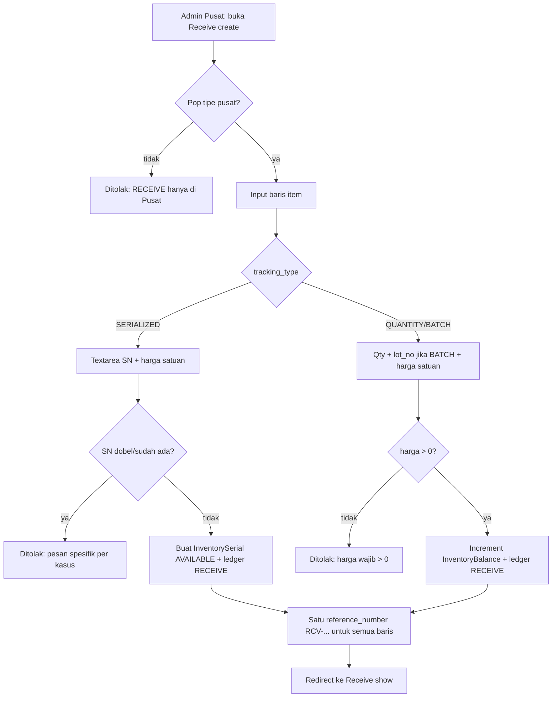
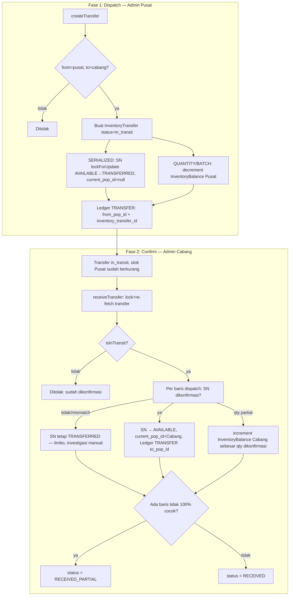
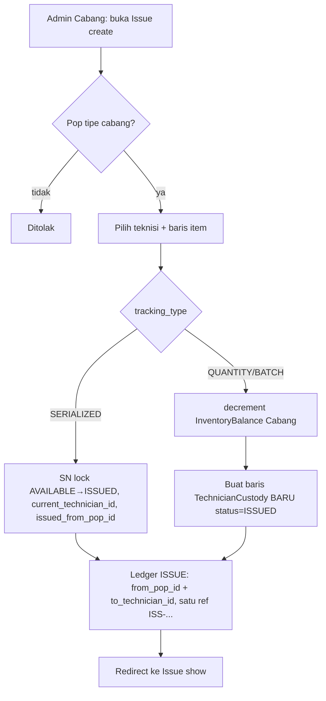
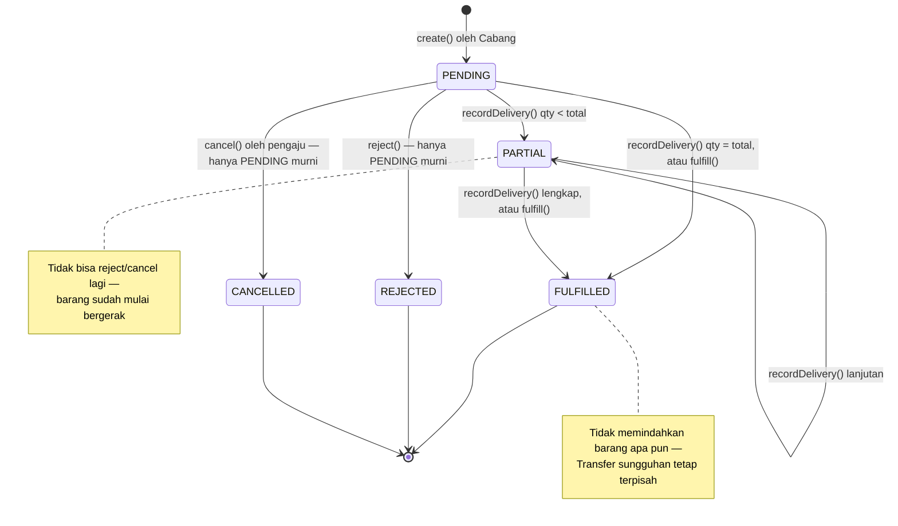
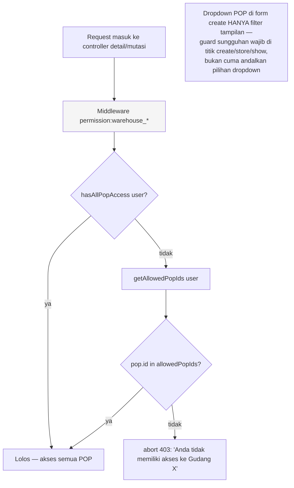

# Flowchart — Modul Gudang

## 1. Receive (Barang Masuk)



## 2. Transfer Pusat → Cabang (2 Fase)



## 3. Issue (Cabang → Teknisi)



## 4. Lifecycle Stock Request



## 5. State SerialStatus & Transisi

```mermaid
stateDiagram-v2
    [*] --> AVAILABLE: RECEIVE (receiveSerialized)
    AVAILABLE --> TRANSFERRED: TRANSFER dispatch
    TRANSFERRED --> AVAILABLE: TRANSFER confirm (di gudang tujuan)
    TRANSFERRED --> TRANSFERRED: confirm tidak mencakup SN ini (limbo)
    AVAILABLE --> ISSUED: ISSUE (issueSerialized)
    ISSUED --> AVAILABLE: RETURN (returnSerialToWarehouse)
    ISSUED --> INSTALLED: INSTALL (installSerial, guard OwnershipMode::INSTALLABLE)
    ISSUED --> ISSUED: TRANSFER_CUSTODY (pindah antar teknisi)
    INSTALLED --> AVAILABLE: RETURN (returnInstalledSerialFromCustomer, ke issued_from_pop_id)
    AVAILABLE --> LOST: ADJUSTMENT (evidence wajib)
    AVAILABLE --> DAMAGED: ADJUSTMENT (evidence wajib)
    AVAILABLE --> QUARANTINE: ADJUSTMENT (tanpa evidence)
    ISSUED --> LOST: ADJUSTMENT (evidence wajib)
    ISSUED --> DAMAGED: ADJUSTMENT (evidence wajib)
    INSTALLED --> LOST: ADJUSTMENT (evidence wajib, customer_id/fop_task_id dikosongkan)
    LOST --> SCRAPPED: ADJUSTMENT
    DAMAGED --> SCRAPPED: ADJUSTMENT
    QUARANTINE --> AVAILABLE: ADJUSTMENT (lolos cek)
    SCRAPPED --> [*]: final, tidak bisa diubah lagi
```

Catatan: `RESERVED`/`IN_USE`/`RETURNED` ada di enum tapi belum punya jalur transisi eksplisit di Service saat ini (dicadangkan untuk kebutuhan mendatang).

## 6. Guard POP Scope (Controller Detail/Mutasi)


